# Features of Claude

## Extending Thinking
@See [Extended Thinking Example](../notebooks/006_features_of_claude.ipynb#extended-thinking-capability)

Extended thinking is Claude's **advanced reasoning feature that gives the model time to work through complex problems before generating a final response**. Think of it as Claude's "scratch paper" - you can see the reasoning process that leads to the answer, which helps with transparency and often results in better quality responses.

> 📌 **Important Note:** Extended Thinking is **not compatible** with some other features, notable message pre-filling and temperature. 
>
> See the full list of restrictions here: https://docs.anthropic.com/en/docs/build-with-claude/extended-thinking#feature-compatibility

### How Extended Thinking Works

When extended thinking is enabled, Claude's response changes from a simple text block to a structured response containing two parts:

<p align="center">
  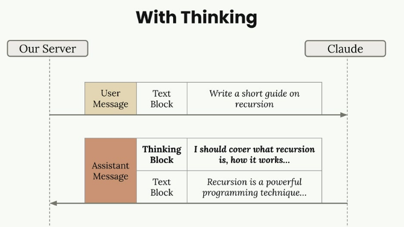
</p>

With thinking enabled, you get both the reasoning process and the final answer.

The key benefits include:

* Better reasoning capabilities for complex tasks
* Increased accuracy on difficult problems
* Transparency into Claude's thought process

However, there are important trade-offs:

* Higher costs (you pay for thinking tokens)
* Increased latency (thinking takes time)
* More complex response handling in your code

### When to Use Extended Thinking

**The decision is straightforward: _use your prompt evaluations_**. Run your prompts without thinking first, and if the accuracy isn't meeting your requirements after you've already optimized your prompt, then consider enabling extended thinking. It's a tool for when standard prompting isn't quite getting you there.

### Response Structure and Security

Extended thinking responses include a **special signature** system for security:

<p align="center">
  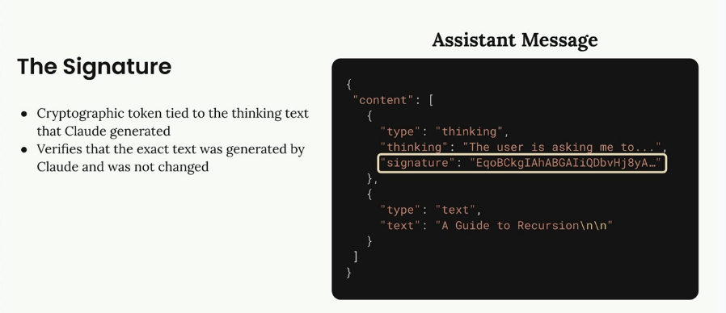
</p>

The signature is a cryptographic token that ensures you haven't modified the thinking text. This prevents developers from tampering with Claude's reasoning process, which could potentially lead the model in unsafe directions.

### Redacted Thinking

Sometimes you'll receive a redacted thinking block instead of readable reasoning text. This **happens when Claude's thinking process gets flagged by internal safety systems**. The redacted content contains the actual thinking in encrypted form, allowing you to pass the complete message back to Claude in future conversations without losing context.

### Implementation

To enable extended thinking in your code, you need to add two parameters to your chat function:

```python
def chat(
    messages,
    system=None,
    temperature=1.0,
    stop_sequences=[],
    tools=None,
    ## these 2 are additional params for extended thinking!
    thinking=False,
    thinking_budget=1024
):
```

The thinking budget sets the maximum tokens Claude can use for reasoning. The minimum value is 1024 tokens, and your max_tokens parameter must be greater than your thinking budget.

Add the thinking configuration to your API parameters:

```python
if thinking:
    params["thinking"] = {
        "type": "enabled",
        "budget": thinking_budget
    }
```

Then call it with thinking enabled:

```python
chat(messages, thinking=True)
```

### Testing Redacted Responses

For testing purposes, you can force Claude to return a redacted thinking block by sending a special trigger string. This helps ensure your application handles redacted responses gracefully without crashing.

Extended thinking is a powerful feature when you need Claude to tackle complex reasoning tasks, but use it judiciously given the cost and latency implications. Start with standard prompting, optimize thoroughly, then add thinking when you need that extra reasoning capability.

## Image Support
@See [Image Support Example](../notebooks/006_features_of_claude.ipynb#images-support)

Claude's vision capabilities let you include images in your messages and ask Claude to analyze them in countless ways. You can ask Claude to describe what's in an image, compare multiple images, count objects, or perform complex visual analysis tasks.

### Image Handling Basics

There are several important limitations to keep in mind when working with images:

* **Up to 100 images** across all messages in a single request
* Max size of 5MB per image
* When sending one image: max height/width of `8000px`
* When sending multiple images: max height/width of `2000px`
* Images can be included as base64 encoding or a URL to the image
* Each image counts as tokens based on its dimensions: `tokens = (width px × height px) / 750`

To send an image to Claude, you include an image block in your user message alongside text blocks. Here's the structure:

```python
with open("image.png", "rb") as f:
    image_bytes = base64.standard_b64encode(f.read()).decode("utf-8")

add_user_message(messages, [
    # Image Block
    {
        "type": "image",
        "source": {
            "type": "base64",
            "media_type": "image/png",
            "data": image_bytes,
        }
    },
    # Text Block
    {
        "type": "text",
        "text": "What do you see in this image?"
    }
])
```

### Message Flow

The conversation works just like text-only interactions. Your server sends a user message containing both image and text blocks to Claude, and Claude responds with a text block containing its analysis.

<p align="center">
  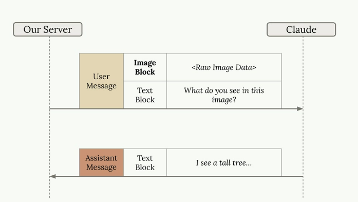
</p>

### Prompting Techniques

The key to getting good results with images is **applying the same prompting engineering techniques you'd use with text**. Simple prompts often lead to poor results. For example, asking `"How many marbles are in this image?"` might return an incorrect count.

<p align="center">
  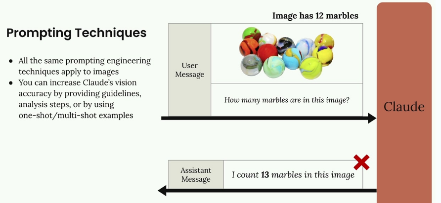
</p>

You can dramatically improve Claude's accuracy by:

* Providing detailed guidelines and analysis steps
* Using one-shot or multi-shot examples
* Breaking down complex tasks into smaller steps


### Step-by-Step Analysis

Instead of a simple question, provide Claude with a methodology:

```
Analyze this image of marbles and determine the exact count using this methodology:
1. Begin by identifying each unique marble one at a time. Assign each a number as you identify it.
2. Verify your result by counting with a different method. Start from the bottom-left corner and work row by row, from left to right.

What is the exact, verified number of marbles in this image?
```

### One-Shot Examples

You can also improve accuracy by providing examples within your message. Include an image with a known count, state the correct answer, then ask about your target image. This gives Claude a reference point for the type of analysis you want.

<p align="center">
  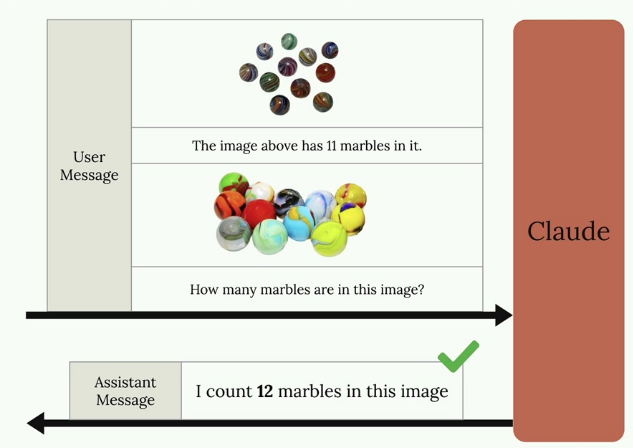
</p>

### Real-World Example: Fire Risk Assessment

Here's a practical application: automating fire risk assessments for home insurance. Instead of sending inspectors to every property, insurance companies can use satellite imagery and Claude's analysis.

<p align="center">
  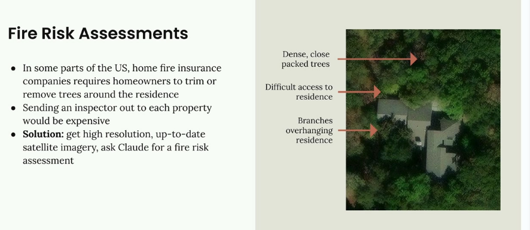
</p>

The system analyzes satellite images to identify:

* Dense, close-packed trees near the residence
* Difficult access routes for emergency services
* Branches overhanging the residence

Rather than a simple prompt like `"provide a fire risk score,"` a well-structured prompt breaks down the analysis into specific steps:

```
Analyze the attached satellite image of a property with these specific steps:

1. Residence identification: Locate the primary residence on the property by looking for:
   - The largest roofed structure
   - Typical residential features (driveway connection, regular geometry)
   - Distinction from other structures (garages, sheds, pools)

2. Tree overhang analysis: Examine all trees near the primary residence:
   - Identify any trees whose canopy extends directly over any portion of the roof
   - Estimate the percentage of roof covered by overhanging branches (0-25%, 25-50%, 50-75%, 75%+)
   - Note particularly dense areas of overhang

3. Fire risk assessment: For any overhanging trees, evaluate:
   - Potential wildfire vulnerability (ember catch points, continuous fuel paths to structure)
   - Proximity to chimneys, vents, or other roof openings if visible
   - Areas where branches create a "bridge" between wildland vegetation and the structure

4. Defensible space identification: Assess the property's overall vegetative structure:
   - Identify if trees connect to form a continuous canopy over or near the home
   - Note any obvious fuel ladders (vegetation that can carry fire from ground to tree to roof)

5. Fire risk rating: Based on your analysis, assign a Fire Risk Rating from 1-4:
   - Rating 1 (Low Risk): No tree branches overhanging the roof, good defensible space around the home
   - Rating 2 (Moderate Risk): Minimal overhang (<25% of roof), some separation between tree canopies
   - Rating 3 (High Risk): Significant overhang (25-50% of roof), connected tree canopies, multiple vulnerability points
   - Rating 4 (Severe Risk): Extensive overhang (>50% of roof), dense vegetation against structure

For each item above (1-5), write one sentence summarizing your findings, with your final response being the numerical rating.
This detailed prompt guides Claude through a systematic analysis, resulting in much more accurate and useful assessments than a simple request would provide.
```

> 🎗️ **Remember:** the _same prompting techniques that work for text apply to images_. Invest time in crafting detailed, structured prompts rather than relying on simple questions if you want reliable results.

## PDF Support

Claude can read and analyze PDF files directly, making it a powerful tool for document processing. This capability works similarly to image processing, but with a few key differences in how you structure your code.

### Setting Up PDF Processing

To process a PDF file with Claude, you'll use nearly identical code to what you'd use for images. The main differences are in the file type specifications and variable names for clarity.

Here's how to modify your existing image processing code for PDFs:

```python
with open("earth.pdf", "rb") as f:
    file_bytes = base64.standard_b64encode(f.read()).decode("utf-8")

messages = []

add_user_message(
    messages,
    [
        {
            "type": "document",
            "source": {
                "type": "base64",
                "media_type": "application/pdf",
                "data": file_bytes,
            },
        },
        {"type": "text", "text": "Summarize the document in one sentence"},
    ],
)

chat(messages)
```

### Key Changes from Image Processing

When adapting your image processing code for PDFs, you need to update several elements:

* Change the file extension from `.png` to `.pdf`
* Update the variable name from `image_bytes` to `file_bytes` for clarity (this is a variable, so use a clear name!)
* Set the type to `"document"` instead of `"image"`
* Change the media type to `"application/pdf"` instead of `"image/png"`

### What Claude Can Extract from PDFs

Claude's PDF processing capabilities go beyond simple text extraction. It can analyze and understand:

* **Text content** throughout the document
* **Images and charts embedded** in the PDF
* **Tables and their data** relationships
* **Document structure and formatting**

This makes Claude essentially a one-stop solution for extracting any type of information from PDF documents, whether you need summaries, data analysis, or specific content extraction.

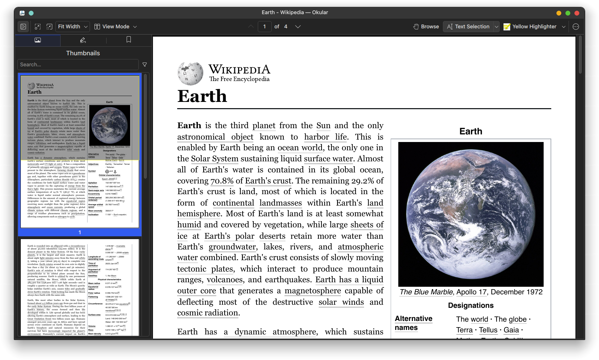

The example above shows Claude successfully processing a Wikipedia article about Earth that was saved as a PDF, demonstrating how it can understand and summarize complex document content in a single sentence.

## Citations

When Claude answers questions based on documents you provide, users might assume it's just drawing from its training data. But what if **Claude could show exactly where it found specific information? That's where citations come in** - a powerful feature that lets Claude reference specific parts of your source documents and show users exactly where each piece of information comes from.


### Why Citations Matter

Imagine asking Claude about how Earth's atmosphere formed and getting a detailed answer. Without citations, users have no way to verify the information or understand that Claude is actually referencing a specific document you provided. Citations solve this transparency problem by creating a clear trail from Claude's response back to your source material.

### Enabling Citations

To enable citations, you need to modify your document message structure. Add two new fields to your document block:

```json
{
    "type": "document",
    "source": {
        "type": "base64",
        "media_type": "application/pdf",
        "data": file_bytes,
    },
    "title": "earth.pdf",
    "citations": { "enabled": True }
}
```

The `title` field gives your document a readable name, while `citations: {"enabled": True}` tells Claude to track where it finds information.

### Understanding Citation Structure

When citations are enabled, Claude's response becomes more complex. Instead of simple text, you get structured data that includes citation information for each claim.

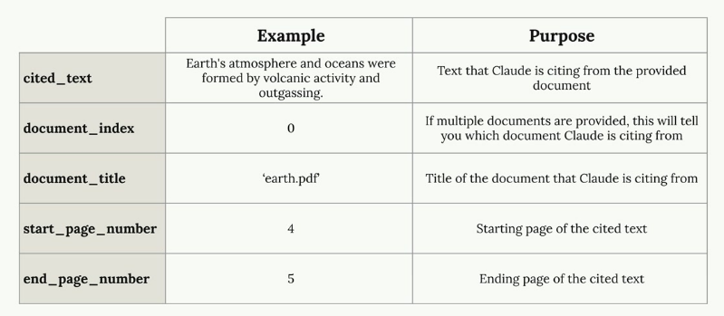

Each citation contains several key pieces of information:

* `cited_text` - The exact text from your document that supports Claude's statement
* `document_index` - Which document Claude is referencing (useful when you provide multiple documents)
* `document_title` - The title you assigned to the document
* `start_page_number` - Where the cited text begins
end_page_number - Where the cited text ends

### Building User Interfaces with Citations

The real power of citations comes from building user interfaces that make this information accessible. You can create interactive elements where users can hover over citation markers to see exactly where information came from.

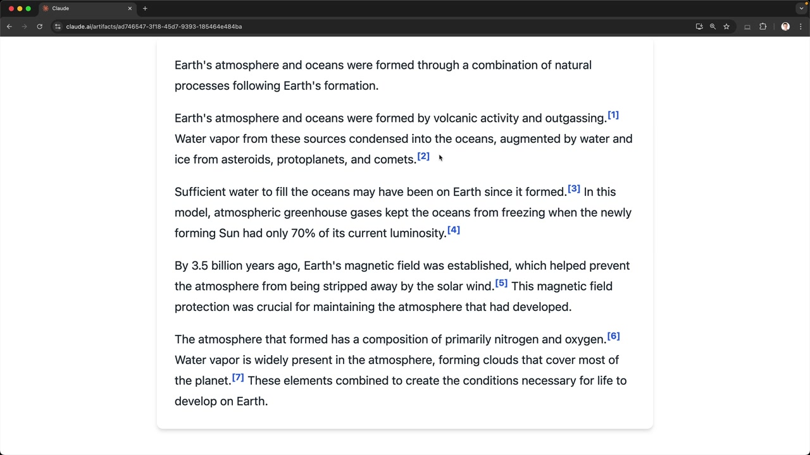

This creates a transparent experience where users can:

* See that Claude's answers are grounded in actual source material
* Verify the information by checking the original document
* Understand the context around each cited piece of information

### Citations with Plain Text

Citations aren't limited to PDF documents. You can also use them with plain text sources. When working with text, modify your document structure like this:

```json
{
    "type": "document", 
    "source": {
        "type": "text",
        "media_type": "text/plain",
        "data": article_text,
    },
    "title": "earth_article",
    "citations": { "enabled": True }
}
```

With plain text sources, instead of page numbers, you'll get character positions that pinpoint exactly where in the text Claude found each piece of information.

### When to Use Citations

Citations are particularly valuable when:

* Users need to verify information for accuracy
* You're working with authoritative documents that users should be able to reference
* Transparency about information sources is critical for your application
* Users might want to explore the broader context around specific facts

By implementing citations, you transform Claude from a "black box" that provides answers into a transparent research assistant that shows its work. This builds user trust and enables them to dive deeper into your source materials when needed.

## Prompt Caching

Prompt caching is a feature that speeds up Claude's responses and reduces the cost of text generation by reusing computational work from previous requests. Instead of throwing away all the processing work after each request, Claude can save and reuse it when you send similar content again.

### How Claude Normally Processes Requests

To understand prompt caching, let's first look at what happens during a typical request without caching enabled.

<p align="center">
  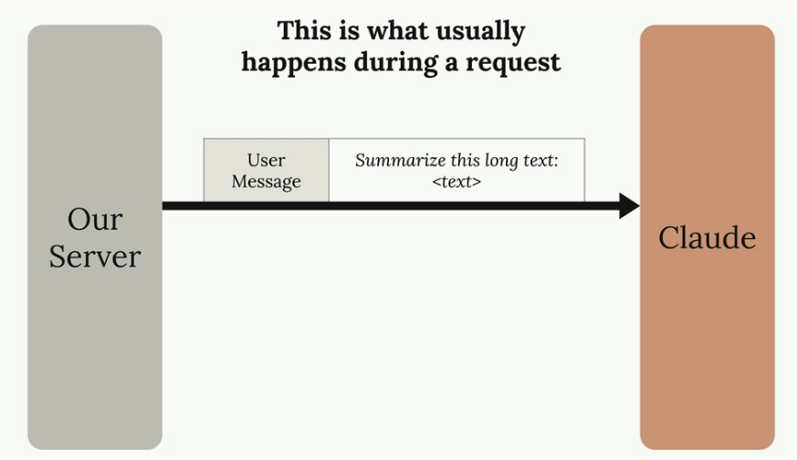
</p>

When you send a message to Claude, it doesn't immediately start generating a response. Instead, Claude does a tremendous amount of preprocessing work on your input:

<p align="center">
  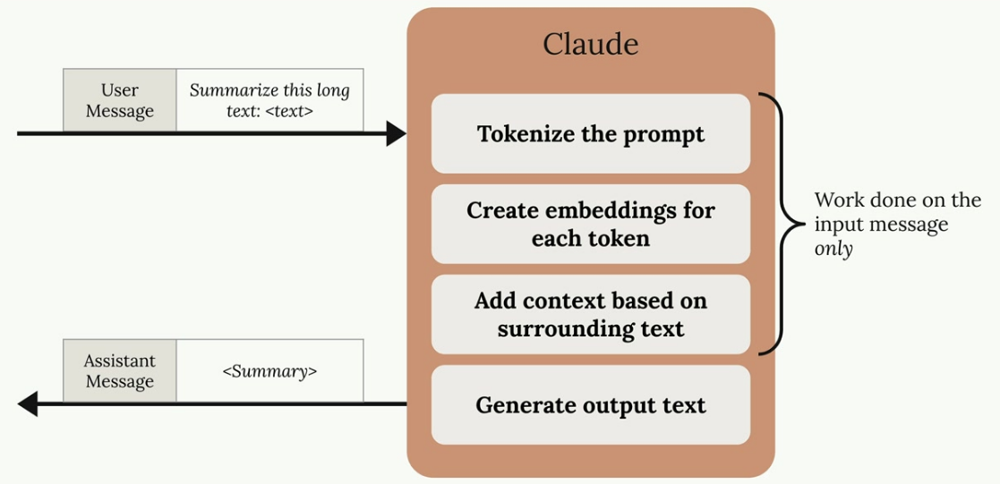
</p>

* Tokenizes the prompt into smaller pieces
* Creates embeddings for each token
* Adds context based on surrounding text
* Only then generates the actual output text

After sending you the response, **Claude throws away all this computational work** 😳 - the tokenization, embeddings, and context analysis all get discarded 😩.

<p align="center">
  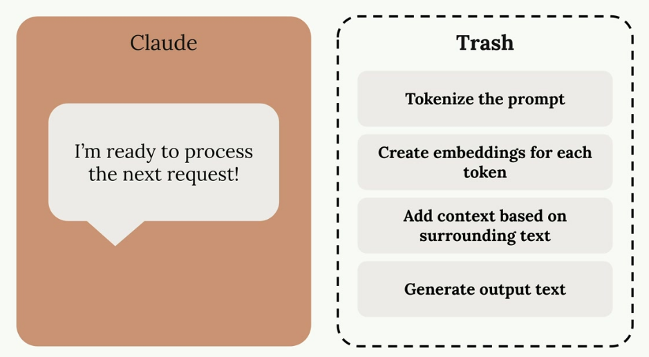
</p>

### The Problem with Discarding Work

This becomes inefficient when you make follow-up requests that include the same content. For example, in a conversation where you're asking Claude to refine a summary of the same long text:

<p align="center">
  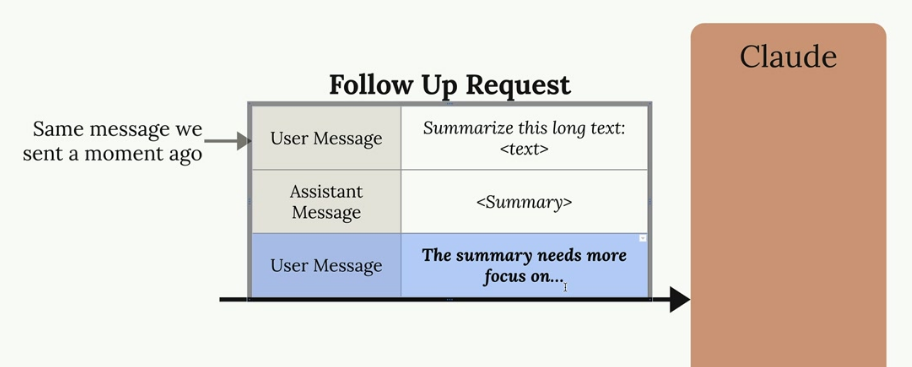
</p>

Claude has to repeat all the same preprocessing work on content it just analyzed moments ago. As Claude might think to itself: `"I just processed that message and threw away all the work I did - I could have reused it!"` 😠

<p align="center">
  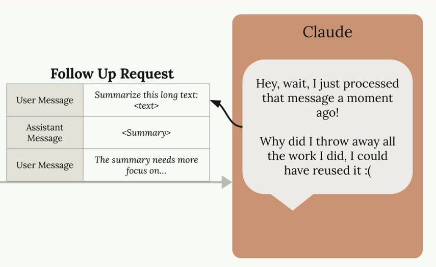
</p>

### How Prompt Caching Solves This

Prompt caching changes this workflow by saving the preprocessing work instead of discarding it:

<p align="center">
  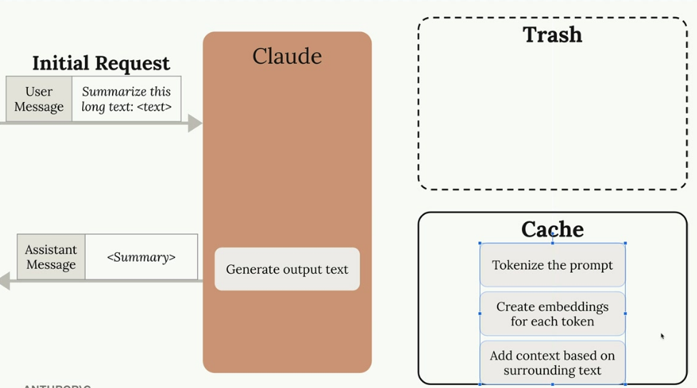
</p>

When you make an initial request, Claude performs all the usual preprocessing but stores the results in a cache instead of throwing them away. The cache acts like a lookup table that says "If I ever see this message again, I'll reuse this work I already did."

<p align="center">
  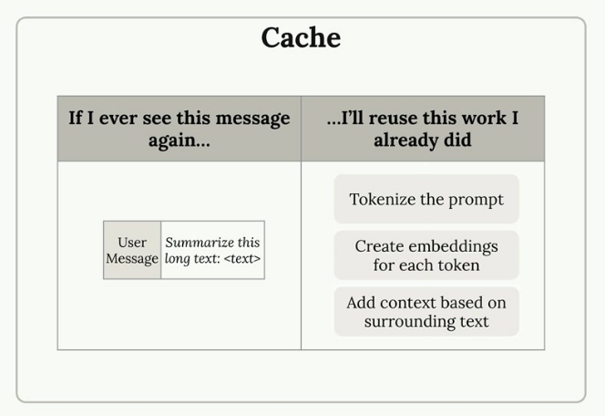
</p>

### Key Benefits and Limitations

<p align="center">
  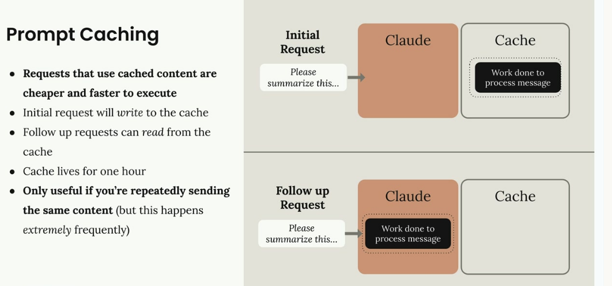
</p>

**Prompt caching offers several advantages:**

* `Faster responses:` Requests using cached content execute more quickly
* `Lower costs:` You pay less for the cached portions of your requests
* `Automatic optimization:` The initial request writes to the cache, follow-up requests read from it

**Important limitations of prompt caching**

* `Cache duration:` Cached content only lives for one hour 🥺
* `Limited use cases:` Only beneficial when you're repeatedly sending the same content
* `High frequency requirement:` Most effective when the same content appears extremely frequently in your requests

Prompt caching works best for scenarios like document analysis workflows, where you're asking multiple questions about the same large document, or iterative editing tasks where the base content remains constant while you refine specific aspects.

## Rules of Prompt Caching

Prompt caching in Claude works by storing the computational work done on your messages so it can be reused in follow-up requests. This makes subsequent requests both faster and cheaper to execute, but only when you're repeatedly sending identical content.

<p align="center">
  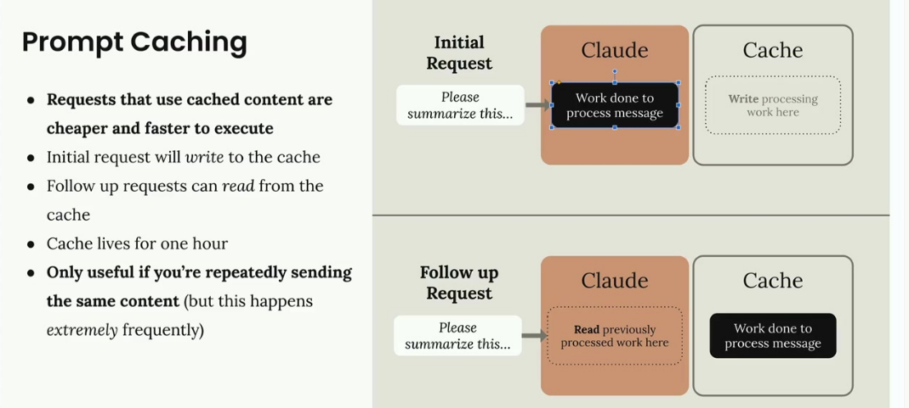
</p>

The process is straightforward: your initial request writes processing work to the cache, and follow-up requests can read from that cache instead of reprocessing the same content. The cache lives for one hour, so this feature is only useful if you're repeatedly sending the same content within that timeframe.

### Cache Breakpoints

**Caching isn't enabled automatically** - you need to manually add cache breakpoints to specific blocks in your messages. Here's how it works:

* Work done on messages is not cached automatically
* You must manually add a 'cache breakpoint' to a block
* Work done for everything before the breakpoint will be cached
* Cache will only be used on follow-up requests if the content up to and including the breakpoint is identical

To add a cache breakpoint, you need to use the **longhand form** for writing text blocks instead of the shorthand:

<table>
<tr>
<th>Shorthand form</th>
<th>Longhand form</th>
</tr>
<tr>
<td>

```json
{
  "role": "user",
  "content": "How far is Jupiter from the Sun?"
}
```

</td>
<td>

```json
{
  "role": "user",
  "content": [
    {
      "type": "text",
      "text": "How far is Jupiter from the Sun?",
      "cache_control": { "type": "ephemeral" }
    }
  ]
}
```

</td>
</tr>
</table>

The shorthand form doesn't provide a place to add the `cache control` field, so you must use the expanded format with the `cache_control` field set to `{"type": "ephemeral"}`.

### How Cache Breakpoints Work

When you place a cache breakpoint in a message, Claude **caches all the processing work up to and including that breakpoint**. Content after the breakpoint is processed normally without caching.

<p align="center">
  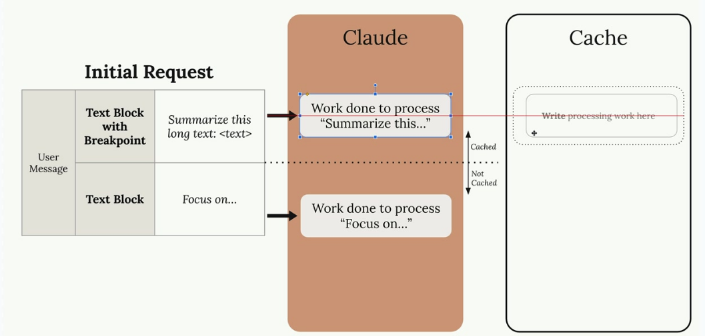
</p>

For the cache to be useful in follow-up requests, the content must be identical up to the breakpoint. Even small changes like adding the word "please" will invalidate the cache and force Claude to reprocess everything.

### Cross-Message Caching

Cache breakpoints can span across multiple messages and message types. If you place a breakpoint in a later message, all previous messages (user, assistant, etc.) will be included in the cached content.


This is particularly useful for conversations where you want to cache the entire context up to a certain point.

System Prompts and Tools
You're not limited to text blocks - cache breakpoints can be added to:

System prompts
Tool definitions
Image blocks
Tool use and tool result blocks

System prompts and tool definitions are excellent candidates for caching since they rarely change between requests. This is often where you'll get the most benefit from prompt caching.

Cache Ordering
Behind the scenes, Claude processes your request components in a specific order: tools first, then system prompt, then messages. Understanding this order helps you place breakpoints effectively.


You can add up to four cache breakpoints total. For example, you might cache your tools, then add another breakpoint partway through your conversation history. This gives you flexibility in what gets cached when different parts of your request change.


Minimum Content Length
There's a minimum threshold for caching: content must be at least 1024 tokens long to be cached. This is the sum of all messages and blocks you're trying to cache, not individual blocks.


A simple "Hi there!" message won't meet this threshold, but if you duplicate that content 500 times (or have a genuinely long prompt), it will exceed 1024 tokens and be eligible for caching.

The key to effective prompt caching is identifying which parts of your requests stay consistent across multiple calls and placing breakpoints strategically to maximize reuse while minimizing cache invalidation.