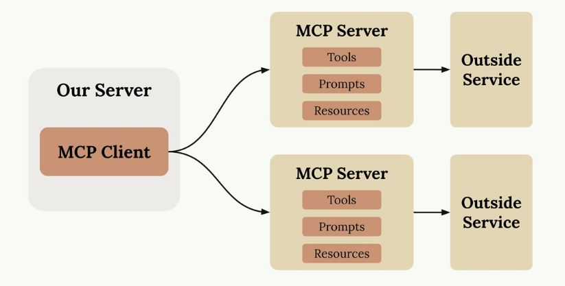
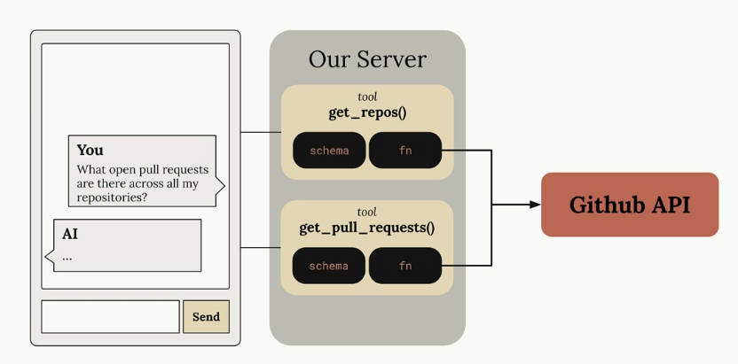
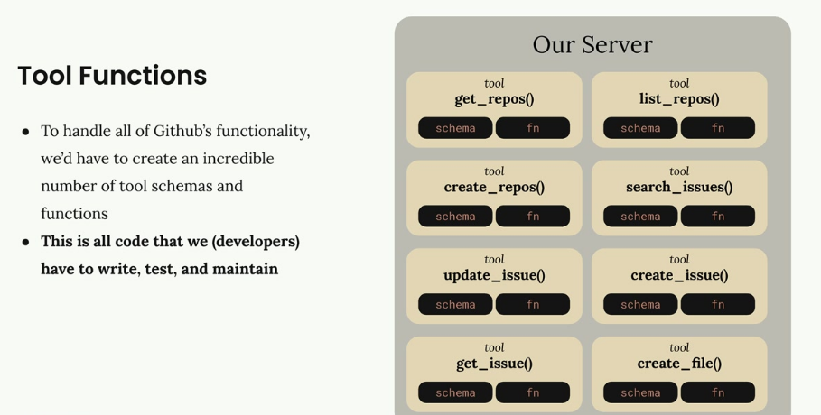
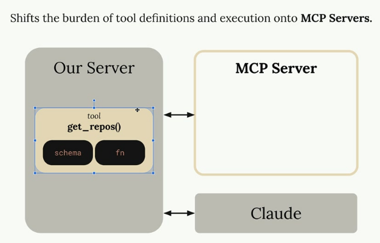
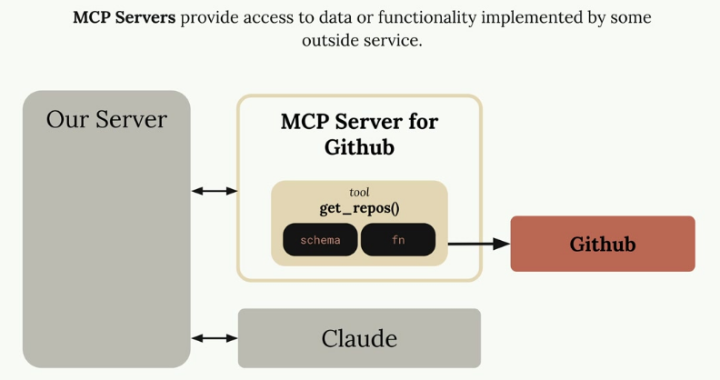
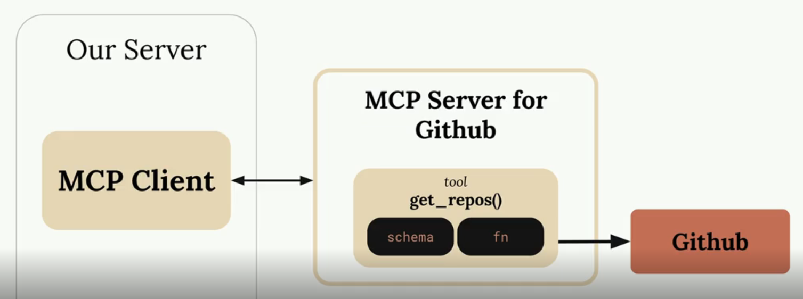
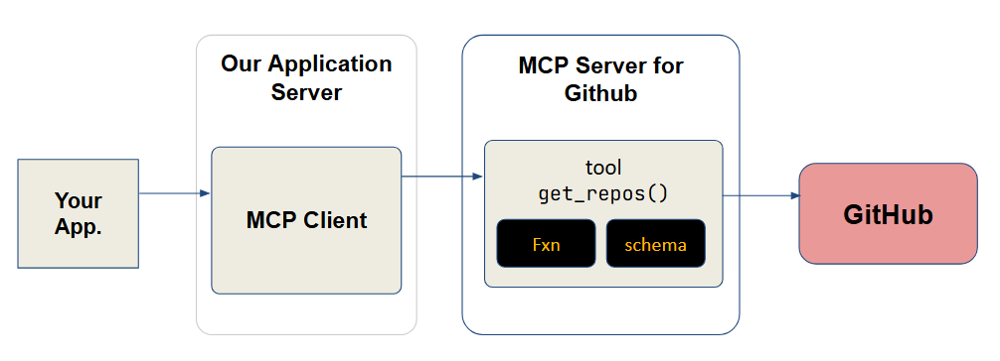
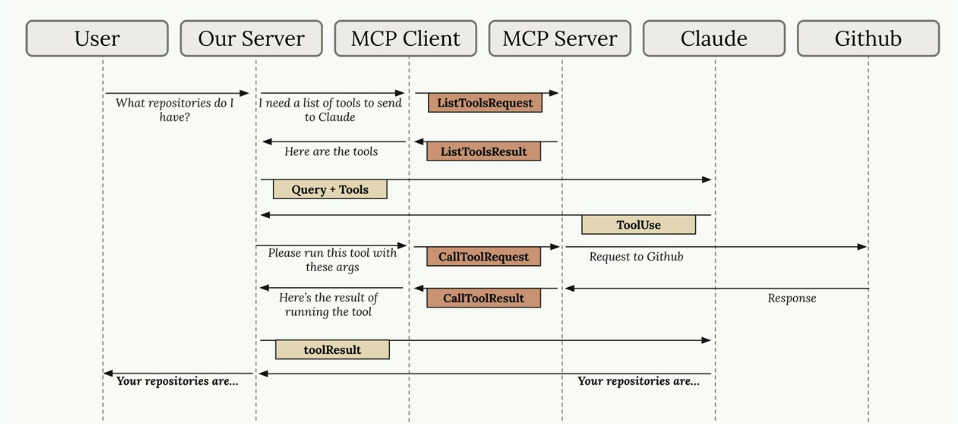
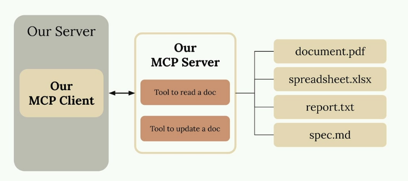

# The Model Context Protocol (MCP)

## Introducing MCP

Model Context Protocol (MCP) is a communication layer that provides Claude with context and tools without requiring you to write a bunch of tedious integration code. Think of it as a way to shift the burden of tool definitions and execution away from your server to specialized MCP servers.



When you first encounter MCP, you'll see diagrams showing the basic architecture: an MCP Client (your server) connecting to MCP Servers that contain tools, prompts, and resources. Each MCP server acts as an interface to some outside service.

### Understanding MCP Through a Real Example

Let's say you're building a chat interface where users can ask Claude about their GitHub data. A user might ask `"What open pull requests are there across all my repositories?"` To answer this, Claude needs tools to access GitHub's API.



**Without MCP, you'd need to create all the GitHub integration tools yourself**. This means writing schemas and functions for every piece of GitHub functionality you want to support.

### The Tool Function Problem

GitHub has massive functionality - repositories, pull requests, issues, projects, and much more. To build a complete GitHub chatbot, you'd need to author an incredible number of tools:



Each tool requires both a schema definition and a function implementation. This represents a lot of code that you have to write, test, and maintain as a developer.

### How MCP Solves This

MCP shifts the burden of tool definitions and execution from your server to MCP servers. Instead of you writing all those GitHub tools, they're authored and executed inside a dedicated MCP server, maintained presumably by Github themselves.



The MCP server acts as a wrapper around GitHub's functionality, providing pre-built tools that you can use without having to implement them yourself.



MCP servers provide access to data or functionality implemented by outside services. They package up complex integrations into reusable components that any application can connect to.

### Common Questions About MCP

#### Who Authors MCP Servers?

Anyone can create an MCP server implementation. Often, service providers themselves will make their own official MCP implementations. For example, AWS might release an official MCP server with tools for their various services, Github for the git-hub interface and so on.

#### How is MCP Different from Direct API Calls?

MCP servers provide tool schemas and functions already defined for you. If you call an API directly, you're responsible for authoring those tool definitions yourself. MCP saves you that implementation work.

#### Isn't MCP Just Tool Use?

This is a common misconception. MCP servers and tool use are complementary but different concepts. MCP is about who does the work of creating and maintaining the tools. With MCP, someone else has already written the tool functions and schemas for you - they're packaged inside the MCP server.

The key insight is that MCP servers provide tool schemas and functions already defined for you, eliminating the need to build and maintain complex integrations yourself.

## MCP Clients

The MCP client serves as the _communication bridge_ between your server and MCP servers. Think of it as your access point to all the tools that an MCP server provides. When you need to use external tools or services, the client handles all the message passing and protocol details for you. 



The MCP client sits between your application and the MCP server. Taking the example of Github, your app will connect to the Github MCP client running in your app server, which will connect to the MCP server (with the Github tools implementation), which will connect to Github. 



### Transport Agnostic Communication

One of MCP's key strengths is being transport agnostic - a fancy way of saying the client and server can talk to each other using different communication methods. 

* One kind of setup runs both the MCP client and server on the same machine, where they communicate through standard input/output. This is where your MCP server runs locally on the same machine your app server/app runs on.
* But you're not limited to that approach. MCP clients and servers can also connect over:
    * HTTP
    * WebSockets
    * Various other network protocols

### Message Types

Once connected, the client and server exchange specific message types defined in the MCP specification. The main message types you'll work with are:

* `ListToolsRequest`/`ListToolsResult`: The client asks the server "What tools do you provide?" and gets back a list of available tools.
* `CallToolRequest`/`CallToolResult`: The client asks the server to run a specific tool with certain arguments, then receives the results.

### Complete Flow Example

Here's how all the pieces work together in a real scenario. Let's say a user asks "What repositories do I have?" - here's the complete communication flow:



1. The process starts when a user submits a query to your server. Your server realizes it needs to provide Claude with a list of available tools before making the request.
2. Your server asks the MCP client for tools, which sends a `ListToolsRequest` to the MCP server and receives a `ListToolsResult` back.
3. Now your server has everything needed to make the initial request to Claude - both the user's question and the available tools.
4. Claude examines the tools and decides it needs to call one to answer the question. It responds with a tool use request.
5. Your server asks the MCP client to execute the tool Claude requested. The MCP client sends a `CallToolRequest` to the MCP server, which then makes the actual request to GitHub.
6. GitHub returns the repository data, which flows back through the MCP server as a `CallToolResult`, then to the MCP client, and finally to your server.
7. Your server sends the tool results back to Claude in a follow-up message. Claude now has all the information it needs to formulate a complete response.
8. Finally, Claude responds with the formatted answer, which your server passes back to the user.

Yes, this flow involves many steps, but each component has a clear responsibility. The MCP client abstracts away the complexity of server communication, letting you focus on building your application logic. As we implement our own MCP client and server, you'll see how each piece fits together in practice.The MCP client serves as the communication bridge between your server and MCP servers. Think of it as your access point to all the tools that an MCP server provides. When you need to use external tools or services, the client handles all the message passing and protocol details for you.

## Project Illustration

We're going to build a CLI-based chatbot to better understand how MCP clients and servers work together.  Our chatbot will allow users to interact with a collection of documents through a command-line interface. The system consists of two main components:

* An MCP client that handles user interactions
* A custom MCP server that manages document operations



The server will provide two essential tools: one for reading document contents and another for updating them. All documents will be stored in memory for simplicity - no database required. We are going to build our MCP client that is going to connect with our own MCP Server.

### Installing Project Dependencies

We'll the following Python libraries for this project. We'll install them using `uv` as below:

```bash
uv add anthropic python-dotenv prompt-toolkit "mcp[cli]==1.8.0"
```


