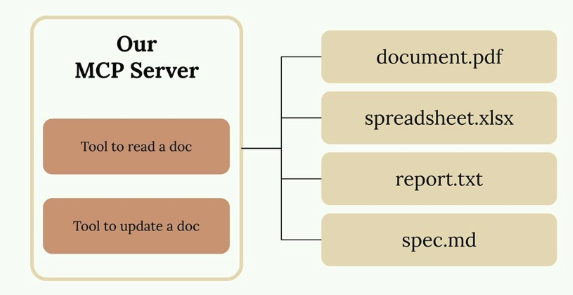
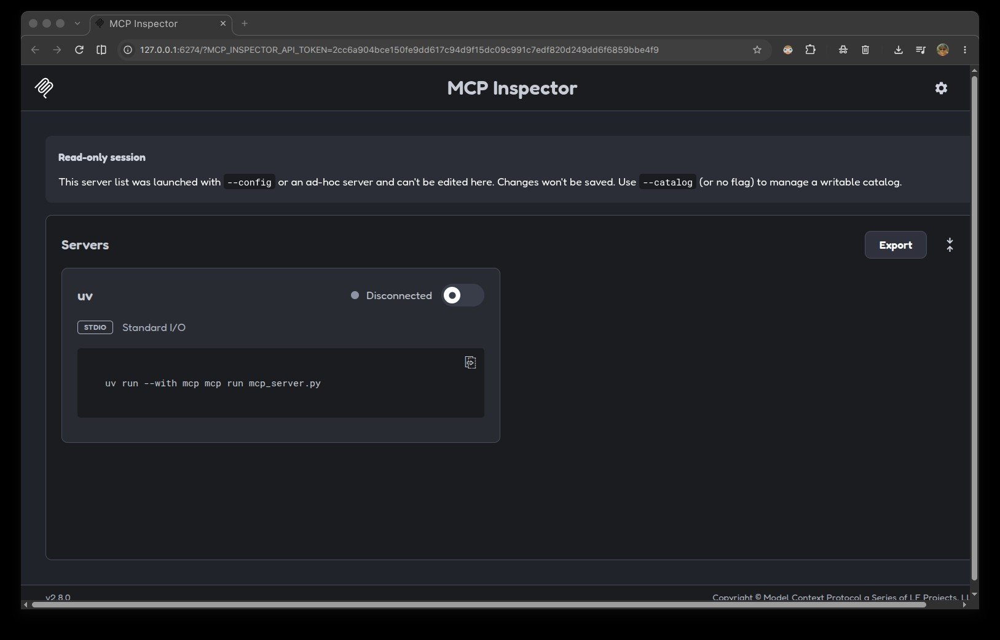
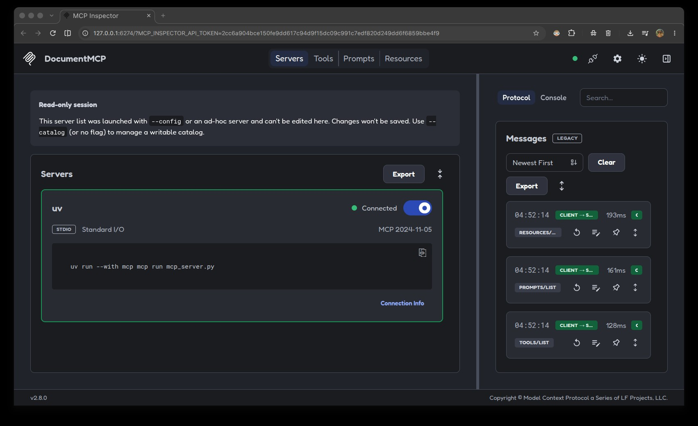
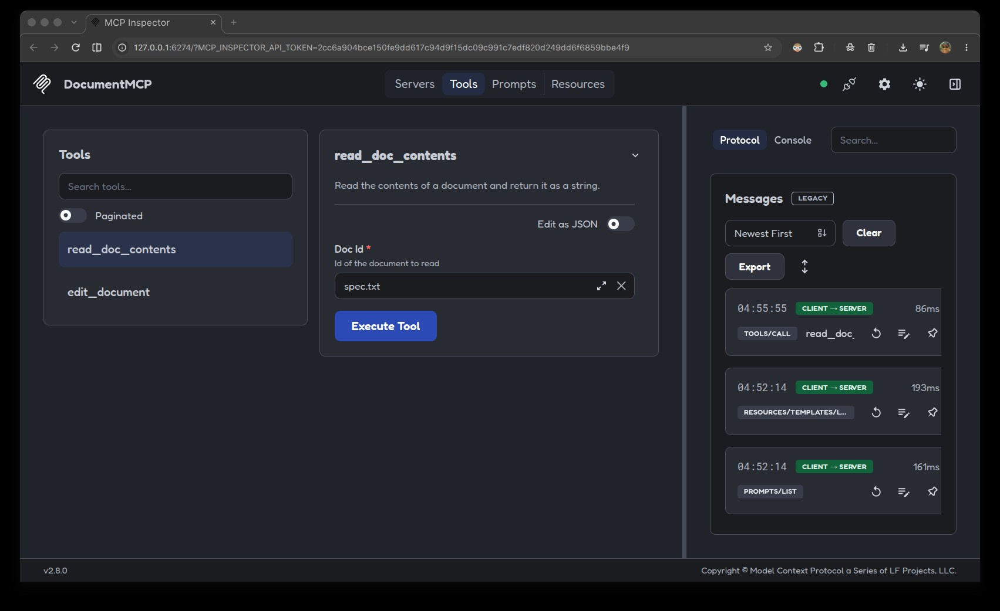
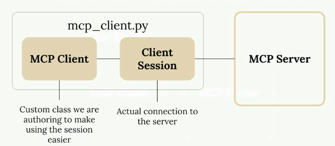
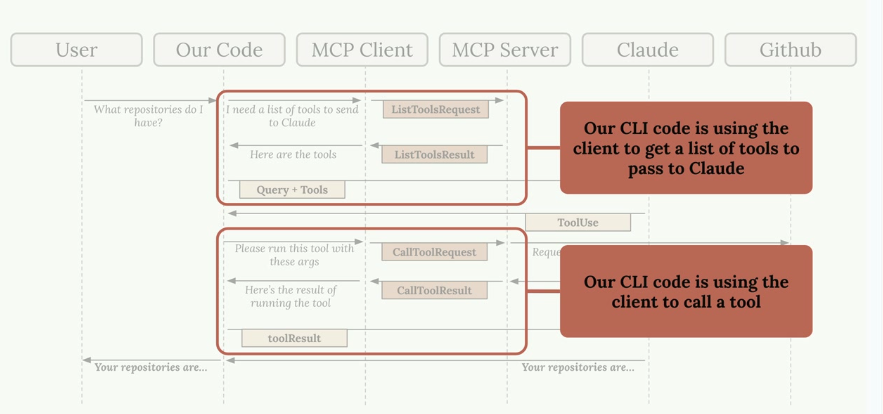

# The Model Context Protocol (MCP)

## Introducing MCP

Model Context Protocol (MCP) is a communication layer that provides Claude with context and tools without requiring you to write a bunch of tedious integration code. Think of it as a way to shift the burden of tool definitions and execution away from your server to specialized MCP servers.


When you first encounter MCP, you'll see diagrams showing the basic architecture: an MCP Client (your server) connecting to MCP Servers that contain tools, prompts, and resources. Each MCP server acts as an interface to some outside service.

### Understanding MCP Through a Real Example

Let's say you're building a chat interface where users can ask Claude about their GitHub data. A user might ask `"What open pull requests are there across all my repositories?"` To answer this, Claude needs tools to access GitHub's API.


**Without MCP, you'd need to create all the GitHub integration tools yourself**. This means writing schemas and functions for every piece of GitHub functionality you want to support.

### The Tool Function Problem

GitHub has massive functionality - repositories, pull requests, issues, projects, and much more. To build a complete GitHub chatbot, you'd need to author an incredible number of tools:


Each tool requires both a schema definition and a function implementation. This represents a lot of code that you have to write, test, and maintain as a developer.

### How MCP Solves This

MCP shifts the burden of tool definitions and execution from your server to MCP servers. Instead of you writing all those GitHub tools, they're authored and executed inside a dedicated MCP server, maintained presumably by Github themselves.


The MCP server acts as a wrapper around GitHub's functionality, providing pre-built tools that you can use without having to implement them yourself.


MCP servers provide access to data or functionality implemented by outside services. They package up complex integrations into reusable components that any application can connect to.

### Common Questions About MCP

#### Who Authors MCP Servers?

Anyone can create an MCP server implementation. Often, service providers themselves will make their own official MCP implementations. For example, AWS might release an official MCP server with tools for their various services, Github for the git-hub interface and so on.

#### How is MCP Different from Direct API Calls?

MCP servers provide tool schemas and functions already defined for you. If you call an API directly, you're responsible for authoring those tool definitions yourself. MCP saves you that implementation work.

#### Isn't MCP Just Tool Use?

This is a common misconception. MCP servers and tool use are complementary but different concepts. MCP is about who does the work of creating and maintaining the tools. With MCP, someone else has already written the tool functions and schemas for you - they're packaged inside the MCP server.

The key insight is that MCP servers provide tool schemas and functions already defined for you, eliminating the need to build and maintain complex integrations yourself.

## MCP Clients

The MCP client serves as the _communication bridge_ between your server and MCP servers. Think of it as your access point to all the tools that an MCP server provides. When you need to use external tools or services, the client handles all the message passing and protocol details for you. 


The MCP client sits between your application and the MCP server. Taking the example of Github, your app will connect to the Github MCP client running in your app server, which will connect to the MCP server (with the Github tools implementation), which will connect to Github. 


### Transport Agnostic Communication

One of MCP's key strengths is being transport agnostic - a fancy way of saying the client and server can talk to each other using different communication methods. 

* One kind of setup runs both the MCP client and server on the same machine, where they communicate through standard input/output. This is where your MCP server runs locally on the same machine your app server/app runs on.
* But you're not limited to that approach. MCP clients and servers can also connect over:
    * HTTP
    * WebSockets
    * Various other network protocols

### Message Types

Once connected, the client and server exchange specific message types defined in the MCP specification. The main message types you'll work with are:

* `ListToolsRequest`/`ListToolsResult`: The client asks the server "What tools do you provide?" and gets back a list of available tools.
* `CallToolRequest`/`CallToolResult`: The client asks the server to run a specific tool with certain arguments, then receives the results.

### Complete Flow Example

Here's how all the pieces work together in a real scenario. Let's say a user asks "What repositories do I have?" - here's the complete communication flow:


1. The process starts when a user submits a query to your server. Your server realizes it needs to provide Claude with a list of available tools before making the request.
2. Your server asks the MCP client for tools, which sends a `ListToolsRequest` to the MCP server and receives a `ListToolsResult` back.
3. Now your server has everything needed to make the initial request to Claude - both the user's question and the available tools.
4. Claude examines the tools and decides it needs to call one to answer the question. It responds with a tool use request.
5. Your server asks the MCP client to execute the tool Claude requested. The MCP client sends a `CallToolRequest` to the MCP server, which then makes the actual request to GitHub.
6. GitHub returns the repository data, which flows back through the MCP server as a `CallToolResult`, then to the MCP client, and finally to your server.
7. Your server sends the tool results back to Claude in a follow-up message. Claude now has all the information it needs to formulate a complete response.
8. Finally, Claude responds with the formatted answer, which your server passes back to the user.

Yes, this flow involves many steps, but each component has a clear responsibility. The MCP client abstracts away the complexity of server communication, letting you focus on building your application logic. As we implement our own MCP client and server, you'll see how each piece fits together in practice.The MCP client serves as the communication bridge between your server and MCP servers. Think of it as your access point to all the tools that an MCP server provides. When you need to use external tools or services, the client handles all the message passing and protocol details for you.

## Project Illustration

We're going to build a CLI-based chatbot to better understand how MCP clients and servers work together.  Our chatbot will allow users to interact with a collection of documents through a command-line interface. The system consists of two main components:

* An MCP client that handles user interactions
* A custom MCP server that manages document operations


The server will provide two essential tools: one for reading document contents and another for updating them. All documents will be stored in memory for simplicity - no database required. We are going to build our MCP client that is going to connect with our own MCP Server.

### Installing Project Dependencies

We'll need to install the following Python libraries for this project. We'll install them using `uv` as below:

```bash
uv add anthropic python-dotenv prompt-toolkit "mcp[cli]==1.8.0"
```

## Creating the MCP Server

Building an MCP server becomes much simpler when you use the official Python SDK. Instead of manually writing complex JSON schemas for tools, the SDK handles all that complexity for you with decorators and type hints.



In this example, we're creating an MCP server that manages documents stored in memory. The server will provide two essential tools: one to read document contents and another to update them through find-and-replace operations.

### Setting Up the MCP Server

(@see code: `mcp_server.py`)

The Python MCP SDK makes server creation incredibly straightforward. You can initialize a complete MCP server with just one line:

```python
from mcp.server.fastmcp import FastMCP

mcp = FastMCP("DocumentMCP", log_level="ERROR")
```

For this implementation, documents are stored in a simple Python dictionary where keys are document IDs and values contain the document content:

```python
docs = {
    "deposition.md": "This deposition covers the testimony of Angela Smith, P.E.",
    "report.pdf": "The report details the state of a 20m condenser tower.",
    "financials.docx": "These financials outline the project's budget and expenditure",
    "outlook.pdf": "This document presents the projected future performance of the",
    "plan.md": "The plan outlines the steps for the project's implementation.",
    "spec.txt": "These specifications define the technical requirements for the equipment"
}
```

### Tool Definition with Decorators

The SDK transforms tool creation from a verbose process into something clean and readable. Instead of writing lengthy JSON schemas, you use Python decorators and type hints.

#### Creating the Document Reader Tool

The first tool allows Claude to read any document by its ID. Here's the complete implementation:

```python
@mcp.tool(
    name="read_doc_contents",
    description="Read the contents of a document and return it as a string."
)
def read_document(
    doc_id: str = Field(description="Id of the document to read")
):
    if doc_id not in docs:
        raise ValueError(f"Doc with id {doc_id} not found")
    
    return docs[doc_id]
```

The `@mcp.tool` decorator automatically generates the JSON schema that Claude needs. The `Field` class from Pydantic provides parameter descriptions that help Claude understand what each argument expects.

#### Building the Document Editor Tool

The second tool performs simple find-and-replace operations on documents:

```python
@mcp.tool(
    name="edit_document",
    description="Edit a document by replacing a string in the documents content with a new string."
)
def edit_document(
    doc_id: str = Field(description="Id of the document that will be edited"),
    old_str: str = Field(description="The text to replace. Must match exactly, including whitespace."),
    new_str: str = Field(description="The new text to insert in place of the old text.")
):
    if doc_id not in docs:
        raise ValueError(f"Doc with id {doc_id} not found")
    
    docs[doc_id] = docs[doc_id].replace(old_str, new_str)
```

This tool takes three parameters: `doc_id` (the document ID), `old_str` (the text to find), and `new_str` (the replacement text). The implementation uses Python's built-in string `replace()` method for simplicity.

#### Error Handling

Both tools include basic error handling to manage cases where Claude requests a document that doesn't exist. When an invalid document ID is provided, the tools raise a `ValueError` with a descriptive message that Claude can understand and potentially act upon.

### Key Benefits of the SDK Approach

* Automatic JSON schema generation from Python type hints
* Clean, readable code that's easy to maintain
* Built-in parameter validation through Pydantic
* Reduced boilerplate compared to manual schema writing
* Type safety and IDE support for development

The MCP Python SDK transforms what used to be a complex process of writing tool definitions into something that feels natural for Python developers. You focus on the business logic while the SDK handles the protocol details.

### Testing the MCP Server - The Server Inspector

When building MCP servers, you need a way to test your functionality without connecting to a full application. The Python MCP SDK includes a built-in browser-based inspector that lets you debug and test your server in real-time.

#### Starting the Inspector

First, make sure your Python environment is activated. Then run the inspector with:

```bash
uv run mcp dev mcp_server.py
```

This starts a development server on port `6275` and gives you a local URL to open in your browser. The inspector interface will load, showing the MCP Inspector dashboard.



> 📌 **Important Note About the Interface**
>
> The MCP inspector is actively being developed, so the interface you see might look different from current screenshots. However, the core functionality for testing tools, resources, and prompts should remain similar.

Click the "Connect" slider button connected to your MCP server. Once connected, you'll see a navigation bar along the top with sections for Resources, Prompts, Tools, and other features. You will also see a "monitoring sidebar" along the right edge of the screen, which you can close.



#### To test your tools:

* Click the "Tools" option on the top navigation bar
* You will see the screen shown below
* Select a tool you want to test (e.g. `read_doc_contents`)
* Fill in the required parameters on right panel
* Click "Execute Tool" to execute and see results
* The right panel will be replaced by output of the tool



For example, to test a document reading tool, you'd enter a document ID (like "deposition.md") and run the tool. The inspector shows the result, including any returned content or success messages.

You can chain operations to verify functionality. For instance, after editing a document by replacing text, you can immediately run the read tool again to confirm the changes were applied correctly.

#### Development Workflow

The inspector creates an efficient development loop:

* Make changes to your MCP server code
* Test individual tools through the inspector
* Verify results without needing a full application setup
* Debug issues in isolation

This tool becomes essential as you build more complex MCP servers. It eliminates the need to wire up your server to Claude or another application just to test basic functionality, making development much faster and more focused.

## Creating the MCP Client

Now that we have our MCP server working, it's time to build the client side. The client is what allows our application to communicate with the MCP server and access its functionality.

### Understanding the Client Architecture

In most real-world projects, you'll either implement an MCP client OR an MCP server - not both. We're building both in this project just so you can see how they work together.

The MCP client consists of two main components:

* `Client Session` - The actual connection to the server (part of the MCP Python SDK)
* `MCP Client` - A custom class we create to make using the session easier



The client session requires proper resource cleanup when we're done with it. That's why we wrap it in our custom MCP Client class - to handle all that cleanup automatically.

### How the Client Fits Into Our Application

Remember our application flow? Our CLI code needs to do two main things with the MCP server:

* Get a list of available tools to send to Claude
* Execute tools when Claude requests them



The MCP client provides these capabilities through simple method calls that our application code can use.

### Implementing the Core Methods

We need to implement two key methods in our client: `list_tools()` and `call_tool()`.

#### List Tools Method

This method gets all available tools from the server:

```python
async def list_tools(self) -> list[types.Tool]:
    result = await self.session().list_tools()
    return result.tools
```

It's straightforward - we access our `session` (the connection to the server), call the built-in `list_tools()` function, and return the tools from the result.

#### Call Tool Method

This method executes a specific tool on the server:

```python
async def call_tool(
    self, tool_name: str, tool_input: dict
) -> types.CallToolResult | None:
    return await self.session().call_tool(tool_name, tool_input)
```

We pass the tool name and input parameters (provided by Claude) to the server and return the result.

### Testing the Client

To test our implementation, we can run the client directly. The file includes a testing harness that connects to our MCP server and calls our methods:

```python
# @see mcp_client.py
async with MCPClient(
    command="uv", args=["run", "mcp_server.py"]
) as client:
    result = await client.list_tools()
    print(result)
```

When we run this test, we should see our tool definitions printed out, including the read_doc_contents and edit_document tools we created earlier.

#### Putting It All Together

Now that our client can list tools and call them, we can test the complete flow. When we run our main application and ask Claude about a document:

* Our code uses the client to get available tools
* These tools are sent to Claude along with the user's question
* Claude decides to use the read_doc_contents tool
* Our code uses the client to execute that tool
* The result is sent back to Claude, who then responds to the user

For example, asking `"What is the contents of the report.pdf document?"` will trigger Claude to use our document reading tool, and we'll get back information about the 20m condenser tower document we set up in our server.

The client acts as the bridge between our application logic and the MCP server, making it easy to access server functionality without worrying about the underlying connection details.

## Accessing Resources

Resources in MCP allow your server to expose data that can be directly included in prompts, rather than requiring tool calls to access information. This creates a more efficient way to provide context to AI models like Claude.

### Understanding Resource Requests

When you've defined resources on your MCP server, your client needs a way to request and use them. The client acts as a bridge between your application and the MCP server, handling the communication and data parsing automatically.


The flow is straightforward: when a user wants to reference a document (like typing "@report.pdf"), your application uses the MCP client to fetch that resource from the server and include its contents directly in the prompt sent to Claude.

Implementing Resource Reading
The core functionality requires a read_resource function in your MCP client. This function takes a URI parameter identifying which resource to fetch:

async def read_resource(self, uri: str) -> Any:
    result = await self.session().read_resource(AnyUrl(uri))
    resource = result.contents[0]
The response from the MCP server contains a contents list. You typically only need the first element, which contains the actual resource data along with metadata like the MIME type.

Handling Different Content Types
Resources can return different types of content, so your client needs to parse them appropriately. The MIME type tells you how to handle the data:

if isinstance(resource, types.TextResourceContents):
    if resource.mimeType == "application/json":
        return json.loads(resource.text)
    
    return resource.text
This approach ensures that JSON resources are properly parsed into Python objects, while plain text resources are returned as strings. The MIME type acts as your hint for determining the correct parsing strategy.

Required Imports
To make this work properly, you'll need these imports in your MCP client:

import json
from pydantic import AnyUrl
The json module handles parsing JSON responses, while AnyUrl ensures proper type handling for the URI parameter.

Testing Resource Access
Once implemented, you can test the functionality through your CLI application. When you type something like "What's in the @report.pdf document?", the system should:

Show available resources in an autocomplete list
Allow you to select a resource
Fetch the resource content automatically
Include that content in the prompt to Claude

The key advantage is that Claude receives the document content directly in the prompt, eliminating the need for tool calls to access the information. This makes interactions faster and more efficient.

Integration with Your Application
Remember that the MCP client code you write gets used by other parts of your application. The read_resource function becomes a building block that other components can call to fetch document contents, list available resources, or integrate resource data into prompts.

This separation of concerns keeps your code clean: the MCP client handles communication with the server, while your application logic focuses on how to use that data effectively.