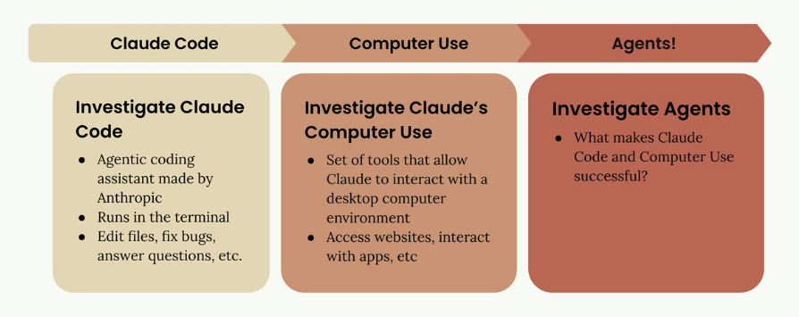
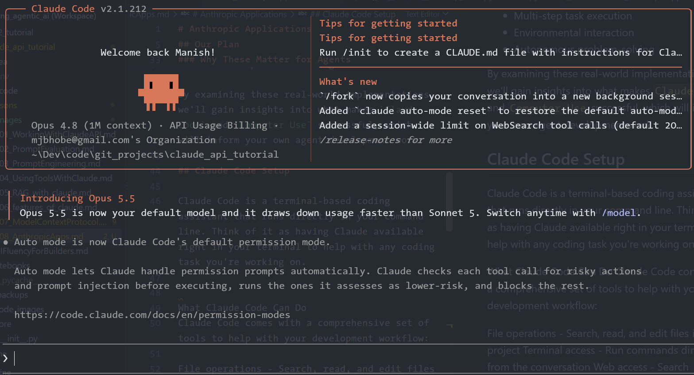
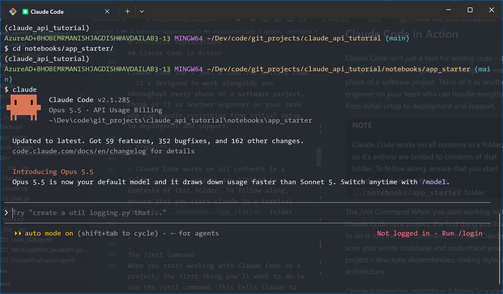
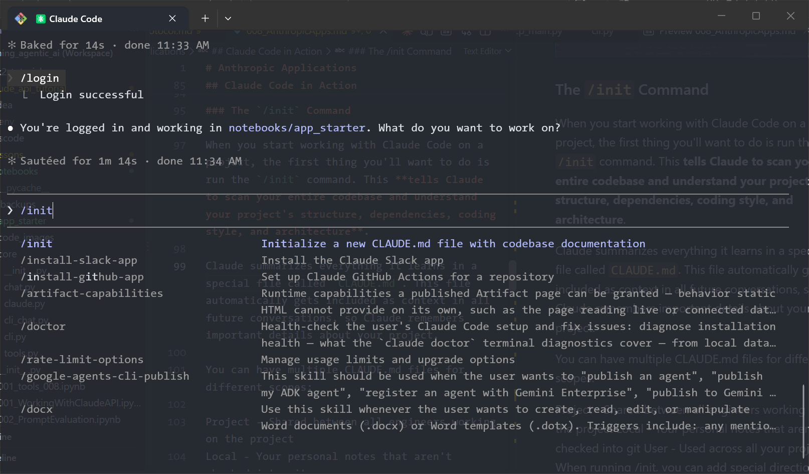
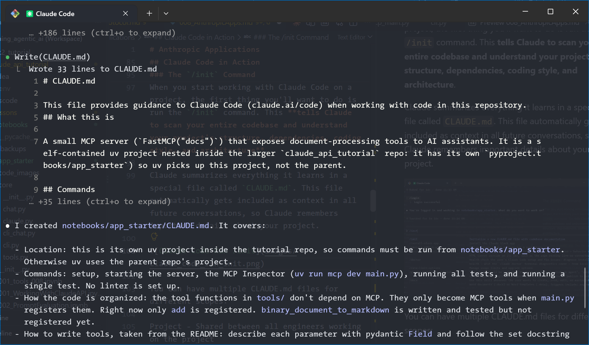
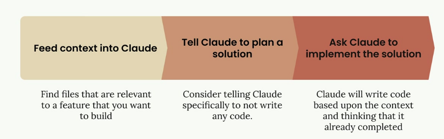

# Anthropic Applications

In this document, we'll explore two powerful applications built by Anthropic: `Claude Code` and `Computer Use`. These aren't just useful tools on their own - they're perfect examples of AI agents in action. By understanding how they work, you'll get a solid foundation for building your own agents later.

## Our Plan

We'll follow a progression that builds your understanding step by step:



* **Claude Code** - Start with this agentic coding assistant that runs in your terminal
* **Computer Use** - Explore this set of tools that lets Claude interact with desktop applications
* **Agents** - Understand what makes these applications successful as agents

### Claude Code

Claude Code is a **terminal-based coding assistant that can help you with various programming tasks**. Think of it as having Claude available right in your command line, ready to:

* Edit files and fix bugs
* Answer coding questions
* Help with development workflows

### Computer Use

Computer Use takes Claude's capabilities much further. It's a **collection of tools that allow Claude to interact with a full desktop computer environment**. This means Claude can:

* Access websites and browse the internet
* Interact with desktop applications
* Perform tasks that require visual interface navigation

This dramatically expands what's possible compared to text-only interactions.

### Why These Matter for Agents

Both `Claude Code` and `Computer Use` serve as excellent case studies for understanding agents. They demonstrate key principles that make agents effective:

* Tool integration and usage
* Multi-step task execution
* Environmental interaction
* Autonomous problem-solving

By examining these real-world implementations, we'll gain insights into what makes `Claude Code` and `Computer Use` successful, which will inform your own agent development work.

## Claude Code Setup

Claude Code is a terminal-based coding assistant that runs directly in your command line. Think of it as having Claude available right in your terminal to help with any coding task you're working on.

### What Claude Code Can Do

Claude Code comes with a comprehensive set of tools to help with your development workflow:

* **File operations** - Search, read, and edit files in your project
* **Terminal access** - Run commands directly from the conversation
* **Web access** - Search documentation, fetch code examples, and more
* **MCP Server support** - Add additional tools by connecting MCP servers

The MCP integration is particularly powerful because it means you can extend Claude Code's capabilities by adding specialized tools for databases, APIs, or any other services you work with.

Claude Code works across MacOS, Windows WSL, and Linux, so you can use it regardless of your development environment.

### Installation

1. Install `node.js`

Following instructions at [https://nodejs.org/en/download](https://nodejs.org/en/download) for your specific operating system.

2. Install Claude Code from your terminal

```bash
npm install -g @anthropic-ai/claude-code
```

3. Start Claude Code: In your terminal, navigate to any folder and then run `claude`. 

```bash
claude
```

When you run the `claude` command for the first time, it will prompt you to log in to your Anthropic account. The full setup guide is available at [docs.anthropic.com](docs.anthropic.com) if you need more detailed instructions.

Once you're set up, you'll have Claude available directly in your terminal, ready to help with any coding project or task you're working on.



## Claude Code in Action

Claude Code isn't just a tool for writing code - it's designed to work alongside you throughout every phase of a software project. Think of it as another engineer on your team who can handle everything from initial setup to deployment and support.

> **NOTE** 
>
> Claude Code works on all contents in a folder, so it's actions are limited to contents of that folder. To follow along, ensure that you start claude in a terminal from the `../notebooks/app_starter` folder.



Once you see the above screen, you should ask Claude Code to 

### The `/init` Command

When you start working with Claude Code on a project, the first thing you'll want to do is run the `/init` command. This **tells Claude to scan your entire codebase and understand your project's structure, dependencies, coding style, and architecture**.

Claude summarizes everything it learns in a special file called `CLAUDE.md`. This file automatically gets included as context in all future conversations, so Claude remembers important details about your project.



After scanning your project (current folder) files, claude will display a _report_ on the screen like so:



And if you scan the root folder of your project, you should see a new `CLAUDE.md` file that claude created for you.

> **NOTE**: the name `CLAUDE.md` is case-sensitive!

You can have multiple `CLAUDE.md` files for different scopes:

* Project - Shared between all engineers working on the project
* Local - Your personal notes that aren't checked into git
* User - Used across all your projects
When running /init, you can add special directions for areas you want Claude to focus on. The generated file will include build commands, coding guidelines, and project-specific patterns that Claude should follow.

You can also quickly add notes to your CLAUDE.md file using the # command. For example, typing `# Always use descriptive variable names that clearly indicate what the variable holds (e.g. cashBalance instead of cb). Use camelCase for variables, starting with lowercase letter.` will prompt you to add this guideline to your project, local, or user memory.

### Common Workflows

Claude works best when you approach it as an effort multiplier. The more context and structure you provide, the better results you'll get. Here's the most effective workflow:



1. **Step 1: Feed Context into Claude**

    Before asking Claude to build something, identify files in your codebase that are relevant to the feature you want to create. Ask Claude to read and analyze these files first. This gives Claude examples of your coding patterns and existing functionality it can build upon.

2. **Step 2: Tell Claude to Plan a Solution**

    Instead of jumping straight to implementation, ask Claude to think through the problem and create a plan. Tell Claude specifically not to write any code yet - just focus on the approach and steps needed.

3. **Step 3: Ask Claude to Implement the Solution**

    Once you have a solid plan, ask Claude to implement it. Claude will write code based on the context and planning work you've already done together.

Test-Driven Development Workflow
For even better results, you can use a test-driven approach:


Feed context into Claude - Same as before, show Claude relevant files
Ask Claude to think of test cases - Have Claude brainstorm what tests would validate your new feature
Ask Claude to implement those tests - Select the most relevant tests and have Claude write them
Ask Claude to write code that passes the tests - Claude will iterate on the implementation until all tests pass
This approach often produces more robust code because Claude has clear success criteria to work toward.

Practical Example
Here's how these workflows look in practice. Let's say you want to add a document conversion tool to an existing project:

// First, ask Claude to read relevant files
> Read the math.py and document.py files

// Then ask for planning (not implementation)
> Plan to implement document_path_to_markdown tool:
1. Create a function that:
   - Takes a file path parameter
   - Validates the file exists  
   - Determines file type from extension
   - Reads binary data from file
   - Leverages existing binary_document_to_markdown function
   - Returns markdown string
2. Add appropriate documentation
3. Register the tool with MCP server
4. Add tests

// Finally, ask for implementation
> Implement the plan
Claude will then create the function, update the necessary files, write tests, and even run the test suite to verify everything works correctly.

Additional Commands
Claude Code includes several helpful commands:

/clear - Clears conversation history and resets context
/init - Scans codebase and creates CLAUDE.md documentation
# - Adds notes to your CLAUDE.md file
Claude can also handle routine development tasks like staging and committing changes to git, running tests, and managing dependencies. Instead of switching between your editor and terminal, you can ask Claude to handle these tasks while you focus on the bigger picture.

The key to success with Claude Code is remembering that it's designed to be a collaborative partner, not just a code generator. The more context and structure you provide, the more effectively Claude can help you build and maintain your projects.