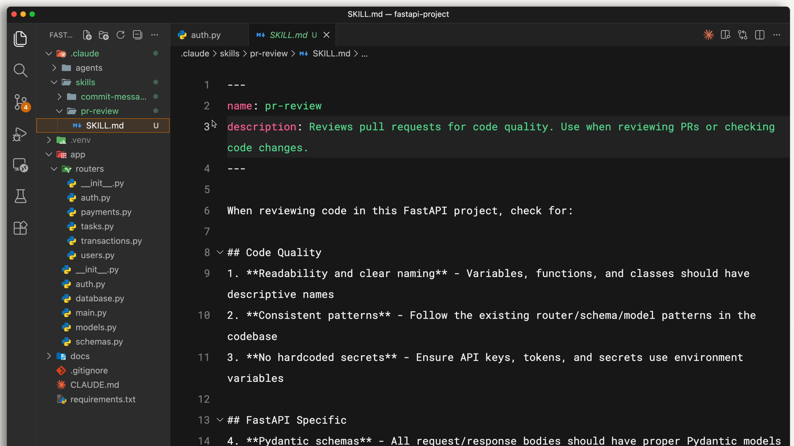
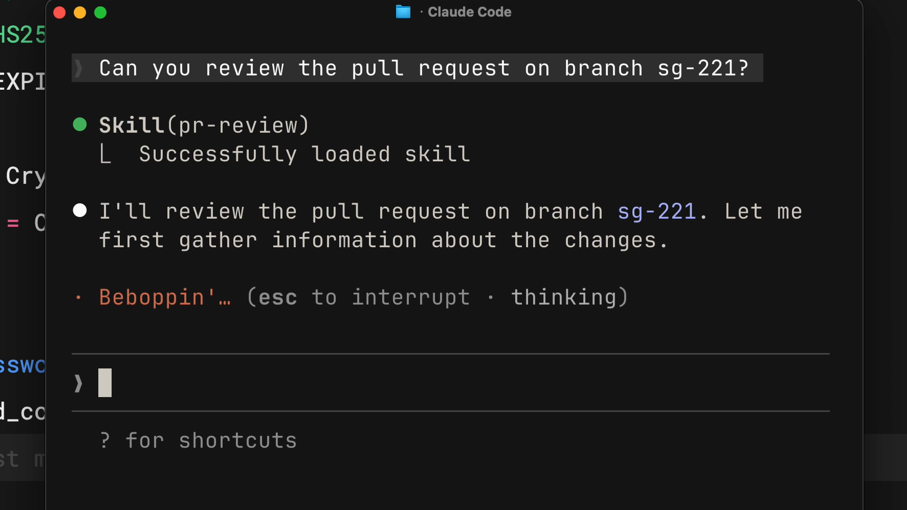
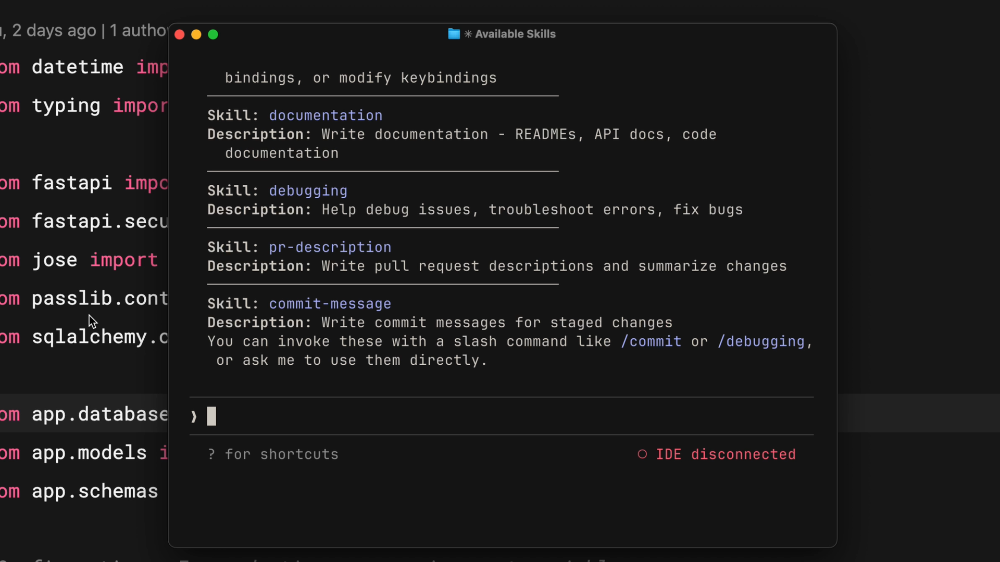
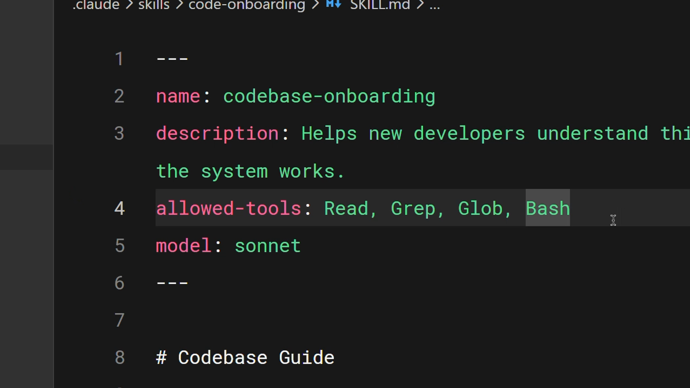
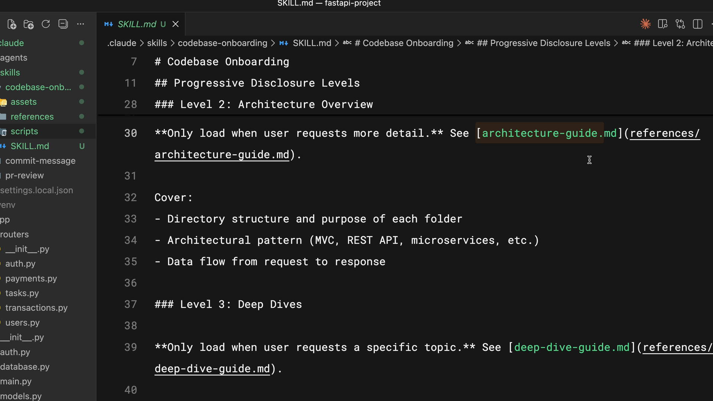
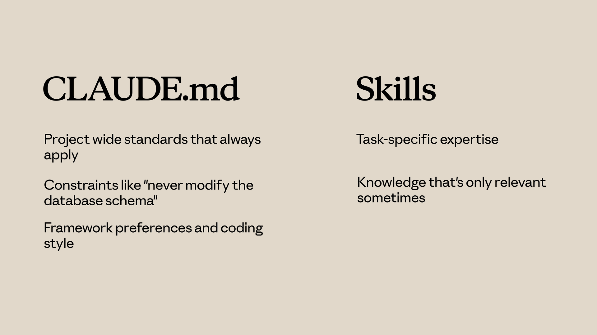
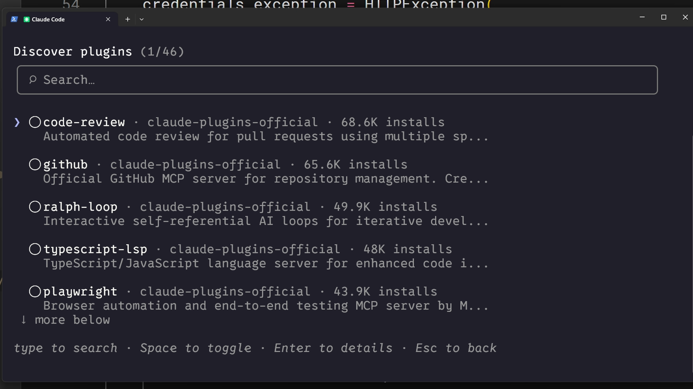
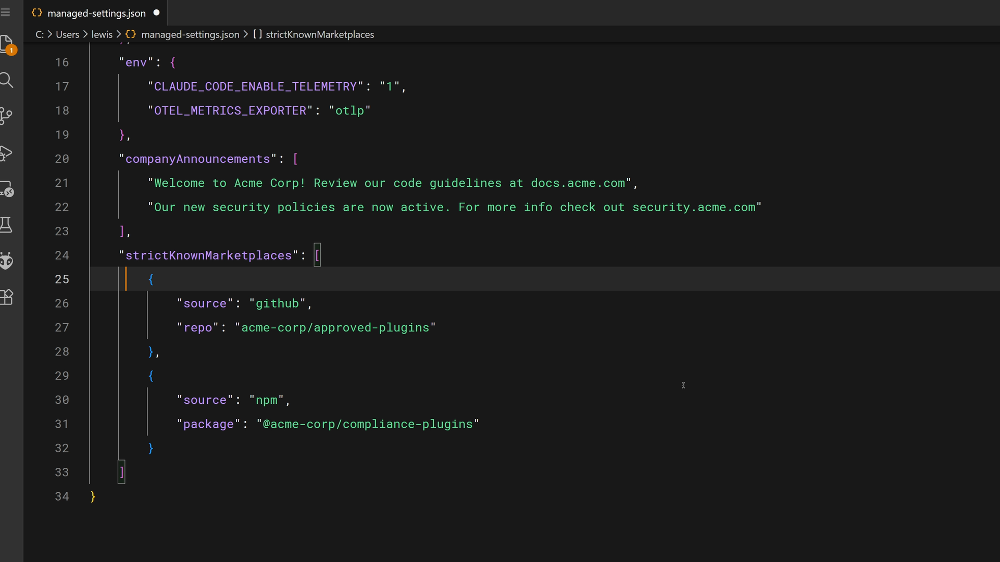
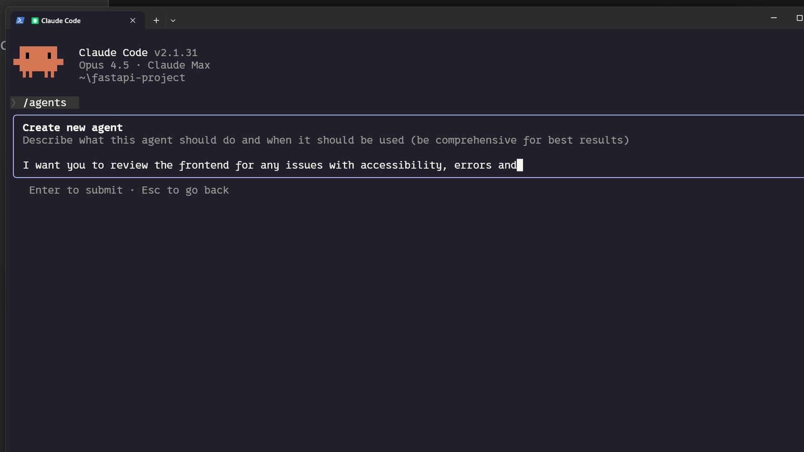

# Introduction to Agent Skills

## What are Skills?

**Skills are reusable markdown files** that teach Claude Code how to handle specific tasks automatically. Instead of repeating instructions every time you ask Claude to review a PR or write a commit message, you write a skill once and Claude applies it whenever the task comes up. This chapter covers what skills are, where they live, and how they compare to other Claude Code customization options.

### Key takeaways

* **Skills are folders of instructions, scripts and resources** that Claude Code can discover and use to handle tasks more accurately. Each skill lives in a `SKILL.md` file with a name and description in its front-matter.
* **Claude uses the description to match skills to requests**. When you ask Claude to do something, it compares your request against available skill descriptions and activates the ones that match
* Your **personal skills** go in `~/.claude/skills` (in the home folder of your machine) and follow you across all projects. **Project skills** go in `.claude/skills` (sub-folder of your project) inside a repository and are shared with anyone who clones it
* **Skills load on demand** — unlike `CLAUDE.md` (which loads into every conversation) or slash commands (which require explicit invocation), skills activate automatically when Claude recognizes the situation.
* If you find yourself **explaining the same thing to Claude repeatedly**, that's a skill waiting to be written

Every time you explain your team's coding standards to Claude, you're repeating yourself. Every PR review, you re-describe how you want feedback structured. Every commit message, you remind Claude of your preferred format. Skills fix this.

A skill is a markdown file that teaches Claude how to do something once. Claude then applies that knowledge automatically whenever it's relevant.

### What Skills Are?

Skills are folders of instructions, scripts and resources that Claude Code can discover and use to handle tasks more accurately. Each skill lives in a `SKILL.md` file with a name and description in its front-matter.



The `description` is how Claude decides whether to use the skill. When you ask Claude to review a PR, it matches your request against available skill descriptions and finds the relevant one. Claude reads your request, compares it to all available skill descriptions, and activates the ones that match.

Here's what a skill's front-matter looks like (the leading and trailing `---` are required!):

```yaml
---
name: pr-review
description: Reviews pull requests for code quality. Use when reviewing PRs or checking code changes.
---
```

Below the front-matter, you write the actual instructions — your review checklist, formatting preferences, or whatever Claude needs to know for that task.

### Where Skills Live?

You can store skills in different places depending on who needs them:

* Personal skills go in `~/.claude/skills` (i.e. under your home directory). These follow you across all your projects — your commit message style, your documentation format, how you like code explained.
* Project skills go in `.claude/skills` inside the root directory of your repository. Anyone who clones the repo gets these skills automatically. This is where team standards live, like your company's brand guidelines, preferred fonts, and colors for web design.

On Windows, personal skills live in `C:/Users/<your-user>/.claude/skills`.

Project skills get committed to version control alongside your code, so the whole team shares them.

### Skills vs. `CLAUDE.md` vs. Slash Commands

Claude Code has several ways to customize behavior. Skills are unique because they're automatic and task-specific. Here's how they compare:

* `CLAUDE.md` files load into every conversation. If you want Claude to always use TypeScript's strict mode, that goes in `CLAUDE.md`.
* Skills load on demand when they match your request. Claude only loads the name and description initially, so they don't fill up your entire context window. Your PR review checklist doesn't need to be in context when you're debugging — it loads when you actually ask for a review.
* Slash commands require you to explicitly type them. Skills don't. Claude applies them when it recognizes the situation.

When Claude matches a skill to your request, you'll see it load in the terminal:



### When to Use Skills

Skills work best for specialized knowledge that applies to specific tasks:

* Code review standards your team follows
* Commit message formats you prefer
* Brand guidelines for your organization
* Documentation templates for specific types of docs
* Debugging checklists for particular frameworks

The rule of thumb is simple: if you find yourself explaining the same thing to Claude repeatedly, that's a skill waiting to be written.

## Creating your first skill

This section walks through building a skill from scratch — a personal PR description skill that works across all your projects. You'll see exactly how to structure the `SKILL.md` file, test it, and understand how Claude Code discovers and matches skills to your requests. This section also covers the priority hierarchy that determines which skill wins when names conflict.

### Key takeaways

* A skill is a directory containing a `SKILL.md` file with metadata (name, description) in front-matter and instructions below
* Claude loads only skill names and descriptions at startup, then matches incoming requests against those descriptions using semantic matching
* You get a confirmation prompt before Claude loads the full skill content into context
* Priority for name conflicts: Enterprise → Personal → Project → Plugins
* To update a skill, edit its `SKILL.md`. To remove one, delete its directory. Always restart Claude Code for changes to take effect

Let's walk through creating a skill from scratch, then look at how Claude Code actually loads and matches skills behind the scenes.

### Creating a Skill

We'll build a personal skill that teaches Claude how to write PR descriptions in a consistent format. Since it's a personal skill, it lives in your home directory and works across all your projects.

First, create a directory for your skill inside the skills folder. The directory name should match your skill name:

```bash
mkdir -p ~/.claude/skills/pr-description
```

Then create a `SKILL.md` file inside that directory. The file has two parts separated by front-matter dashes:

```bash
touch ~/.claude/skills/pr-description/SKILL.md
```

```bash
---
name: pr-description
description: Writes pull request descriptions. Use when creating a PR, writing a PR, or when the user asks to summarize changes for a pull request.
---

When writing a PR description:

1. Run `git diff main...HEAD` to see all changes on this branch
2. Write a description following this format:

## What
One sentence explaining what this PR does.

## Why
Brief context on why this change is needed

## Changes
- Bullet points of specific changes made
- Group related changes together
- Mention any files deleted or renamed
```

The name identifies your skill. The description tells Claude when to use it — this is the matching criteria. Everything after the second set of dashes is the instructions Claude follows when the skill is activated.

### Testing Your Skill

Claude Code loads skills at startup, so restart your session after creating one. You can verify it's available by checking the available skills list.



You should see your skill listed. To test it, make some changes on a branch and say something like `"write a PR description for my changes."` Claude will indicate it's using the PR description skill, check your diff, and write a description following your template — same format every time.

### How Skill Matching Works

When Claude Code starts, it scans four locations for skills but only loads the name and description — not the full content. This is an important detail.

When you send a request, Claude compares your message against the descriptions of all available skills. For example, `"explain what this function does"` would match a skill described as `"explain code with visual diagrams"` because the intent overlaps.

Once a match is found, Claude asks you to confirm loading the skill. This confirmation step keeps you aware of what context Claude is pulling in. After you confirm, Claude reads the complete SKILL.md file and follows its instructions.

### Skill Priority

If you clone a repository that has a skill with the same name as one of your personal skills, which one wins? There's a clear priority order:

* Enterprise — managed settings, highest priority (saved in a managed settings directory controlled by IT admin - for example, `/etc/claude-code`. So skills will be under `/etc/claude-code/.claude` folder)
* Personal — your home directory (`~/.claude/skills`)
* Project — the `.claude/skills` directory inside a repository
* Plugins — installed plugins, lowest priority

This lets organizations enforce standards through enterprise skills while still allowing individual customization. If your company has an enterprise "code-review" skill and you create a personal "code-review" skill with the same name, the enterprise version takes precedence.

To avoid conflicts, use descriptive names. Instead of just "review," use something like "frontend-review" or "backend-review."

> 📌 **NOTE**: Claude never merges skills.
>
> If you have a skill with the same name (say `pr-review`) at different levels, only the higher-level skill will run. For example, Personal & Project, then only Personal will run.

### Updating and Removing Skills

To update a skill, edit its `SKILL.md` file. To remove one, delete its directory. Restart Claude Code after any changes for them to take effect.
Lesson reflection

* What's one task in your daily workflow that you could turn into a skill right now? What would the description look like?
* How might the priority hierarchy affect your team's skill management strategy? Would you rely more on personal or project-level skills?

## Configuration and multi-file skills

This section covers the advanced techniques that make skills more powerful: the full set of metadata fields, how to write descriptions that trigger reliably, restricting tool access for security-sensitive workflows, and organizing larger skills across multiple files using progressive disclosure. You'll learn how to keep your skills efficient while still supporting complex use cases.

### Key takeaways

* `name` and `description` are required — `allowed-tools` and `model` are optional but powerful additions
* A good description answers two questions: What does the skill do? When should Claude use it?
* `allowed-tools` restricts which tools Claude can use when the skill is active — useful for read-only or security-sensitive workflows
* **Progressive disclosure:** keep `SKILL.md` under 500 lines and link to supporting files (references, scripts, assets) that Claude reads only when needed
* **Scripts execute without loading their contents into context** — only the output consumes tokens, keeping context efficient

A basic skill works with just a name and description, but there are several advanced techniques that can make your skills much more effective in Claude Code. Let's walk through the key fields, best practices for descriptions, tool restrictions, and how to structure larger skills.

### Skill Metadata Fields

The agent skills open standard supports several fields in the `SKILL.md` front-matter. Two are required, and the rest are optional:

* `name` (required & case-sensitive!) — Identifies your skill. Use lowercase letters, numbers, and hyphens only. Maximum 64 characters. **Should match your directory name**.
* `description` (required) — Tells Claude when to use the skill. Maximum 1,024 characters. This is the most important field because Claude uses it for matching.
* `allowed-tools` (optional) — Restricts which tools Claude can use when the skill is active.
* `model` (optional) — Specifies which Claude model to use for the skill.

### Writing Effective Descriptions

**Be explicit with your instructions**. If someone told you `"your job is to help with docs,"` you wouldn't know what to do — and Claude thinks the same way.

A good description answers two questions:

* What does the skill do?
* When should Claude use it?

If your skill isn't triggering when you expect it to, try adding more keywords that match how you actually phrase your requests. The description is what Claude uses to decide whether a skill is relevant, so the language matters.

### Restricting Tools with allowed-tools

Sometimes you want a skill that can only read files, not modify them. This is useful for security-sensitive workflows, read-only tasks, or any situation where you want guardrails.



In this example, the allowed-tools field is set to `Read, Grep, Glob, Bash`. When this skill is active, Claude can only use those tools without asking permission — no editing, no writing.

```yaml
---
name: codebase-onboarding
description: Helps new developers understand the system works.
allowed-tools: Read, Grep, Glob, Bash
model: sonnet
---
```

**If you omit allowed-tools entirely, the skill doesn't restrict anything**. Claude uses its normal permission model.

### Progressive Disclosure

Skills share Claude's context window with your conversation. When Claude activates a skill, it loads the contents of that `SKILL.md` into context. But sometimes you need references, examples, or utility scripts that the skill depends on.

Cramming everything into one 2,000-line file has two problems: it takes up a lot of context window space, and it's not fun to maintain.

Progressive disclosure solves this. **Keep essential instructions in SKILL.md and put detailed reference material in separate files that Claude reads only when needed**.

The open standard suggests organizing your skill directory with:

* `scripts/` — Executable code subfolder
* `references/` — Additional documentation subfolder
* `assets/` — Images, templates, or other data files

Then in `SKILL.md`, link to the supporting files with clear instructions about when to load them:



In this example, Claude reads `architecture-guide.md` only when someone asks about system design. If they're asking where to add a component, it never loads that file. It's like having a table of contents in the context window rather than the entire document.

**A good rule of thumb:** keep `SKILL.md` under 500 lines. If you're exceeding that, consider whether the content should be split into separate reference files.

### Using Scripts Efficiently

Scripts in your skill directory can run without loading their contents into context. The script executes and only the output consumes tokens. The key instruction to include in your `SKILL.md` is to tell Claude to run the script, not read it.

This is particularly useful for:

* Environment validation
* Data transformations that need to be consistent
* Operations that are more reliable as tested code than generated code

## Skills vs Other Claude Code Features

Claude Code offers several customization options, and choosing the wrong one can lead to unnecessary complexity. This video breaks down when to use skills versus `CLAUDE.md`, `subagents`, `hooks`, and `MCP Servers`. You'll learn the key differences between each option and how they complement each other in a typical development setup.

### Key takeaways

* `CLAUDE.md` loads into every conversation and is best for always-on project standards. Skills load on demand and are best for task-specific expertise
* `Subagents` run in isolated execution contexts — use them for delegated work. Skills add knowledge to your current conversation
* `Hooks` are event-driven (fire on file saves, tool calls). Skills are request-driven (activate based on what you're asking)
* `MCP servers` provide external tools and integrations — a different category entirely from skills.
* Each feature handles its own specialty — combine them rather than forcing everything into one approach

Claude Code offers several customization options: Skills, `CLAUDE.md`, subagents, hooks, and MCP servers. They solve different problems, and knowing when to use each prevents you from building the wrong thing. Let's break them down.

### `CLAUDE.md` vs Skills

`CLAUDE.md` loads into every conversation, always. If you want Claude to use TypeScript strict mode in your project, put it in your `CLAUDE.md` file.

Skills load on demand. When Claude matches a request to a skill, that skill's instructions join the conversation. Your PR review checklist doesn't need to be in context when you're writing new code — it activates when you ask for a review.



Use `CLAUDE.md` for:

* Project-wide standards that always apply
* Constraints like "never modify the database schema"
* Framework preferences and coding style

Use Skills for:

* Task-specific expertise
* Knowledge that's only relevant sometimes
* Detailed procedures that would clutter every conversation

### Skills vs Subagents

Skills add knowledge to your current conversation. When a skill activates, its instructions join the existing context.

Subagents run in a separate context. They receive a task, work on it independently, and return results. They're isolated from the main conversation.

Use Subagents when:

* You want to delegate a task to a separate execution context
* You need different tool access than the main conversation
* You want isolation between delegated work and your main context

Use Skills when:

* You want to enhance Claude's knowledge for the current task
* The expertise applies throughout a conversation

### Skills vs Hooks

Hooks fire on events. A hook might run a linter every time Claude saves a file, or validate input before certain tool calls. They're event-driven.

Skills are request-driven. They activate based on what you're asking.

Use Hooks for:

* Operations that should run on every file save
* Validation before specific tool calls
* Automated side effects of Claude's actions

Use Skills for:

* Knowledge that informs how Claude handles requests
* Guidelines that affect Claude's reasoning

### Putting It All Together

A typical setup might include:

* `CLAUDE.md` — always-on project standards
* `Skills` — task-specific expertise that loads on demand
* `Hooks` — automated operations triggered by events
* `Subagents` — isolated execution contexts for delegated work
* `MCP servers` — external tools and integrations

Each handles its own specialty. Don't force everything into skills when another option fits better — and you can use multiple at a time. Skills provide automatic task-specific expertise, CLAUDE.md is for always-on instructions, subagents run in isolated contexts, hooks fire on events, and MCP provides external tools.

Use skills when you have knowledge that Claude should apply automatically when the topic is relevant, and combine them with other features for comprehensive customization.

## Sharing Skills

Skills become much more valuable when they're shared across a team or organization. This section covers the three main distribution methods — repository commits, plugins, and enterprise managed settings — and explains how to configure custom subagents to use skills. You'll learn which approach fits which scenario and how to handle an important gotcha: subagents don't inherit skills automatically.

### Key takeaways

* **Project skills in** `.claude/skills` are shared automatically through Git — anyone who clones the repo gets them
* **Plugins** let you distribute skills across repositories via marketplaces for broader community use
* **Enterprise managed settings** deploy skills organization-wide with the highest priority, ideal for mandatory standards and compliance
* **Subagents don't automatically see your skills** — you must explicitly list skills in a custom agent's front-matter `skills` field
* Built-in agents (Explorer, Plan, Verify) can't access skills at all — only custom subagents defined in `.claude/agents` can

Skills become much more valuable when they're shared. A PR review skill that only you use is helpful, but that same skill shared across your entire team standardizes code review and creates a consistent experience across your organization. Let's look at the different ways you can distribute skills.

### Committing Skills to Your Repository

The simplest sharing method is committing skills directly to your repository. Place them in `.claude/skills`, and anyone who clones the repo gets those skills automatically — no extra installation needed.

When you push updates, everyone gets them on the next pull. This approach works well for:

* Team coding standards
* Project-specific workflows
* Skills that reference your codebase structure

The `.claude` directory contains your agents, hooks, skills, and settings — all version-controlled and shared with the team through normal Git workflows.

### Distributing Skills Through Plugins

Plugins are a way to extend Claude Code with custom functionality designed to be shared across teams and projects. In your plugin project, create a skills directory that follows a similar file structure to the `.claude` directory — each skill gets its own folder with a `SKILL.md` file inside.

After you distribute your plugin to a marketplace, other users can discover and install it into Claude Code for themselves.



This approach is best when your skills aren't too project-specific and can be useful to community members beyond your immediate team.

### Enterprise Deployment Through Managed Settings

Administrators can deploy skills organization-wide through managed settings. Enterprise skills take the highest priority — they override personal, project, and plugin skills with the same name.



The managed settings file supports features like `strictKnownMarketplaces` to control where plugins can be installed from:

```json
"strictKnownMarketplaces": [
  {
    "source": "github",
    "repo": "acme-corp/approved-plugins"
  },
  {
    "source": "npm",
    "package": "@acme-corp/compliance-plugins"
  }
]
```

This is the right choice for mandatory standards, security requirements, compliance workflows, and coding practices that must be consistent across the organization. The keyword here is "must."

### Skills and Subagents

Here's something that surprises people: subagents don't automatically see your skills. When you delegate a task to a subagent, it starts with a fresh, clean context.

There are important distinctions to understand:

* **Built-in agents** (like Explorer, Plan, and Verify) can't access skills at all
* **Custom subagents** you define _can_ use skills, but only when you explicitly list them
* Skills are loaded when the subagent starts, not on demand like in the main conversation

To create a custom subagent with skills, add an agent markdown file in `.claude/agents`. You can use the `/agents` command in Claude Code to create one interactively:



The generated agent file includes a skills field that lists which skills to load. Here's what the front-matter looks like:

```yaml
---
name: frontend-security-accessibility-reviewer
description: "Use this agent when you need to review frontend code for accessibility..."
tools: Bash, Glob, Grep, Read, WebFetch, WebSearch, Skill...
model: sonnet
color: blue
skills: accessibility-audit, performance-check
---
```

When you delegate to this subagent, it has both skills loaded and applies them to every review. First make sure the skills exist in your `.claude/skills` directory, then either create a new subagent or add the skills field to an existing agent's markdown file.

This pattern works really well when:

* You want isolated task delegation with specific expertise
* Different subagents need different skills (frontend reviewer vs. backend reviewer)
* You want to enforce standards in delegated work without relying on prompts

## Troubleshooting Skills

When skills don't work as expected, the problem usually falls into a few predictable categories. This video walks through each one — from skills that don't trigger to priority conflicts to runtime failures — and gives you a systematic troubleshooting approach. You'll also learn about the skills validator tool and how to use claude --debug to diagnose loading issues.

Key takeaways
Start with the skills validator tool — it catches structural problems before you spend time debugging other things
If a skill doesn't trigger, the cause is almost always the description — add trigger phrases that match how you actually phrase requests
If a skill doesn't load, check that SKILL.md is inside a named directory (not at the skills root) and the file name is exactly SKILL.md
If the wrong skill gets used, your descriptions are too similar — make them more distinct
For runtime errors, check dependencies, file permissions (chmod +x), and path separators (use forward slashes everywhere)
When skills don't work, the problem usually falls into one of a few categories: the skill doesn't trigger, doesn't load, has conflicts, or fails at runtime. The good news is that most fixes are pretty straightforward.

Use the Skills Validator
The first thing to try is the agent skills verifier command. Installation steps vary by operating system, but using uv is the easiest way to get it set up quickly.

Once installed, either navigate to your skill directory or run the command from anywhere. The validator will catch structural problems before you spend time debugging other things.

Skill Doesn't Trigger
Your skill exists and passes validation, but Claude isn't using it when you expect. The cause is almost always the description.

Claude uses semantic matching, so your request needs to overlap with the description's meaning. If there's not enough overlap, no match. Here's what to do:

Check your description against how you're actually phrasing requests
Add trigger phrases users would actually say
Test with variations like "help me profile this," "why is this slow?", "make this faster"
If any variation fails to trigger, add those keywords to your description
Skill Doesn't Load
If your skill doesn't appear when you ask Claude "what skills are available," check these structural requirements:

The SKILL.md file must be inside a named directory, not at the skills root
The file name must be exactly SKILL.md — all caps on "SKILL", lowercase "md"
Run claude --debug to see loading errors. Look for messages mentioning your skill name. Sometimes this alone will point you straight to the problem.

Wrong Skill Gets Used
If Claude uses the wrong skill or seems confused between skills, your descriptions are probably too similar. Make them distinct. Being as specific as possible doesn't just help Claude decide when to use your skill — it also prevents conflicts with other similar-sounding skills.

Skill Priority Conflicts
If your personal skill is being ignored, an enterprise or higher-priority skill might have the same name.


For example, if there's an enterprise "code-review" skill and you also have a personal "code-review" skill, the enterprise one wins every time. Your options:

Rename your skill to something more distinct (this is usually the easier path)
Talk to your admin about the enterprise skill
Plugin Skills Not Appearing
Installed a plugin but can't see its skills? Clear the cache, restart Claude Code, and reinstall.

If skills still don't appear after that, the plugin structure might be wrong. This is when the validator tool really earns its keep.

Runtime Errors
The skill loads but fails during execution. A few common causes:

Missing dependencies: If your skill uses external packages, they must be installed. Add dependency info to your skill description so Claude knows what's needed.
Permission issues: Scripts need execute permission. Run chmod +x on any scripts your skill references.
Path separators: Use forward slashes everywhere, even on Windows.
Quick Troubleshooting Checklist
Not triggering? Improve your description and add trigger phrases.
Not loading? Check your path, file name, and YAML syntax.
Wrong skill used? Make descriptions more distinct from each other.
Being shadowed? Check the priority hierarchy and rename if needed.
Plugin skills missing? Clear cache and reinstall.
Runtime failure? Check dependencies, permissions, and paths.