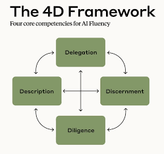

# AI Fluency for Developers

## Introduction

If you have ever shipped software before, you'll know that `writing code is just part of the job`. You need to figure out `what problem is worth solving`, you need to `make decisions in how it should work`, and finally get it into the hands of people who use it - `ship it and learn from what happens`.

That full cycle, from understanding a customer problem to shipping a full solution that reaches them is what Anthropic defines as `being a builder`. AI is changing almost every part of that right now.

Most of what is called AI training focuses on one narrow slice: writing better prompts to get better code from a LLM. That is useful, but not enough to build lasting AI fluency. You need to know:

* What to build in the first place
* You need to evaluate what AI produced is actually right - not just technically correct, but solving the real problem, working with real users and not creating unexpected new problems.

> 📌 **AI fluency is the ability to work with AI systems in ways that are _effective_, _efficient_, _ethical_ and _safe_.**
>
> It is _not a prompt library_. It is a set of inter-connected competencies that empower you to make great decisions regardless of the model or features at your disposal.

### The 4D Framework

The 4D Framework, co-developed by academia with Anthropic, is a set of 4 competencies: `Delegation`, `Discernment`, `Diligence` and `Description`. Think of these as the OS under every collaboration you have with AI.

* `Delegation`: is about decomposing a problem into parts and deciding what role AI plays at each stage/part. Delegation of implementation to AI is usually fine, but delegation (to AI) of judgement - the call about whether something is actually good and ready - is not advised.
* `Description`: is about the builder's ability to ensure that every input - from user's voice, product requirements, to technical specs - make it into the implementation. 
    
    Most AI training is hyper-focused on making sure that the code written ensures that the tests pass. That's important but not sufficient. Any missing input or context cascades downstream. A user complains that a tool doesn't work for them. A traceback usually does not point to an issue in code, but to misinterpretation & incorrect description of the user's problem. Builders must own every aspect of description.
* `Discernment`: is how you evaluate what AI gives you - not just "Does it run?", but "Does it run well? Does it solve the right problem? Is it actually good to use? and Is it responsible?". 

    AI has real blind spots. It can produce code that is locally correct, but breaks under load; it can generate UX that is functional, but confusing. Discernment is the skill of catching those gaps before your users do.
* `Diligence`: is full ownership of the outcomes - not just the output! Shipping is a skill with its own technically realities that AI surfaces only proactively. Migrations, rate-limiting, monitoring, what happens when something breaks at 2AM and you're the one that built it? Prototype freely, ship selectively and be willing to veto something when the evidence says it's not right.

Think of AI as a capable but very literal collaborator. It's fast, knowledgeable, doesn't get tired, but it need clear tasks, context about why you are building something and specific feedback when it gets something wrong.

Managing the collaborator (AI) well, knowing when to step in, when to let it run, how to give it the right brief are the core skills that builders need to develop and understand.

