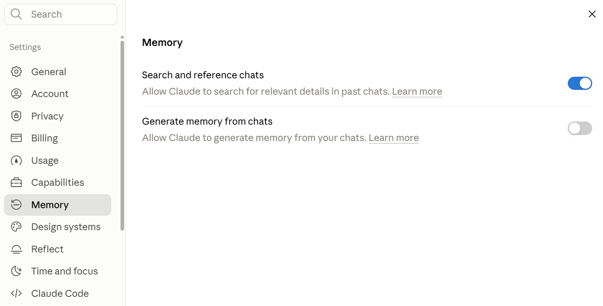

# Claude Platform & Model Foundations

## Overview

Most professionals who use Claude start by learning one or two things it does well. That approach produces results for simple tasks.

For recurring work, team projects, and deliverables that need to hold up under review, the feature decisions made within Claude before writing a single prompt determine the quality ceiling for session outputs.

This module builds the framework for the four decisions that sit at the front of every Claude interaction: 

1. Which entry point to use
2. Which capability features to activate
3. Which model to select, and
4. How to manage context across a session.

These four decisions determine whether sessions build on prior work or require constant re-setup.

## What to Expect from Generative AI

Before selecting entry points and models, there are five behavioral properties that apply to Claude regardless of which feature you use. Understanding them before building workflows with Claude prevents the most common sources of frustration and misaligned expectations.

1. **Responses Vary**: Ask Claude the same question twice and you will get two different answers. Both may be useful, but neither should be viewed as the _"one correct response"_. This is how Gen AI works. Outputs are produced using probability as opposed to being deterministic. Plan for variation in any workflow that depends on consistent outputs and build review into the process.
2. **Confident tone is not a signal of accuracy**:Claude writes with consistent fluency regardless of whether the answer is correct or not (i.e. it could lie confidently). A fabricated statistic reads with the same assurance as a verified one. 
3. **Context is a budget**: Every Claude conversation holds a working memory limit. As a conversation approached the limit `claude.ai` automatically summarizes the earlier messages so that the conversation can continue (on paid plans with code execution enabled!). Summaries can compress details, which is why instructions given at the start of a session lose force by the end.
4. **Knowledge has a training boundary**: Claude's training data has a cutoff date. Information after that date is outside Claude's reliable knowledge unless you connect a current source, turn on web-search in chat, or use Research. This affects recent events, current regulations, and upto date market data.
5. **Configured procedures still produce varied output**: A skill setup to run the same procedure everytime reduces output variance, but does not eliminate it. Even a well-configured workflow produces different output each time it's run. Review sould stay in your workflow no matter how carefully the skill has been built.

## Entry Points - Chat, Projects, Artifacts, Research

Claude appears in one interface, but that interface offers four distinct working entry points: `Chat`, `Projects`, `Artifacts`, and `Research Mode`. Choosing the right one before starting work determines how efficiently the session runs and whether the context you build today carries forward to tomorrow.

* **Chat**: Chat is the default entry point, an unstructured conversation. A Chat is saved to your history and can be continued later, and Memory plus past-chat search can carry key context into new sessions; what Chat does not give you is a Project's deliberate persistence, standing instructions and a curated knowledge base. Use Chat for one-off questions, quick drafts, exploratory prompting, and tasks you will not repeat. Chat works well for any task where the work starts and ends in that session. However, when you find yourself opening a new Chat by pasting the same background paragraph you pasted last week, that workstream has outgrown Chat.
* **Projects**: Projects are persistent workspaces. A Project holds three things:
    * **Standing instructions**: what Claude should know and do consistently across every conversation in this space
    * **Knowledge base**: documents, policies, and reference files uploaded once so Claude can draw on them without re-uploading each session
    * **Conversation history**: each Project maintains its own conversation list, separate from your global conversation history. Conversations within a Project share the Project's instructions and knowledge base, but they do not share context with each other.

    **Projects solve the most common productivity drain in AI-assisted professional work**: re-explaining the same background every session. Set the context once in the Project's standing instructions and knowledge base. Every conversation that follows starts with that context already in place.
* **Artifacts**: Artifacts are the right output format when the result is a deliverable rather than a conversational reply. When Claude produces an Artifact, it appears as a separate, editable block alongside the chat rather than flowing into the conversation thread. Use Artifacts for draft documents, data tables, formatted reports, and code. Use inline responses for answers you will act on within the conversation.
* **Research**: Research enables deep multi-source synthesis (available on paid plans). Regular Chat can search the web: web search is available on all Claude plans as a per-chat toggle in the chat input; on Team and Enterprise plans, an Owner or Primary Owner must first enable web search for the workspace in the organization's capability settings before members can switch it on. Official documentation does not specify whether the toggle is on or off by default. Research goes further: it runs multi-step searches across multiple sources and synthesizes them. **Use Research when the task needs deep investigation across a range of sources, or synthesis of current information beyond a quick lookup**.

### Selection Logic

| **Task type** | **Entry point**|
| :-- | :-- |
| One-off question or quick task, no plan to reuse | Chat |
| Recurring work with stable context requirements (e.g. RFP responses, given client supplied documents + capabilities) | Project |
| Output is a deliverable the recipient will open and read (e.g. Weekly Status report, based on project inputs) | Artifact |
| Requires deep multi-source investigation or synthesis (quick current-information lookups: web search in Chat) |	Research |

## Capability Layer

### Skill and Code Execution 

_Entry points determine where you work. The capability layer determines what Claude can do within that entry point_.

Three features extend Claude's default text-generation behavior in ways that matter for professional work: `Skills` for consistent procedures, `Code Execution` for verified computation, and `Memory` for continuity across sessions.

**The four-layer model**

Think of the relationship between layers in the following way:

1. **Projects Carry Context**: What background knowledge and standing instructions apply to this workstream.
2. **Skills define procedures**: How a specific task should be executed (step-by-step instructions), consistently every time.
3. **Code Execution verified computations**: When the result _must be correct, not merely plausable_.
4. **Memory persists continuity**: Relevant facts carry forward across sessions without re-entry.

### Memory

Memory retains work-relevant facts across sessions, removing the need to re-enter the same context each time. Examples of what professionals store in Memory include: recurring role context, preferences for output format, names of frequent collaborators, standing constraints that apply across projects.

#### Memory curation

Memory is most useful when actively curated. A memory that was accurate last quarter and has not been reviewed since can be actively misleading. Plan to:

* Review stored memories periodically, at least once per month for active users
* Delete or update entries that no longer hold
* Keep the stored set focused on information that genuinely recurs across sessions

For Chat interface, the Memory setting can be accessed from `Settings -> Memory`



* **Search and reference chats:** When this is ON Claude can look through your past conversations when you refer to earlier work, such as "the exam prep plan we discussed". It retrieves content from specific old chats on request. It does not build a profile of you.
* **Generate memory from chats:** this is the actual memory feature. When it is ON, Claude distils details from your conversations, such as your role and preferences, and stores them for use in future chats.

**Project-scoped Memory keeps Memory contexts separate for each Project**. Context from client A does not appear in client B sessions. Set up separate Projects for separate workstreams; Memory will follow the same boundaries. There is no separate _setting_ for Project memory, it's available by default and is distinct for each project.

Incognito mode (you get into this by clicking the small "ghost" icon on top right of the chat window) keeps a session out of Memory and chat history (it applies to standalone chats, outside Projects). Use it for sensitive conversations or exploratory work with confidential inputs that shouldn't surface in history or Memory. Note it does not override your organization's underlying data retention.

Importing memories from other AI platforms is an experimental feature as of June 2026. Memory import is documented for Free, Pro, Max, and Team plans (not Enterprise). If the automatic import path is not available in your account, the documented fallback is to add the key facts to Memory manually through your memory settings, rather than routing them into a Project's knowledge base.

#### Scenario

```
A business analyst produced a regulatory tracking report once a month. The task was consistent: take that month's regulatory updates, identify which applied to the portfolio, summarize the implications, and format the output per a defined template. The task was high stakes, but with a repeatable structure.

For the first two months, she ran the workflow in Chat. Each session, she uploaded the regulatory documents, re-pasted the portfolio context, and re-typed the format instructions. She ran a verification step on every numeric figure. She caught two errors in month one and one in month two, all before the report went out.

In month three, she rebuilt the workflow using the capability layer. The portfolio context and standing format instructions went into the Project, prior reports went into the knowledge base, she enabled a Skill for the report output format, and numeric calculations moved to Code Execution.

The time per session dropped from 65 minutes to 30, and the verification step still ran. No errors were found in months three through eight.
```

**What the analyst asked before rebuilding**

| Question | Layer it pointed to |
| :-- | :-- | 
| Which parts of this task are the same every time?	| Standing instructions + Skill |
| Which reference material recurs across sessions? |Knowledge base |
| Which outputs need to be computed correctly, not just "sound right"? | Code Execution |
| Which context do I want to carry across sessions without re-entry? | Memory |

## Choosing Models - Haiku, Sonnet, Opus

The capability layer determines what Claude does. The model determines how well Claude does it, and at what cost in speed.

Different model tiers in the Claude family span a range from efficient-and-fast to thorough-and-capable. Matching the tier to the task avoids both over-engineering routine work and under-resourcing high-stakes analysis.

| Model | When to use? |
| :-- | :-- |
| Haiku | Haiku is the **fastest and most efficient model** (token consumption wise) in the Claude family. It handles structured tasks well. **Recommended for:  classification, extraction, formatting, straightforward summarization, and high-volume routine work where speed matters and the cost of an imperfect output is low**. When a task runs at volume across hundreds of items in sequence, Haiku's speed advantage compounds. |
| Sonnet | Sonnet is the balanced tier. It **handles the full range of professional tasks with strong quality across task types: drafting, synthesis, analysis, research assistance, and document review**. For most knowledge-worker work, Sonnet is the right starting point. _If quality is falling short for a complex task, upgrade to Opus_. If speed and volume are the primary requirements and the task is structured, then consider Haiku. |
| Opus | Opus is a **higher-capability tier**, offering more advanced performance than Sonnet and Haiku. Use it **for tasks that require nuanced judgment, complex multi-step reasoning, ambiguous inputs that require interpretation, or any work where quality outranks speed**. Client-facing deliverables, complex document analysis, strategic planning, and high-stakes synthesis across multiple sources are typical Opus candidates. |

#### Decision Logic

| Task profile | Model |
| :-- | :-- |
| Routine, structured extraction or classification at volume | Haiku |
| Most professional drafting, synthesis, and analysis | Sonnet |
| Complex judgment, high-stakes output, ambiguous or multi-layered inputs | Opus |

> **NOTE:** ON USAGE AND COST
> Opus produces better output on complex tasks, with the tradeoff of running slower. For most knowledge work, Sonnet handles the task well. Reserve Opus for work where the quality ceiling genuinely matters. Use Haiku where volume and speed are the primary requirements and the task has clear structure.
> 
> One additional dimension to keep in mind: on metered or usage-budgeted plans (including API access), this speed-versus-capability trade-off also becomes a per-call cost trade-off. A higher-capability tier such as Opus consumes more usage per call than Haiku or Sonnet, so on those plans "efficiency" means cost as well as speed. On the standard `Claude.ai` subscription surface, treat efficiency (speed and usage headroom) as the practical proxy for cost; the selection logic above does not change.
>
> The model picker lineup, the default model, and automatic model-switching behavior vary by plan and change over time; verify all three in the product at publish. The decision logic above applies regardless of which tiers are available to you.
>
>
> _Please note_: as of June 2026 the shipped model family includes a fourth tier above Opus (Claude Fable 5, GA 2026-06-09), and Opus-tier latency is currently characterized as moderate rather than slow. The certification pins the three-tier Haiku/Sonnet/Opus frame, so this lesson teaches that frame; treat tier names and characteristics as a verify-at-delivery item. Not exam-relevant.

## Context Management: Context Limits, Conversation Hygiene & Memory Management

_Model selection and capability configuration determine what Claude can do in a session. Context management determines how long it can do it well_. Every Claude conversation has a finite working-memory budget, and that budget runs down as the conversation grows. Deliberate context management keeps sessions coherent through long or complex work.

### The context window in practical terms

Every conversation has a working-memory limit. As messages and uploaded documents accumulate, Claude's context window fills. As it fills toward the limit, `Claude.ai` automatically summarizes earlier messages to make room (on paid plans with Code Execution enabled), and the full history remains available for reference. In practical terms: a long session where you gave Claude detailed instructions in the first 10 minutes may produce responses 90 minutes later that don't follow those instructions, not because Claude is ignoring them, but because detail can compress when earlier context is summarized.

Signs a conversation needs intervention:

* Claude stops following instructions it followed correctly earlier in the same session
* Responses address only the most recent exchange without reference to earlier decisions or context
* Accuracy drops in ways that are consistent with missing early-session context

### Three responses when context degrades

1. **Restart**. Start a _new conversation_. The Project's standing instructions and knowledge base carry forward automatically. The conversation thread does not. Restarting is the right call when the current session has drifted beyond recovery, or when you are beginning a genuinely new task within the same workstream. 

2. **Summarize**. Before starting a new conversation, ask Claude to produce a summary of the current state: decisions made, work in progress, and open questions. Paste that summary at the start of the new conversation as context. This preserves thread continuity without carrying a degraded context window into the next session. 

3. **Persist**. For information that should be available across all future sessions, save it to Memory or update the Project knowledge base. Saving the right information at the right moment is more efficient than re-entering it repeatedly. A well-maintained Project with current knowledge base entries reduces the impact of individual session context limits.

### Memory curation

Memory serves best when it stays current. A memory entry that was accurate three months ago and has not been reviewed since can be actively misleading. Treat Memory like a working file. Review it on a regular cadence, delete entries that have expired, and update facts that have changed. The accuracy of stored memories matters more than the volume.

### Usage limits

Claude's usage limits operate on more than one time window: a short rolling session window, plus weekly limits on paid plans that apply across models (with a separate weekly pool for the highest model tier). The specific windows and allowances vary by plan and change over time; verify current limits in the Help Center at publish. Extended sessions on higher-tier models may reach a limit before the work is complete. For intensive tasks, planning ahead is more efficient than working around an interrupted session: break large tasks into segments, save interim progress to the knowledge base, and restart from a summary rather than extending a single session indefinitely.

## Key Takeaways

1. **Select the entry point before writing the prompt**
    Chat handles one-off work. Projects handle recurring work with stable context. Artifacts handle deliverable outputs. Research handles tasks requiring current multi-source information. The entry-point decision shapes every subsequent choice in the session.
2. **Four capability layers, four distinct problems**
    Projects carry context. Skills define repeatable procedures. Code Execution verifies computations. Memory persists continuity. Use them independently or in combination based on what the task requires.
3. **Model tiers reflect a speed-capability trade-off**
    Haiku handles structured, high-volume tasks efficiently. Sonnet covers most professional work. Opus handles complex, high-stakes tasks where quality outranks speed. Match the tier to what the task demands.
4. **Context is a budget**
    Long conversations degrade as context fills. Restart, summarize, or persist. Managing context deliberately is more efficient than working around drift after it has accumulated.
5. **Variation is inherent; review is structural**
    Every Claude feature, including configured Skills, produces different outputs run to run. Module 3 builds the discipline to evaluate those outputs before they leave your hands. The framework from this module determines the right entry point and capability layer. The framework from Module 3 determines what to do with the output.


