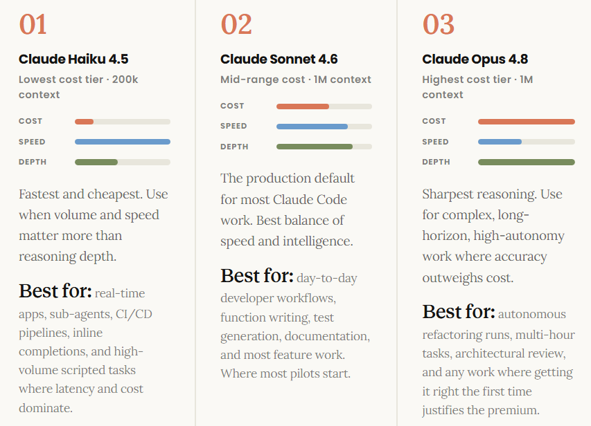
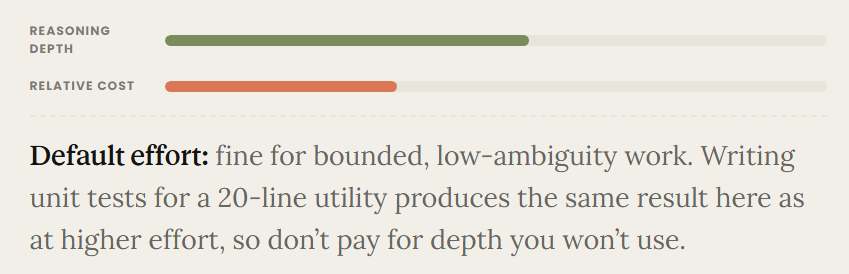
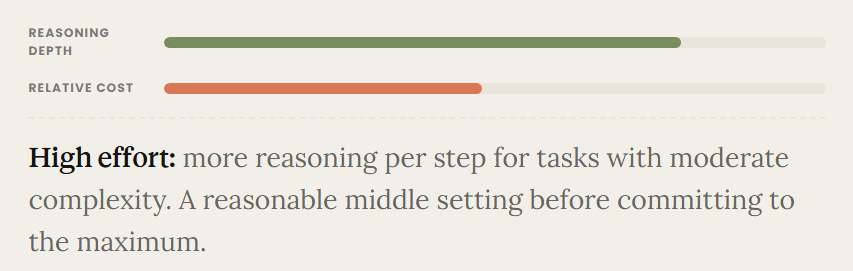
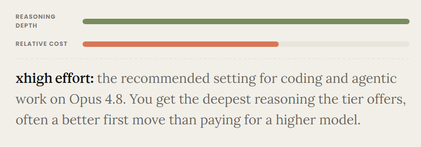
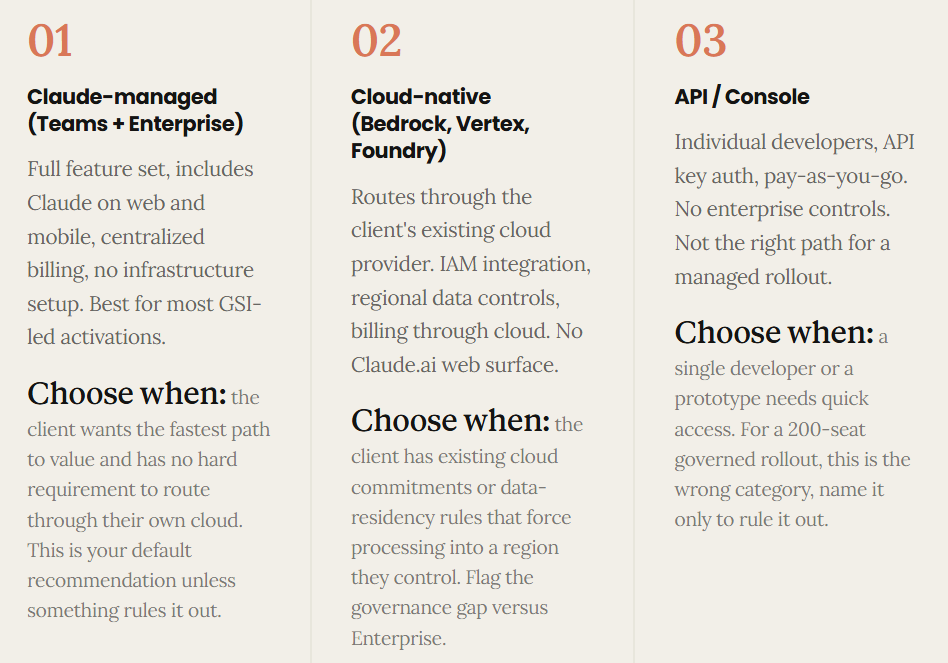
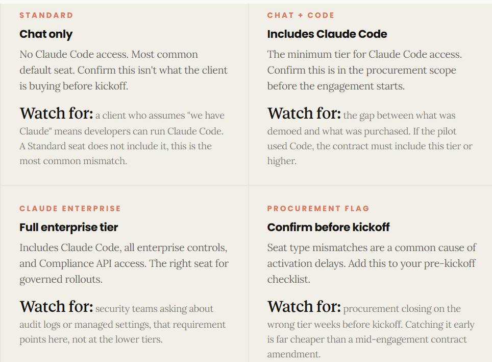

# Claude Code: Product Foundations

_Claude Code: an agent built for the codebase._

By the end of this lesson, you can explain what Claude Code is, how it operates inside a repository, and why that's different from a chat interface.

## What Claude Code is and how it behaves?

Claude Code works inside the codebase. That changes what it can actually do.

Most AI tools sit outside the work. Claude Code sits inside it.

| Chat interface | Claude Code |
| :-- | :-- |
| **Answers questions. Generates text.** No access to your files, terminal, or project context. It's stateless between messages, useful for drafting and explaining but not for building. | **Reads, edits, runs, and loops.**  Reads and writes files directly, runs bash commands, and edits across the codebase. Maintains session context and keeps working until the task is done.|

### How it Works

_It reads, plans, acts, and checks with you before it keeps going._

Claude Code doesn't generate code and stop. It works in a loop until the task is complete or you pause it.

1. **Observe:** Reads the relevant files, terminal context, and project history. Builds an understanding of the current state before planning anything.

    _In practice_ it greps the codebase, opens the files it judges relevant, and reads recent terminal output. It does not assume the structure of your project; it looks first.
2. **Plan:** Breaks the task into steps. Decides which files to touch, which commands to run, and in what order.

    For larger tasks it can surface the plan for your review before acting, so you approve the approach rather than reacting to changes after they land.
3. **Act:** Edits files, runs bash commands, calls tools. Every action is logged and visible in the terminal, not simulated output in a chat window.

    Each tool call is a real operation on the machine. You see the diff, the command, and its output, which is what makes the work auditable rather than opaque.
4. **Verify:** Surfaces the result and waits for your approval. If something needs correcting, it loops back to Observe. You stay in control of the cycle.

    Failed test? Unexpected output? It feeds that back into a fresh Observe pass and tries again, until the task is done or you pause it.

### Where it runs

The `CLI` is the core. Everything else is a wrapper around the same agent. Same model. Same agentic loop. The surface changes the integration point, not the intelligence.

The four surfaces share the same model and agent loop. One important distinction: the CLI has native filesystem and terminal access at the operating system level. Desktop, Web, and Mobile reach those same capabilities only when the developer explicitly invokes Claude Code's agent tooling from within those surfaces, not directly from the host OS. That difference in access surface matters when scoping what a deployment can do.

| | |
| :--- | :--- |
| <h1>01</h1> ### CLI &nbsp;&nbsp; `NATIVE ACCESS`  Native terminal access with the full Claude Code capability set. The primary interface for most developer workflows and the reference point for all configuration decisions.  ### Access surface: <small>direct, at the operating-system level. Filesystem and terminal are available without any extra invocation. This is the baseline every other surface is measured against.</small> | <h1>02</h1> ### IDE Extensions &nbsp;&nbsp; `NATIVE ACCESS`  Available for VS Code and JetBrains, surfacing the same agent inline with the editor. Reduces context switching without changing what Claude Code can do.  ### Access surface: <small>same as the CLI, since the extension runs the local agent. The editor is a wrapper, not a lighter version of the product.</small>[cite: 1] |
| <h1>03</h1> ### Agent SDK &nbsp;&nbsp; `NATIVE ACCESS`  Programmatic access for pipeline and automation use cases. Lets engineering teams embed Claude Code into CI/CD, tooling, or multi-agent workflows.  ### Access surface: <small>whatever the host environment grants. In CI/CD it has the runner's access; the scope is defined by where you run it.</small> | <h1>04</h1> ### Desktop / Web / Mobile &nbsp;&nbsp; `SCOPED ACCESS`  Runs tasks in the cloud, without requiring a local environment. Suited for business-facing work that doesn't need filesystem or terminal access.  ### Access surface: <small>reaches filesystem and terminal only when the developer explicitly invokes the agent tooling, not directly from the host OS. This is the distinction that matters when scoping a deployment.</small>[cite: 1] |

### Check your understanding

**What's true about Claude Code?**

1. `"Claude Code uses a different model tier than Claude.ai."`

    **False.** Claude Code runs on the same model family (Haiku, Sonnet, Opus) as every other Claude product. Model choice is a configuration decision made at deployment time, not something baked into the product itself. The common misconception here is that "developer tool" implies a specialized or stripped-down model. It doesn't. You're configuring access to the same model lineup, and you can run Opus through Claude Code just as you can through Claude.ai.

2. `"Claude Code can run bash commands and edit files on the machine where it's installed."`

    **True.** This is what separates an agent from a chat window: Claude Code has tools that interact with the real environment, including the filesystem, the terminal, and external APIs. Those tools are configurable and can be scoped or restricted by the admin. If you answered False, the likely confusion is that "AI tool" sounds like it generates output for you to copy-paste. Claude Code doesn't stop at generating code; it writes the file, runs the test, and reads the result, all on the machine where it's running.

3. `"The IDE extension gives Claude Code different capabilities than the CLI."`

    **False.** The IDE extension and the CLI call the same agent, run on the same model, and have access to the same tool set. The surface changes the integration point, which is how you invoke Claude Code and where the output appears, not the underlying capability. If you answered True, the likely reason is that the terminal feels more "technical" and therefore more powerful. That intuition is wrong here. An IDE extension running in VS Code is not a lighter version; it's the same agent surfaced in a different wrapper. The distinction that does matter is the access surface, not the surface label. See the anatomy grid above for that nuance.

## Claude family model selection and tradeoffs

### Product Foundations

Three models, one recommendation, and when to deviate.

By the end of this lesson, you can recommend a model for a new Claude Code deployment and defend that choice against cost, speed, and capability objections.

### The model family

**Haiku is cheapest, Opus is sharpest, and Sonnet is where most production work lands.**

### The Decision

**Start with Sonnet, move to Opus for sustained reasoning tasks, and reach for Haiku when volume and cost dominate.**

Most pilots start with Sonnet and expand from there. High-volume or high-autonomy use cases are where the model mix gets more deliberate.

| Start fast (Haiku path) | Start capable (Opus path) |
| :-- | :-- |
| **High-volume or time-sensitive**  Sub-agent pipelines, CI/CD scripting, rapid prototyping, cost-sensitive deployments. When throughput and latency matter more than reasoning depth. |**Complex or long-horizon tasks**  Autonomous refactoring runs, multi-hour tasks, work where getting it right the first time outweighs cost. Sonnet handles everything in between.|

### The effort lever

**Before you switch models, try adjusting effort first. It's a cheaper move.**

The effort parameter tunes reasoning depth within a tier without switching models. On Opus 4.8, `xhigh` is available and is the recommended setting for coding and agentic work, often a better first lever than paying for a higher tier. On Sonnet 4.6, the parameter goes up to `high`, a useful lever before committing to Opus pricing. Writing unit tests for a 20-line utility function produces the same result at default effort as at extended thinking; a multi-file refactor with cross-module dependency analysis is where higher effort produces materially better output.

### To remember

_Model selection is an architecture decision; `effort tuning is a performance lever`._ Know which you're reaching for before making a recommendation.

<link rel="stylesheet" href="./tabs.css">

<input type="radio" name="jb-tab-group" id="tab1" checked>
<input type="radio" name="jb-tab-group" id="tab2">
<input type="radio" name="jb-tab-group" id="tab3">

<label class="jb-tab-label" for="tab1">Default</label>
<label class="jb-tab-label" for="tab2">High</label>
<label class="jb-tab-label" for="tab3">xHigh</label>

### Scenario

<small>`Your client is rolling out Claude Code for 50 developers doing routine feature work (writing functions, generating tests, updating documentation). A small group will also run overnight autonomous refactoring tasks across legacy modules. What's your model recommendation?`</small>

**Ans:** Sonnet 4.6 default; Opus 4.8 for overnight runs. Match the model to the task type.

Sonnet 4.6 handles routine feature work well at a reasonable cost. Opus covers the overnight autonomous runs where task complexity and duration justify the premium. This tiered approach gives the client cost efficiency on high-volume daily work while preserving reasoning depth for the tasks that need it.

## Platform options at a glance: Enterprise, API, deployment paths

_Seven paths to Claude Code, `one right fit for your client`._

By the end of this section, you can map a client's cloud commitments, governance requirements, and feature needs to the right deployment option and explain why you're not recommending the others.

<small>The seven paths:</small> Claude.ai Teams, Claude.ai Enterprise, Amazon Bedrock, Google Cloud Vertex AI, Microsoft Azure AI Foundry, Anthropic API, and Anthropic Console.

### Three categories

Full feature set, cloud-native, or API-only. Which category fits determines everything else.

### Enterprise vs Teams

Enterprise isn't more seats. It's the controls tier.

| TEAMS | ENTERPRISE |
| :-- | :-- |
| **For getting started**  Usage-based billing plus a per-seat subscription fee. Verify current pricing at anthropic.com/pricing. Team management, admin tools, basic SSO. A starting tier, not the right fit for most enterprise rollouts.| **For governed rollouts**  SSO with domain capture, SCIM provisioning, RBAC, Compliance API, and managed policy settings. If the client's security team is asking about audit logs or managed settings, this is the tier. |

For most GSI-led activations, recommend Enterprise. If a client asks about SSO, managed settings, or audit logs, Teams won't satisfy the requirement.

### Cloud-native path

**Route through the client's cloud when they have existing commitments or data residency requirements.**

Bedrock for AWS-first clients, Vertex for GCP, Foundry for Azure. The trade-off: billing through their cloud, IAM integration, regional data controls, but no Claude.ai web surface, no managed settings, no Compliance API. An LLM Gateway (a middleware layer that routes model API calls through corporate network controls, adding logging, filtering, and policy enforcement before requests reach the model provider) can sit between Claude Code and any cloud provider to add centralized auth, usage tracking, and rate limiting on top.

> [!Tip]
> <small>TO REMEMBER</small>
>
> Cloud-native routing satisfies an existing commitment, not a security requirement. The governance gap compared to Enterprise is real and worth flagging to the client.

### Seat types

Usage-based Claude Code access requires the right seat type. Flag this early in procurement.

_These seat names reflect the usage-based pricing model. Clients on legacy seat-based plans use Standard and Premium seat types instead. Confirm which model the client is on before procurement. It affects both naming and what each seat includes._

