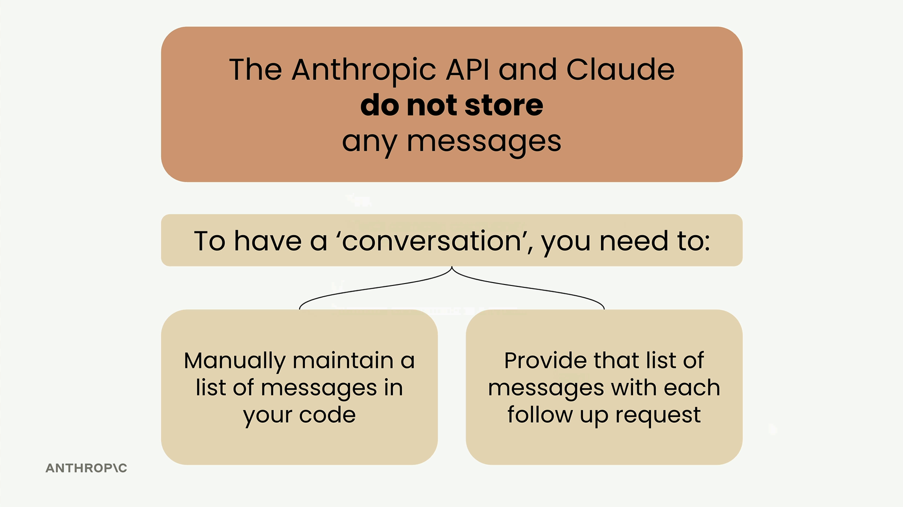
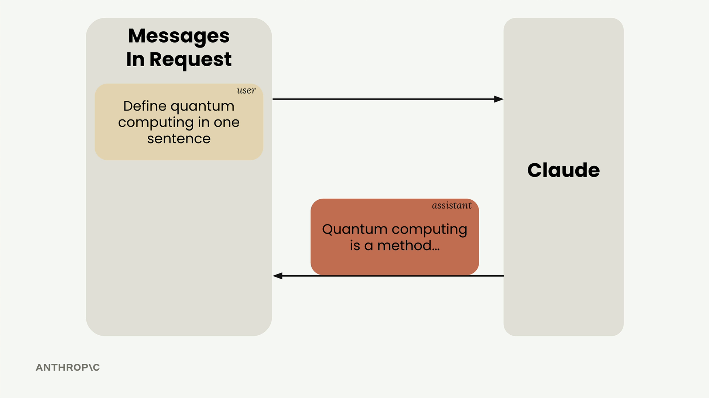
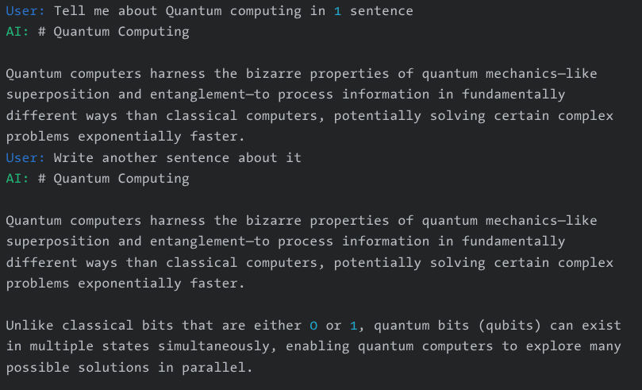
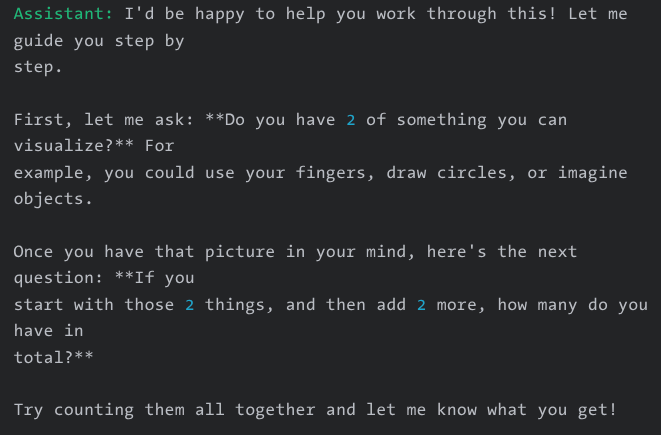
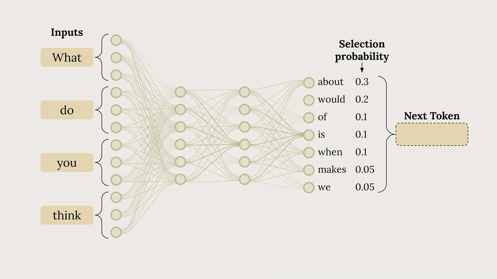
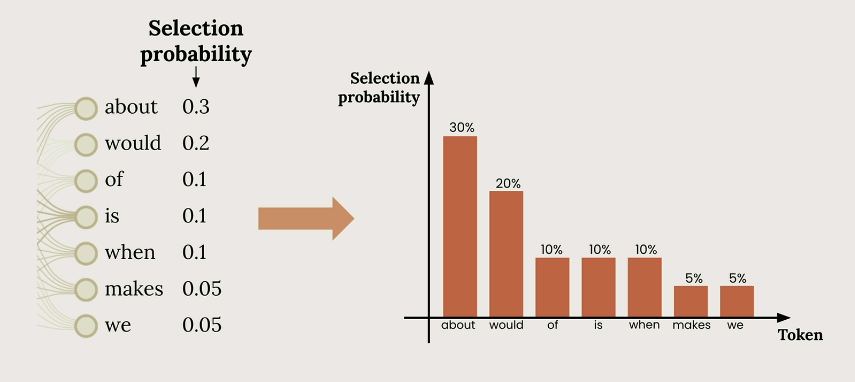
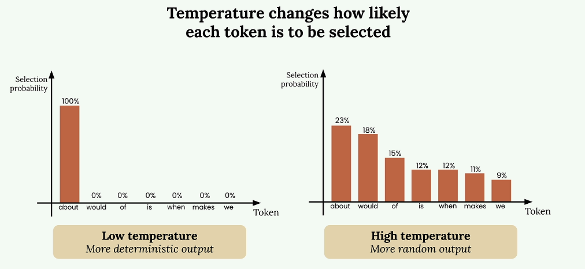
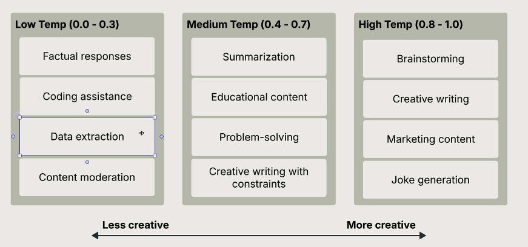
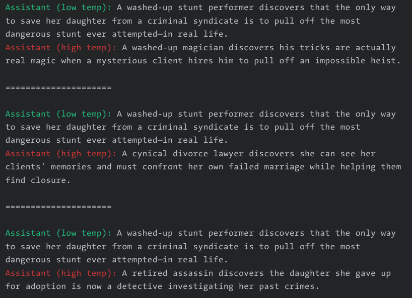

# Working with the Claude API

## Accessing The API

When building applications with Claude, understanding the complete request lifecycle helps you make better architectural decisions and debug issues more effectively. Let's walk through what happens from the moment a user clicks "send" in your chat interface to when Claude's response appears on screen.


### The Five-Step Request Flow

Every interaction with Claude follows a predictable pattern with five distinct phases: request to server, request to Anthropic API, model processing, response to server, and response to client.


#### Why You Need a Server

You should **never make requests to the Anthropic API directly from client-side code**. Here's why:

API requests require a secret API key for authentication Exposing this key in client code creates a serious security vulnerability. Anyone could extract the key and make unauthorized requests. Instead, your web or mobile app sends requests to your own server, which then communicates with the Anthropic API using the securely stored key.

### Making API Requests

When your server contacts the Anthropic API, you can use either an official SDK or make plain HTTP requests. Anthropic provides SDKs for Python, TypeScript, JavaScript, Go, and Ruby.


Every request must include these essential fields:

* **API Key** - Identifies your request to Anthropic
* **Model** - Name of the model to use (such as, "`claude-haiku-4-5-20251001`"  or "`claude-sonnet-4-5`")
* **Messages** - List containing the user's input text
* **Max Tokens** - Limit for how many tokens Claude can generate

### Inside Claude's Processing

Once Anthropic receives your request, Claude processes it through four main stages: tokenization, embedding, contextualization, and generation.

**Tokenization**

Claude first breaks your input text into smaller chunks called tokens. These can be whole words, parts of words, spaces, or symbols. For simplicity, think of each word as one token.


**Embedding**

Each token gets converted into an embedding - a long list of numbers that represents all possible meanings of that word. Think of embeddings as numerical definitions that capture semantic relationships.

Words often have different meanings. For example, consider the following examples:

1. Bank
    * "She sat by the river**bank** and watched the water flow."
    * "I need to deposit this cheque at the **bank** before 3 PM."
    * "The pilot had to **bank** the aircraft sharply to avoid the storm."
2. Interest
    * "The bank pays 6.5% annual **interest** on this fixed deposit."
    * "She showed real **interest** in the merger proposal."
    * "He bought a 20% **interest** in the company."
3. Credit
    * "Please **credit** ₹10,000 to my savings account."
    * "She deserves **credit** for closing that deal."
    * "His **credit** score dropped after the missed EMI payment."

Same word, different meanings! You and I can see it clearly. A model needs to "figure" this out by adjusting the embedding, which is where the next step comes in. 

**Contextualization**

Claude refines each embedding based on surrounding words to determine the most likely meaning in context. This process adjusts the numerical representations to highlight the appropriate definition. 

The above examples will make the need for this step very clear - depending on which sentence is encountered, the same word (for example **Interest** has a completely different meaning!)


**Generation**

The contextualized embeddings pass through an output layer that calculates probabilities for each possible next word. Claude doesn't always pick the highest probability word - it uses a mix of probability and controlled randomness to create natural, varied responses.


**When Claude Stops Generating?**

After each token, Claude checks several conditions to decide whether to continue or not:

* `max_tokens` exceeded: has the output exceeded the `max_tokens` limit set by user? If so, stop generation, even if response is _not_ fully completed!
* `stop_sequence` token generated (`stop_reason: "stop_sequence"`): the model generated a `stop_sequence` we (the developer) defined (for example `</note>` at the end of a note generation task, which generates a structured XML output). Claude may/may-not have generated a complete response to your query, but stops the moment it detected user-defined `stop_sequence` has been generated.
* `end-of-sequence` token generate (`stop_reason: "end_turn"`): when Claude decided it has finished generating the complete response to your query.


**The API Response**

When generation completes, the API sends back a structured response containing:

* Message - The generated text
* Usage - Count of input and output tokens
* Stop Reason - Why generation ended


Your server receives this response and forwards the generated text back to your client application, where it appears in the user interface.


### Key Takeaways

Understanding this flow helps you:

* Design secure architectures that protect your API keys
* Set appropriate token limits for your use case
* Handle different stop reasons in your application logic
* Debug issues by understanding where they might occur in the pipeline

## Getting an API Key

Navigate to Claude Console [https://platform.claude.com/dashboard](https://platform.claude.com/dashboard) -> `Get API Key` button -> create new key -> save to `.env` file.

```bash
ANTHROPIC_API_KEY="your-api-key-here"
```

This approach keeps your API key out of your code and prevents accidentally committing it to version control. Always add .env to your .gitignore file.

## Making requests

Making your first request to the Anthropic API is straightforward once you understand the basic setup and structure. This guide walks through the essential steps to get Claude responding to your prompts using Python.

### Setting Up Your Environment

Before making any API calls, you need to install the required packages and configure your API key securely. 

* You can create a local environment using `uv` or `python -m venv` command and then activate it!
* Install the dependencies: install the following dependencies using `uv` or `pip`

```bash
pip install anthropic python-dotenv
```

Load the environment variables and create your API client:

```python
from dotenv import load_dotenv

load_dotenv(override=True))

from anthropic import Anthropic

client = Anthropic()
MODEL = "claude-haiku-4-5-20251001"  # or "claude-sonnet-4-5"
MAX_TOKENS = 1024
```

### The Create Function

The core of making API requests is the `client.messages.create()` function. This function requires three key parameters:

```python
response = client.messages.create(
    model=MODEL,
    max_tokens=MAX_TOKENS,
    messages= [
        # list of messages to send
        ....
    ]
)
```

* `model` - The name of the Claude model you want to use
* `max_tokens` - A safety limit on response length (not a target)
* `messages` - The conversation history you're sending to Claude

The max_tokens parameter acts as a safety mechanism. If you set it to 1000, Claude will stop generating after 1000 tokens even if it has more to say. Claude doesn't try to reach this limit - it just writes what it thinks is appropriate and stops if it hits the maximum.

### Understanding Messages

Messages represent the conversation between you and Claude, similar to a chat application. There are two types of messages:

* `User messages` - Content you want to send to Claude (written by humans)
* `Assistant messages` - Responses that Claude has generated

Each message is a dictionary with a role (either "user" or "assistant") and content (the actual text).

### Making Your First Request

Here's a complete example of making a request to Claude:

```python
response = client.messages.create(
    model=MODEL,
    max_tokens=MAX_TOKENS,
    messages=[
        {
            "role": "user",
            "content": "What is quantum computing? Answer in one sentence"
        }
    ]
)
```

When you run this code, Claude will process your request and return a response object containing the generated text along with metadata about the request.

### Extracting the Response

The response object contains a lot of information, but you usually just want the generated text. Access it using:

```python
response.content[0].text
```

This gives you clean, readable output like:

```
"Quantum computing is a type of computation that leverages quantum mechanics principles like superposition and entanglement to process information using quantum bits (qubits), potentially solving certain complex problems exponentially faster than classical computers."
```

With these basics in place, you can start experimenting with different prompts and building more complex interactions with Claude.

## Multi-turn Conversations

When working with the Anthropic API and Claude, there's a crucial concept you need to understand: **Claude doesn't store any of your conversation history**. Each request you make is completely independent, with no memory of previous exchanges.

This means if you want to have a multi-turn conversation where Claude remembers context from earlier messages, you need to handle the conversation state yourself.

### The Problem with Stateless Conversations

Let's say you ask Claude "What is quantum computing?" and get a good response. Then you follow up with "Write another sentence" - Claude has no idea what you're referring to. It will write a sentence about something completely random because it has no memory of the quantum computing discussion.

<p align="center">
  
</p>

### How Multi-Turn Conversations Work

To maintain conversation context, you need to do two things:

* Manually maintain a list of all messages in your code
* Send the complete message history with every request

<p align="center">
  
</p>

Here's the flow that actually works:

1. Send your initial user message to Claude
2. Take Claude's response and add it to your message list as an assistant message
3. Add your follow-up question as another user message
4. Send the entire conversation history to Claude

<p align="center">
  
</p>

### Building Helper Functions

To simulate a conversation, where Claude should know what we asked before so it can _continue_ from there, we need to pass back the entire message history on every `client.messages.create(...)` call.

Let's simulate that now - first we'll create some helper functions.

```python
def add_user_message(history, message):
    history.append({"role": "user", "content": message})
    return history


def add_assistant_message(history, message):
    history.append({"role": "assistant", "content": message})
    return history


def chat(history):
    response = client.messages.create(
        model=MODEL,
        max_tokens=MAX_TOKENS,
        messages=history,
    )
    # return just the response
    return response.content[0].text

    # if you want token counts also, comment above line
    # and uncomment block below

    # return (
    #     response.content[0].text,
    #     response.usage.input_tokens,
    #     response.usage.output_tokens,
    # )
```

Here's how you'd use these functions in a multi-turn conversation (back-and-forth conversations) - ignore the `rich.console...` part - we use the rich text library only to display colorful text. You can replace `console.print(...)` with plain `print(...)` calls.

```python
from rich.console import Console

# inside of notebooks, use force_jupyter=False
# for better output. In console apps, omit this param
console = Console(force_jupyter=False)

message_history = []  # start with a blank history

# build our messages (in an actual conversation, the user would
# type these turn-by-turn)
messages = [
    "Tell me about Quantum computing in 1 sentence",
    "Write another sentence about it",
]

for msg in messages:
    # add user's message to message history
    message_history = add_user_message(message_history, msg)
    console.print(f"[blue]User:[/blue] {msg}")
    # pass entire history to Claude
    response_text = chat(message_history)
    # add Claude's response to message history & repeat
    message_history = add_assistant_message(message_history, response_text)
    console.print(f"[green]AI:[/green] {response_text}")
```

You should see output something like this:

<p align="center">
  
</p>

On each turn, the entire message history (all `user` messages sent and all `assistant` messages received in sequence) are passed to Claude. Now Claude will understand that "Write another sentence" refers to expanding on the quantum computing definition, because you've provided the complete conversation context.

Here's another classic example:

```python
from rich.console import Console

console = Console(force_jupyter=False)

message_history2 = []
messages = [
    "Hi, my name is Jack Sparrow. What's your name?",
    "Tell me a joke about Generative AI",
    "What's my name again?",
]

for msg in messages:
    message_history2 = add_user_message(message_history2, msg)
    console.print(f"[blue]User:[/blue] {msg}")
    response_text = chat(message_history2)
    message_history2 = add_assistant_message(message_history2, response_text)
    console.print(f"[green]AI:[/green] {response_text}")
```

Because you passed in the entire message history to Claude, it will be able to respond to `What's my name again?` with something like `Your name is Jack Sparrow! You told me at the start of our conversation.`

## Using System Prompt

System prompts are a powerful way to customize how Claude responds to user input. Instead of getting generic answers, you can shape Claude's tone, style, and approach to match your specific use case.

### Why System Prompts Matter

Consider building a math tutor chatbot. When a student asks `"How do I solve 5x + 2 = 3 for x?"`, you want Claude to act like a real tutor, not just spit out the answer. A good math tutor should:

* Initially give hints rather than complete solutions
* Patiently walk students through problems step by step
* Show solutions for similar problems as examples

You definitely don't want Claude to:

* Immediately give direct answers
* Tell students to just use a calculator

### How System Prompts Work

```python
SYSTEM_PROMPT = """
You are a patient math tutor. Do not directly answer the student's question. Guide them to a solution step-by-step.
"""

response = client.messages.create(
    model=MODEL,
    max_tokens=MAX_TOKENS,
    # here is how you add the system prompt
    system_prompt=SYSTEM_PROMPT,
)

messages = []
add_user_message(messages, "How do I solve 5x + 2 = 3 for x?")
response_text = chat(messages)
add_assistant_message(messages, response_text)
print(response_text)
```

And you should see Claude respond like a guide - not with the answer, as directed in the system prompt.

<p align="center">
  
</p>

Let's try the same _without_ a System Prompt:

```python
response = client.messages.create(
    model=MODEL,
    max_tokens=MAX_TOKENS,
)

messages = []
add_user_message(messages, "How do I solve 5x + 2 = 3 for x?")
response_text = chat(messages)
add_assistant_message(messages, response_text)
print(response_text)
```

And you could see something like this - no guidance, just the answer:

<p align="center">
  
</p>

Without a system prompt, Claude gives a complete step-by-step solution immediately. This might be helpful, but it doesn't encourage the student to think through the problem themselves.

With the math tutor system prompt, Claude's response changes dramatically. Instead of providing the full solution, Claude asks guiding questions like "What do you think would be a good first step to isolate x? Consider what operation we might need to perform on both sides to start moving terms around."

### Building a Flexible Chat Function

Rather than hard-coding system prompts, you can make your chat function more reusable by accepting system prompts as parameters:

```python
def chat(messages, system=None):
    params = {
        "model": MODEL,
        "max_tokens": MAX_TOKENS,
        "messages": messages,
    }
    
    if system:
        params["system"] = system
    
    message = client.messages.create(**params)
    return message.content[0].text
```

This approach handles an important detail: Claude's API doesn't accept `system=None`, so you need to conditionally include the system parameter only when it's provided.

Now you can call your chat function with or without a system prompt:

```python
# Without system prompt
answer = chat(messages)

# With system prompt
system = """
You are a patient math tutor.
Do not directly answer a student's questions.
Guide them to a solution step by step.
"""
answer = chat(messages, system=system)
```

System prompts are essential for creating AI applications that behave consistently and appropriately for their intended purpose. They transform generic AI responses into specialized, role-appropriate interactions.

## Temperature

Temperature is a powerful parameter that controls how predictable or creative Claude's responses will be. Understanding how to use it effectively can dramatically improve your AI applications.

### How Claude Generates Text

Before diving into `temperature`, it helps to understand Claude's text generation process. When you send Claude a prompt like "What do you think?", it goes through three key steps:

* `Tokenization` - Breaking your input into smaller chunks
* `Prediction` - Calculating probabilities for possible next words
* `Sampling` - Choosing a token based on those probabilities

<p align="center">
  
</p>

In this example, Claude might assign a `30%` probability to "about", `20%` to "would", `10%` to "of", and so on. The model then selects one token and repeats this entire process to build complete sentences.

<p align="center">
  
</p>

### What Temperature Does

**Temperature is a decimal value between 0 and 1** that directly influences these selection probabilities. It's like adjusting the "creativity dial" on Claude's responses.

<p align="center">
  
</p>

**At low temperatures (near 0), Claude becomes very deterministic** - it almost always picks the highest probability token. **At high temperatures (near 1)**, Claude distributes probability more evenly across options, **leading to more varied and creative outputs**.

### Choosing the Right Temperature

Different tasks call for different temperature ranges:

<p align="center">
  
</p>

**Low Temperature (0.0 - 0.3)**
* Factual responses
* Coding assistance
* Data extraction
* Content moderation

**Medium Temperature (0.4 - 0.7)**
* Summarization
* Educational content
* Problem-solving
* Creative writing with constraints

**High Temperature (0.8 - 1.0)**
* Brainstorming
* Creative writing
* Marketing content
* Joke generation

### Implementing Temperature in Code

Adding temperature support to your chat function is straightforward. Here's how to modify your existing `chat` function:

```python
def chat(messages, system=None, temperature=1.0):
    params = {
        "model": MODEL,
        "max_tokens": MAX_TOKENS,
        "messages": messages,
        # this will work with older (<1.1.0) SDK
        # "temperature": temperature,

        # for 1.1.0+ SDK use the following
        "extra_body": {"temperature": temperature},
    }

    if system is not None:
        params["system"] = system

    message = client.messages.create(**params)
    return message.content[0].text
```

The key changes are adding `temperature=1.0` as a parameter and including `"temperature": temperature` in the params dictionary. **Note how the latest API has changed the way we specify `temperature`, use code that matches your API version**.

### Testing Temperature Effects

To see temperature in action, try generating movie ideas with different settings:

```python
# Low temperature - more predictable
messages = [{"role": "user", "content": "Give me a one-sentence movie idea."}]

for i in range(3):
    # make repeated calls - with temperature=0.0, expect to
    # see similar responses (may/may-not be identical!). For
    # temperature=1.0, expect to see more creative responses on each call.

    answer = chat2(messages, temperature=0.0)
    console.print(f"[green]Assistant (low temp):[/green] {answer}")

    # High temperature - more creative
    answer = chat2(messages, temperature=1.0)
    console.print(f"[red]Assistant (high temp):[/red] {answer}")

    print("\n=====================\n")
```

You could see something like this:

<p align="center">
  
</p>


