# Prompt Evaluation

When working with Claude, writing a good prompt is just the beginning. To build reliable AI applications, you need to understand two critical concepts: prompt engineering and prompt evaluation. Prompt engineering gives you techniques for writing better prompts, while prompt evaluation helps you measure how well those prompts actually work.

<p align="center">
  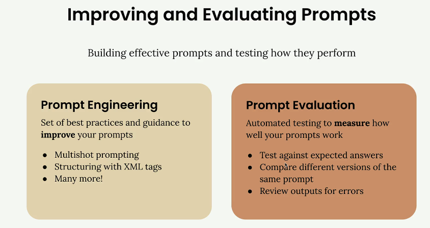
</p>

## Prompt Engineering vs Prompt Evaluation

Prompt _engineering_ is your toolkit for _crafting effective prompts_. It includes techniques like:

* Multi-shot prompting
* Structuring with XML tags
* Many other best practices

These techniques help Claude understand exactly what you're asking for and how you want it to respond.

Prompt _evaluation_ takes a different approach. Instead of focusing on how to write prompts, it's about _measuring their effectiveness_ through automated testing. You can:

* Test against expected answers
* Compare different versions of the same prompt
* Review outputs for errors

## Three Paths After Writing a Prompt

Once you've drafted a prompt, you typically face three options for what to do next:

<p align="center">
  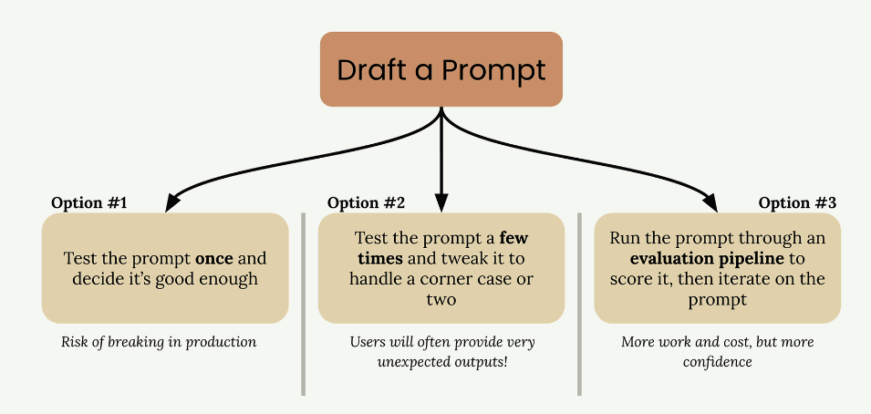
</p>

* **Option 1:** Test the prompt once and decide if it's good enough. This carries a significant risk of breaking in production when users provide unexpected inputs.

* **Option 2:** Test the prompt a few times and tweak it to handle an _edge case_ or two. While better than option 1, users will often provide very unexpected outputs that you haven't considered.

* **Option 3:** Run the prompt through an evaluation pipeline to score it, then iterate on the prompt based on objective metrics. This approach requires more work and cost, but gives you much more confidence in your prompt's reliability.

## Why Most Engineers Fall Into Testing Traps

Options 1 and 2 are common traps that all engineers fall into, myself included. It's natural to write a prompt for a serious application and not test it thoroughly enough. _We tend to underestimate how many edge cases real users will encounter_.

The reality is that when you deploy a prompt to production, users will interact with it in ways you never anticipated. What seemed like a solid prompt during your limited testing can quickly break down when faced with the full variety of real-world inputs.

The _Evaluation-First Approach_
Option 3 represents a more systematic approach to prompt development. By running your prompt through an evaluation pipeline, you get objective metrics about its performance across a broader range of test cases. This data-driven approach lets you:

* Identify weaknesses before they become production issues
* Compare different prompt versions objectively
* Iterate with confidence based on measurable improvements
* Build more reliable AI applications

While this approach requires more upfront investment in time and testing infrastructure, it pays dividends in the reliability and robustness of your final application. The goal is to catch problems during development rather than after your users encounter them.

## A Typical Evaluation Workflow

A typical _prompt evaluation workflow follows **five key steps**_ that help you systematically improve your prompts through objective measurement. While there are many different ways to assemble these workflows and various open source and paid tools available, understanding the core process helps you start small and scale up as needed.

<p align="center">
  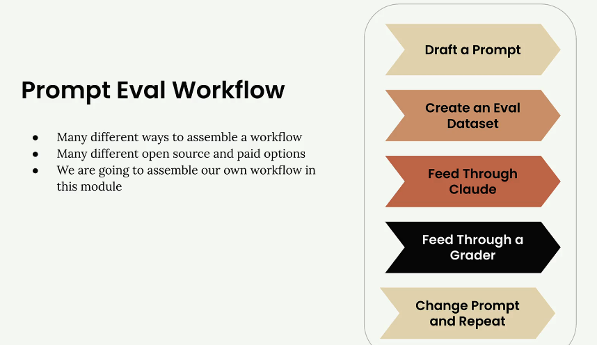
</p>

### Step 1: Draft a Prompt

Start by writing an initial prompt that you want to improve. For this example, we'll use a simple prompt:

```python
prompt = f"""
Please answer the user's question:

{question}
"""
```

<p align="center">
  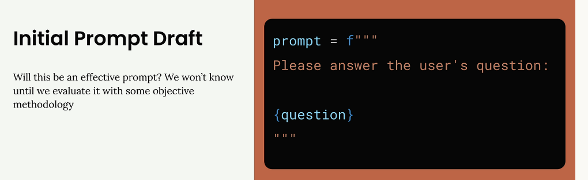
</p>

This basic prompt will serve as our baseline for testing and improvement.

### Step 2: Create an Eval Dataset

Your evaluation dataset contains sample inputs that represent the types of questions or requests your prompt will handle in production. The dataset should include questions that will be interpolated into your prompt template.

<p align="center">
  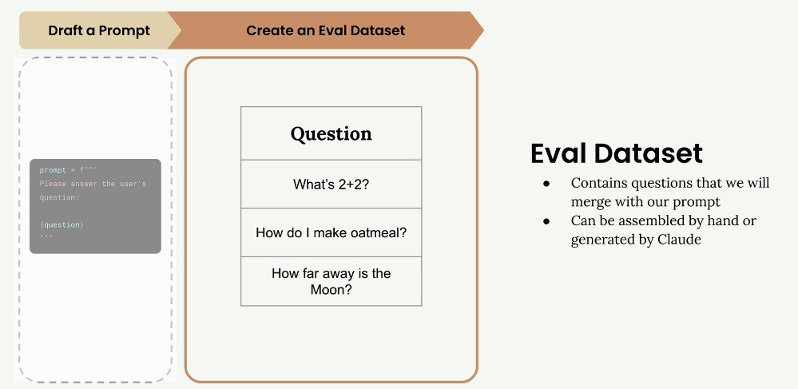
</p>

For this example, our dataset includes three questions:

* `"What's 2+2?"`
* `"How do I make oatmeal?"`
* `"How far away is the Moon?"`

In real-world evaluations, you might have tens, hundreds, or even thousands of records. You can assemble these datasets by hand or use Claude to generate them for you.

### Step 3: Feed Through Claude

Take each question from your dataset and merge it with your prompt template to create complete prompts. Then send each one to Claude to get responses.

<p align="center">
  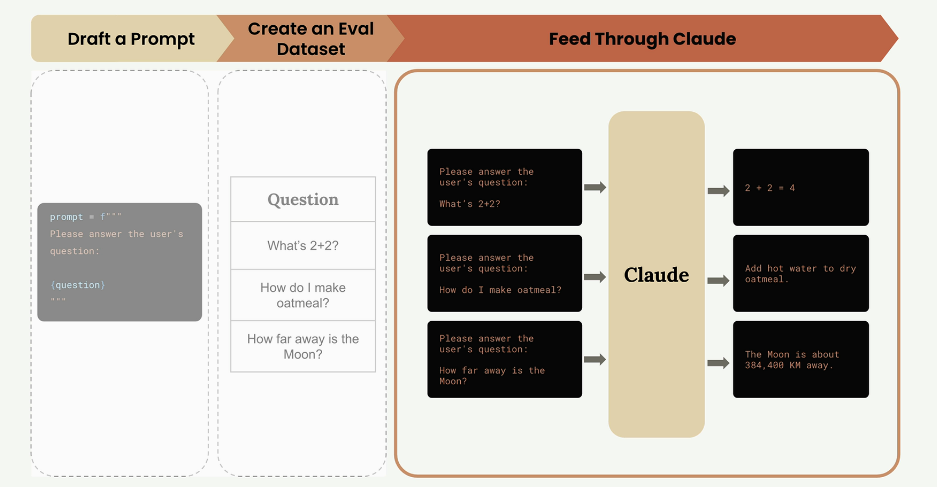
</p>

For example, the first question becomes:

```
Please answer the user's question:
What's 2+2?
```

Claude might respond with `"2 + 2 = 4"` for the math question, provide oatmeal cooking instructions for the second question, and give the distance to the Moon for the third.

### Step 4: Feed Through a Grader

The grader evaluates the quality of Claude's responses by examining both the original question and Claude's answer. This step provides objective scoring, typically on a scale from 1 to 10, where 10 represents a perfect answer and lower scores indicate room for improvement.

<p align="center">
  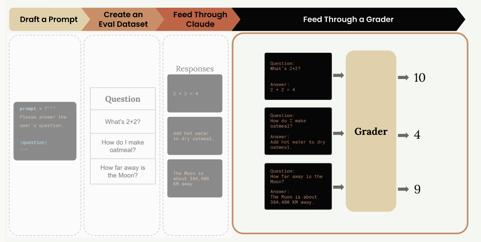
</p>

In our example, the grader might assign:

* Math question: `10` (perfect answer)
* Oatmeal question: `4` (needs improvement)
* Moon question: `9` (very good answer)

The average score across all questions gives you an objective measurement: 

$$\frac{10 + 4 + 9}{3} \approx 7.67$$

Step 5: Change Prompt and Repeat
Now that you have a baseline score, you can modify your prompt and run the entire process again to see if your changes improve performance.

<p align="center">
  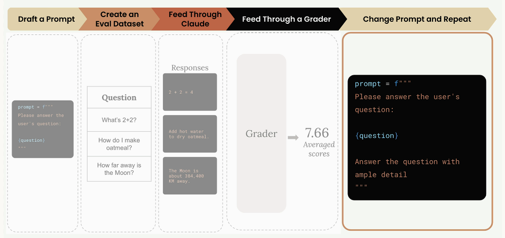
</p>

For example, you might add more guidance to your prompt:

```python
prompt = f"""
Please answer the user's question:

{question}

Answer the question with ample detail
"""
```

After running this improved prompt through the same evaluation process, you might get a higher average score of `8.7`, indicating that the additional instruction helped Claude provide better responses.

### Prompt Scoring

The key benefit of this workflow is getting objective measurements of prompt performance. You can:

* Compare different prompt versions numerically
* Use the version with the best score
* Continue iterating to find even better approaches

<p align="center">
  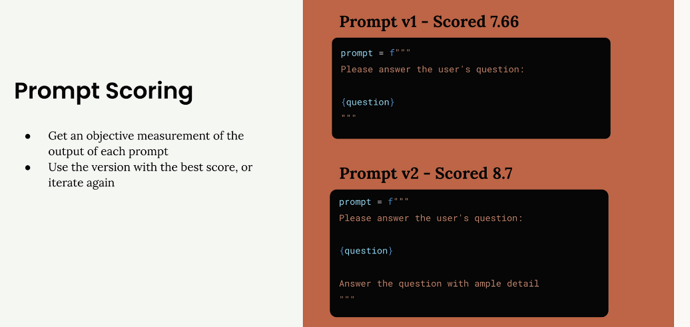
</p>

This systematic approach removes guesswork from prompt engineering and gives you confidence that your changes are actually improvements rather than just different variations.

## Generating Test Datasets

Building a custom prompt evaluation workflow starts with creating a solid prompt and then generating test data to see how well it performs. Let's walk through setting up an evaluation system for a prompt that helps users write AWS-specific code.

### Setting Up the Goal

Our prompt needs to assist users in writing three specific types of output for AWS use cases:

* Python code
* JSON configuration files
* Regular expressions

The key requirement is that when a user requests help with a task, we return clean output in one of these formats without any extra explanations, headers, or footers.

<p align="center">
  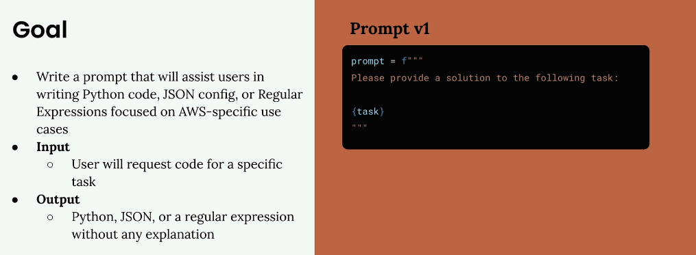
</p>

Here's our starting prompt (version 1):

```python
prompt = f"""
Please provide a solution to the following task:
{task}
"""
```

### Creating an Evaluation Dataset

An evaluation dataset contains inputs that we'll feed into our prompt. For each combination of prompt and input, we'll run the prompt and analyze the results.

Our dataset will be an array of JSON objects, where each object contains a "task" property describing what we want Claude to accomplish. We can either create this dataset by hand or generate it automatically using Claude.

<p align="center">
  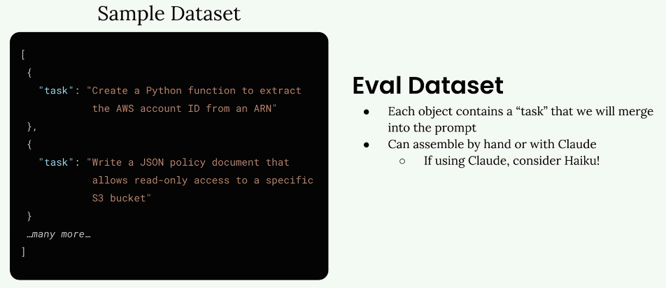
</p>

Since we're generating test data, this is a perfect opportunity to use a faster model like Haiku instead of the full Claude model.

### Generating Test Data with Code

Let's create a function that automatically generates our test dataset. First, we'll need our helper functions for working with Claude:

```python
def add_user_message(messages, text):
    user_message = {"role": "user", "content": text}
    messages.append(user_message)

def add_assistant_message(messages, text):
    assistant_message = {"role": "assistant", "content": text}
    messages.append(assistant_message)

def chat(messages, system=None, temperature=1.0, stop_sequences=[]):
    params = {
        "model": model,
        "max_tokens": 1000,
        "messages": messages,
        # this will work with older (<1.1.0) SDK
        # "temperature": temperature,
        # ------------------------------
        # for 1.1.0+ SDK use the following
        "extra_body": {"temperature": temperature},
    }
    if system:
        params["system"] = system
    if stop_sequences:
        params["stop_sequences"] = stop_sequences
    
    response = client.messages.create(**params)
    return response.content[0].text
```

Now we'll create our dataset generation function:

````python
def generate_dataset():
    prompt = """
Generate an evaluation dataset for a prompt evaluation. The dataset will be used to evaluate prompts that generate Python, JSON, or Regex specifically for AWS-related tasks. Generate an array of JSON objects, each representing task that requires Python, JSON, or a Regex to complete.

Example output:
```json
[
  {
    "task": "Description of task",
  },
  ...additional
]
```

* Focus on tasks that can be solved by writing a single Python function, a single JSON object, or a single regex
* Focus on tasks that do not require writing much code

Please generate 3 objects.
"""
````

To properly parse the JSON response, we'll use prefilling and stop sequences:

```python
    messages = []
    add_user_message(messages, prompt)
    add_assistant_message(messages, "```json")
    text = chat(messages, stop_sequences=["```"])
    return json.loads(text)
```

### Testing the Dataset Generation

Let's run our function and see what kind of test cases we get:

```python
dataset = generate_dataset()
print(dataset)
```

This should return three different test cases covering our target outputs - Python functions, JSON configurations, and regular expressions for AWS-specific tasks.

### Saving the Dataset

Once we have our dataset, we'll save it to a file so we can easily load it later during evaluation:

```python
with open('dataset.json', 'w') as f:
    json.dump(dataset, f, indent=2)
```

This creates a `dataset.json` file in the same directory as your notebook, containing your list of tasks ready for prompt evaluation.

With this foundation in place, you now have a systematic way to generate test data for evaluating how well your prompts perform across different types of AWS-related coding tasks.

## Running the Eval

Now that we have our evaluation dataset ready, it's time to build the core evaluation pipeline. This involves taking each test case, merging it with our prompt, feeding it to Claude, and then grading the results.

The evaluation process follows a clear workflow: we take our dataset of test cases, combine each one with our prompt template, send it to Claude for processing, and then evaluate the output using a grader system.

### Building the Core Functions

The evaluation pipeline consists of three main functions, each with a specific responsibility. Let's start with the simplest one - the function that handles individual prompts.

#### The `run_prompt` Function

This function takes a test case and merges it with our prompt template:

```python
def run_prompt(test_case):
    """Merges the prompt and test case input, then returns the result"""
    prompt = f"""
Please solve the following task:

{test_case["task"]}
"""
    
    messages = []
    add_user_message(messages, prompt)
    output = chat(messages)
    return output
```

Right now, we're keeping the prompt extremely simple. We're not including any formatting instructions, so Claude will likely return more verbose output than we need. We'll refine this later as we iterate on our prompt design.

#### The `run_test_case` Function

This function orchestrates running a single test case and grading the result:

```python
def run_test_case(test_case):
    """Calls run_prompt, then grades the result"""
    output = run_prompt(test_case)
    
    # TODO - Grading
    score = 10
    
    return {
        "output": output,
        "test_case": test_case,
        "score": score
    }
```

For now, we're using a hardcoded score of `10`. The grading logic is where we'll spend significant time in upcoming sections, but this placeholder lets us test the overall pipeline.

#### The `run_eval` Function

This function coordinates the entire evaluation process:

```python
def run_eval(dataset):
    """Loads the dataset and calls run_test_case with each case"""
    results = []
    
    for test_case in dataset:
        result = run_test_case(test_case)
        results.append(result)
    
    return results
```

This function processes every test case in our dataset and collects all the results into a single list.

#### Running the Evaluation

To execute our evaluation pipeline, we load our dataset and run it through our functions:

```python
with open("dataset.json", "r") as f:
    dataset = json.load(f)

results = run_eval(dataset)
```

The first time you run this, expect it to take some time - even with Claude Haiku, it can take around `30` seconds to process a full dataset. We'll cover optimization techniques later.

#### Examining the Results

The evaluation returns a structured JSON array where each object represents one test case result:

```python
print(json.dumps(results, indent=2))
```

Each result contains three key pieces of information:

* `output`: The complete response from Claude
* `test_case`: The original test case that was processed
* `score`: The evaluation score (currently hardcoded)

As you can see in the output, Claude generates quite verbose responses since we haven't provided specific formatting instructions yet. This is exactly the kind of issue we'll address as we refine our prompts.

### What We've Accomplished

At this point, we've successfully built the core evaluation pipeline. We can take our dataset, process it through Claude, and collect structured results. The major missing piece is the grading system - that hardcoded score of 10 needs to be replaced with actual evaluation logic.

This pipeline represents the foundation of most AI evaluation systems. While it may seem simple, you've just built the majority of what an eval pipeline actually does. The complexity comes in the details - better prompts, sophisticated grading, and performance optimizations.

Next, we'll dive into the critical topic of graders, which will transform our hardcoded scores into meaningful evaluations of Claude's performance.

## Model Based Grading

When building prompt evaluation workflows, grading systems provide objective signals about output quality. A grader takes model output and returns some kind of measurable feedback - typically a number between 1 and 10, where 10 represents high quality and 1 represents poor quality.

### Types of Graders

<p align="center">
  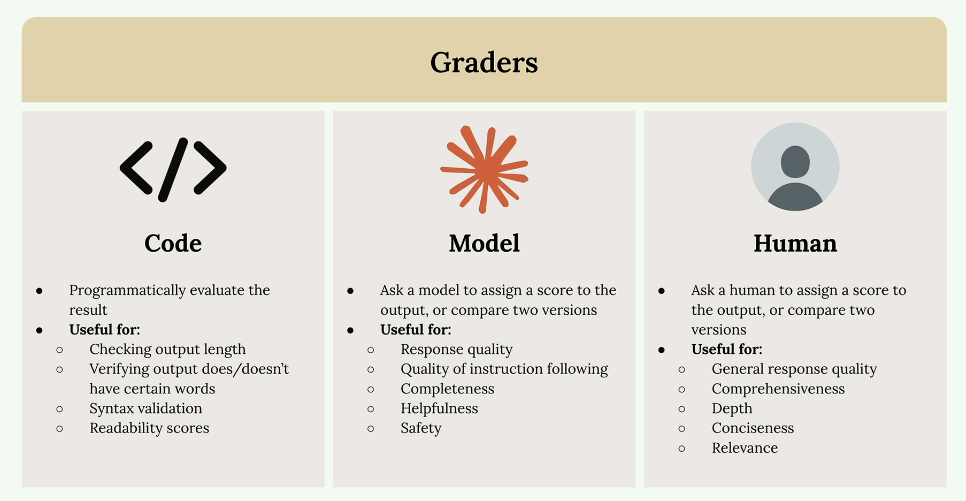
</p>

There are three main approaches to grading model outputs:

* `Code graders` - Programmatically evaluate outputs using custom logic
* `Model graders` - Use another AI model to assess the quality
* `Human graders` - Have people manually review and score outputs

#### Code Graders

Code graders let you implement any programmatic check you can imagine. Common uses include:

* Checking output length
* Verifying output does/doesn't have certain words
* Syntax validation for JSON, Python, or regex
* Readability scores

The only requirement is that your code returns some usable signal - usually a number between 1 and 10.

#### Model Graders

Model graders feed your original output into another API call for evaluation. This approach offers tremendous flexibility for assessing:

* Response quality
* Quality of instruction following
* Completeness
* Helpfulness
* Safety

#### Human Graders

Human graders provide the most flexibility but are time-consuming and tedious. They're useful for evaluating:

* General response quality
* Comprehensiveness
* Depth
* Conciseness
* Relevance

#### Defining Evaluation Criteria

<p align="center">
  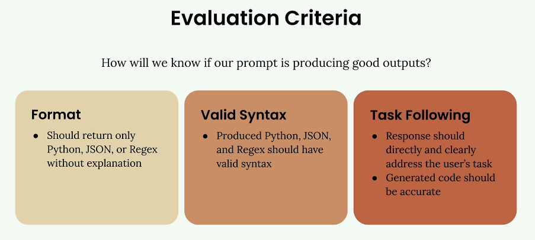
</p>

Before implementing any grader, you need clear evaluation criteria. For a code generation prompt, you might focus on:

* `Format` - Should return only Python, JSON, or Regex without explanation
* `Valid Syntax` - Produced code should have valid syntax
* `Task Following` - Response should directly address the user's task with accurate code.

<p align="center">
  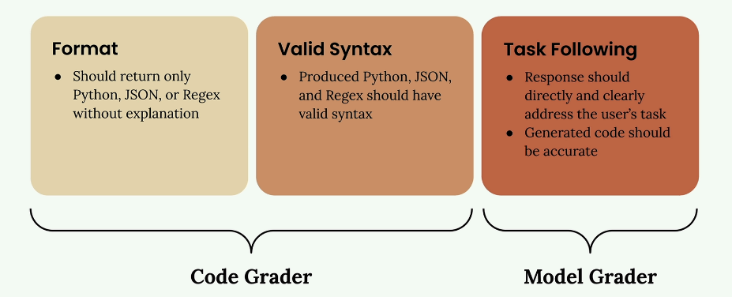
</p>

The first two criteria work well with code graders, while task following is better suited for model graders due to their flexibility.

## Implementing a Model Grader

Here's how to build a model grader function:

```python
def grade_by_model(test_case, output):
    # Create evaluation prompt
    eval_prompt = """
    You are an expert code reviewer. Evaluate this AI-generated solution.
    
    Task: {task}
    Solution: {solution}
    
    Provide your evaluation as a structured JSON object with:
    - "strengths": An array of 1-3 key strengths
    - "weaknesses": An array of 1-3 key areas for improvement  
    - "reasoning": A concise explanation of your assessment
    - "score": A number between 1-10
    """
    
    messages = []
    add_user_message(messages, eval_prompt)
    add_assistant_message(messages, "```json")
    
    eval_text = chat(messages, stop_sequences=["```"])
    return json.loads(eval_text)
```