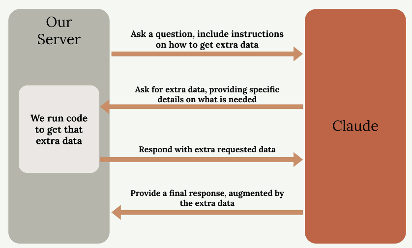
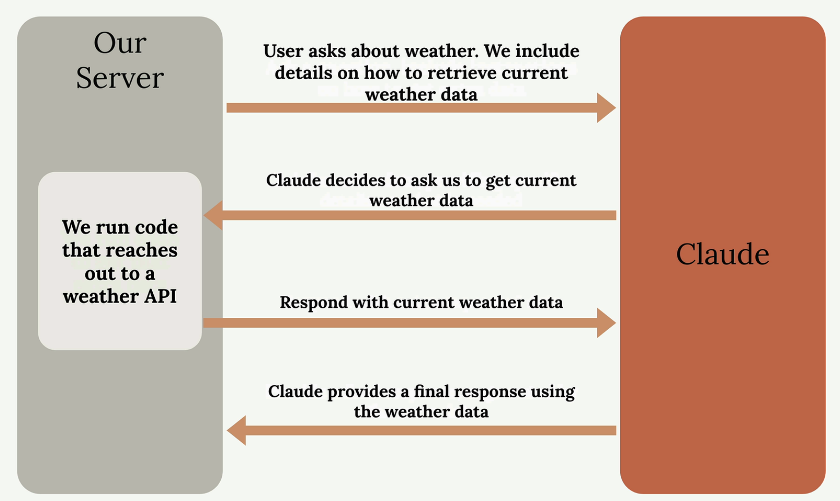
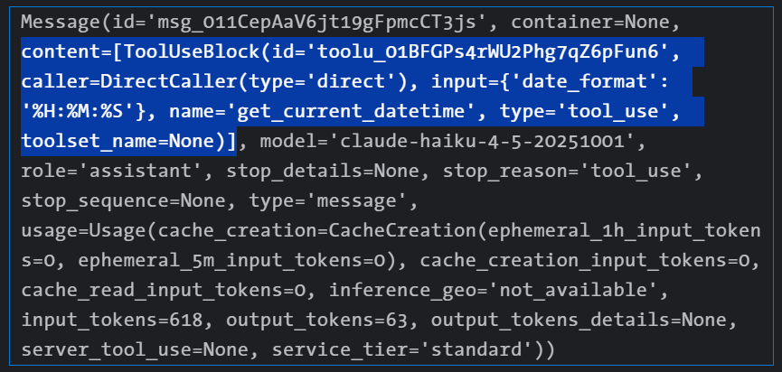
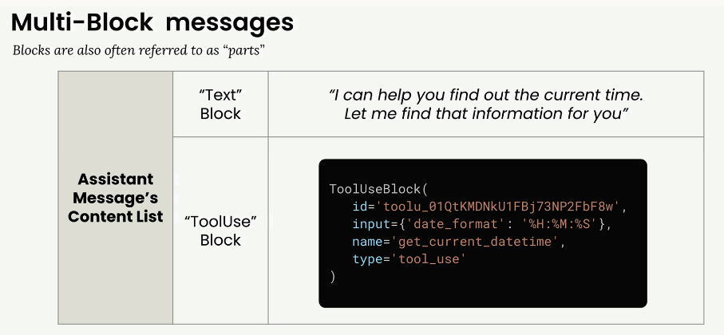
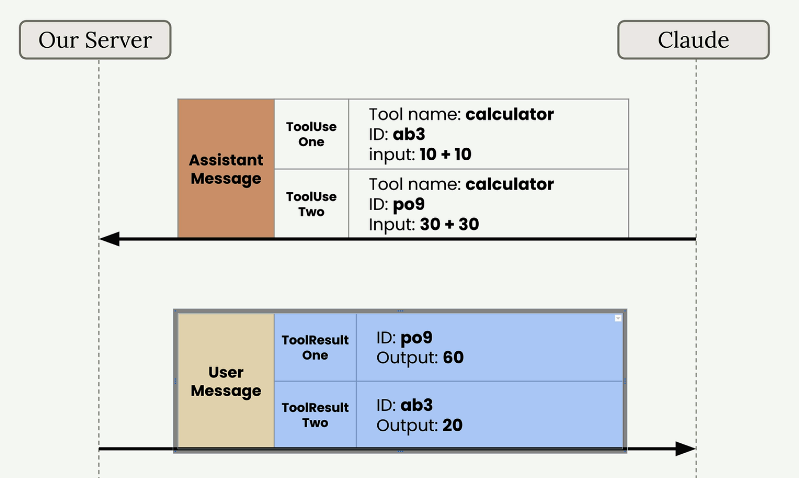
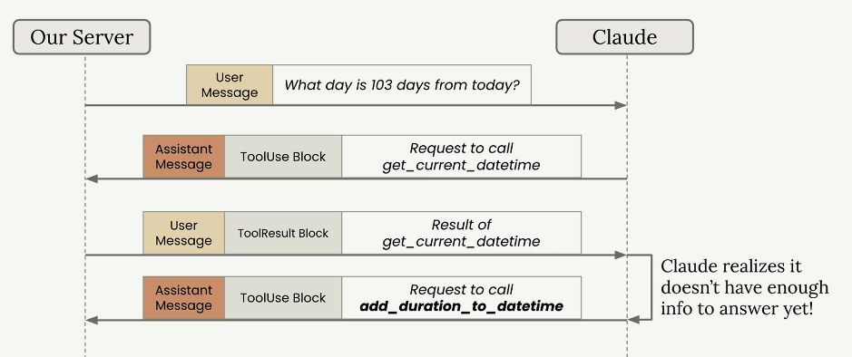

# Using Tools with Claude

Tools allow Claude to access information from the outside world, extending its capabilities beyond what it learned during training. By default, Claude only knows information from its training data and can't access current events, real-time data, or external systems. Tool use solves this limitation by creating a structured way for Claude to request and receive fresh information.

## The Problem Without Tools

When users ask Claude for current information, it hits a wall. For example, if someone asks `"What's the weather in San Francisco, California?"` Claude has to respond with something like `"I'm sorry, but I don't have access to up-to-date weather information."`.

This creates a frustrating user experience when people need real-time data that Claude could theoretically help with if it just had access to current information.

## How Tool Use Works

Tool use follows a specific back-and-forth pattern between your application and Claude. Here's the complete flow:

<p align="center">
  
</p>

1. `Initial Request`: You send Claude a question **along with instructions on how to get extra data from external sources** (i.e. list of tools and when & how to call them)
2. `Tool Request`: Claude analyzes the question and decides it needs additional information. So tells your server that it needs extra info - it can determine this from the extra info. we sent it along with our request.
3. `Data Retrieval`: **Your server runs code to fetch the requested information from external APIs or databases** - this is important to understand. Claude _cannot_ run any code to fetch extra info - it can only tell your server that it needs extra info and server calls the function(s).
4. `Server fetches info`: The server calls APIs/function/makes-Db-call (whatever is needed) to fetch the _extra_ information.
5. `Final Response`: Your server the _raw retrieved data_ back to Claude, which then generates a complete response using both the original question and the fresh data.

### Weather Example in Practice

Let's see how this works with the weather question. The process becomes much more specific:

<p align="center">
  
</p>

When a user asks about current weather [for example: `What's the current weather in Mumbai?`], **you include instructions in your prompt about how to retrieve weather data** (maybe your prompt tells Claude to call a `get_weather` function with city name as parameter for example). Claude recognizes it needs current information tells your server to fetch the additional info (for example, tells your server that it should call the `get_weather("Mumbai")` function). Your server then calls the `get_weather(...)` function, which could use weather API to get real-time conditions for a city/ The server will then send the raw data it fetched back to Claude. Finally, Claude combines the fresh weather data with the user's question to provide an accurate, current response.

### Key Benefits

* `Real-time Information`: Access current data that wasn't available during Claude's training
* `External System Integration`: Connect Claude to databases, APIs, and other services
* `Dynamic Responses`: Provide answers based on the latest available information
* `Structured Interaction`: Claude knows exactly what information it needs and how to ask for it

Tool use transforms Claude from a static knowledge base into a dynamic assistant that can work with live data. This opens up possibilities for building applications that need current information, whether that's weather data, stock prices, database queries, or any other real-time information your users might need.

## Practical Example of Tool Usage

We're going to build a practical project that teaches Claude how to set reminders for future dates. This might sound simple at first, but it reveals several interesting challenges that we'll solve using custom tools.

The goal is straightforward: we want to be able to tell Claude `"Set a reminder for my doctor's appointment. It's a week from Thursday"` and have Claude respond with `"OK, I will remind you"`. Making this possible is not as easy as it sounds - we need to address some limitations in how Claude handles time and reminders.

### Why This Is Challenging?

While Claude knows the current date, there are three specific problems we need to solve:

* `Limited time awareness`: Claude might know the current date, but not the exact time.
* `Date calculation issues`: Claude doesn't always handle time-based addition well, especially when looking many days into the future
* `No reminder capability`: Claude doesn't know how to set a reminder - it has no built-in mechanism for this!

Each of these limitations represents a gap between what Claude can do naturally and what we need for our reminder system. Tools are how we bridge these gaps.

### Tools We'll Need to create

<p align="center">
  
</p>

We'll create three separate tools to handle each challenge:

1. `Get the current date time`: Claude needs to know the current date and time precisely
2. `Add duration to date time`: Claude isn't perfect with date time addition, so we'll give it a reliable tool for this
3. `Set a reminder`: We need a way to actually set a reminder in the system (some API to interface with your calendar and set reminder for that date/time)

We'll implement these tools one at a time, starting with the simplest one. This approach lets us understand how tool calling works before building more complex functionality. By the end, Claude will be able to handle natural language requests like `"remind me in a week"` by combining these tools to calculate the exact time and set the reminder.

### What Are Tool Functions?

A tool function is a plain Python function that gets executed automatically when Claude decides it needs extra information to help a user. For example, if someone asks `"What's the weather in Mumbai?"`, Claude would call (i.e. ask your server to call) your weather tool to get the weather information.

Here's an example of a weather tool function. Notice how it validates inputs and provides clear error messages - these are important best practices.

```python
def get_weather(location):
    if not location or location.strip() == "":
        raise ValueError("Location cannot be empty!")

    url = "https://fakeweatherapi.example.com/current"
    params = {
        "q" : location,
        "appid" : api_key,
        "units" : "metric"
    }

    response = requests.get(url, params=params, timeout=10.0)
    response.raise_for_status()

    return response.json()
```

### Best Practices for Tool Functions

When writing tool functions, follow these guidelines:

* **Use descriptive names**: Both your function name and parameter names should clearly indicate their purpose
* **Validate inputs**: Check that required parameters aren't empty or invalid, and raise errors when they are
* **Provide meaningful error messages**: Claude can see error messages and might retry the function call with corrected parameters

**The validation is particularly important** because Claude learns from errors. If you raise a clear error like `"Location cannot be empty"`, Claude might try calling the function again with a proper location value.

### Building Your First Tool Function

Let's create a function to get the current date and time. This function will accept a date format parameter so Claude can request the time in different formats:

```python
from datetime import datetime

def get_current_datetime(date_format="%Y-%m-%d %H:%M:%S"):
    if not date_format:
        raise ValueError("date_format cannot be empty")
    return datetime.now().strftime(date_format)
```

This function uses Python's datetime module to get the current time and format it according to the provided format string. The default format gives us year-month-day hour:minute:second.

You can test it with different formats:

```python
# Default format: "2024-01-15 14:30:25"
get_current_datetime()

# Just hour and minute: "14:30"
get_current_datetime("%H:%M")
```

The validation check ensures Claude can't pass an empty string for the date format. While this specific error is unlikely, it demonstrates the pattern of validating inputs and providing helpful error messages that Claude can learn from.

## Tool Schemas

Creating the function is just the first step. Next step is **creating a JSON schema that tells Claude what arguments your function expects and how to use it**. This schema acts as documentation that Claude reads to understand when and how to call your tools.

### Understanding JSON Schema

JSON Schema isn't specific to AI or tool calling - it's a widely-used data validation specification that's been around for years. The AI community adopted it because it's a convenient way to describe function parameters and validate data.

Here is an example:

```json
{
    "name" : "get_weather",
    "description" : "Retrieves current weather for a specific location",
    "input_schema" : {
        "type" : "object",
        "properties" : {
            "location" : {
                "type" : "string",
                "description" : "The location for which the weather information is desired (e.g. Mumbai)"
            }
        },
        "required" : [
            "location",
        ]
    }
}
```

The complete tool specification has three main parts:

* `name` - A clear, descriptive name for your tool (like "get_weather")
* `description` - What the tool does, when to use it, and what it returns
* `input_schema` - The actual JSON schema describing the function's arguments

### Writing Effective Descriptions

Your _tool description is crucial_ for helping Claude understand when to use your function. Best practices include:

* Aim for 3-4 sentences explaining what the tool does
* Describe when Claude should use it
* Explain what kind of data it returns
* Provide detailed descriptions for each argument.

### The Easy Way to Generate Schemas

Writing a schema definition like the one above by hand is tedious and error prone. A much easier was is to ask Claude itself to generate them 😊. 

Here's the process:

* Copy your tool function code 
* Go to Claude (`claude.ai`) and ask it to write a JSON schema for tool calling
* Include the Anthropic documentation on tool use as context
* Let Claude generate a properly formatted schema following best practices

The prompt should be something like: `"Write a valid JSON schema spec for the purposes of tool calling for this function. Follow the best practices listed in the attached documentation available at https://platform.claude.com/docs/en/agents-and-tools/tool-use/overview.md"`

> 📌 **NOTE**: As of Aug 2026, the Anthropic tool documentation can be found at `https://platform.claude.com/docs/en/agents-and-tools/tool-use/overview.md`.

Once Claude generated the scheme for us, we can copy it into our code file (where we define the tool functions), like this:

```python
from datetime import datetime

def get_current_datetime(date_format="%Y-%m-%d %H:%M:%S"):
    # tool function
    ...


get_current_datetime_schema = {
    "name": "get_current_datetime",
    "description": "Returns the current date and time formatted according to the specified format",
    "input_schema": {
        "type": "object",
        "properties": {
            "date_format": {
                "type": "string",
                "description": "A string specifying the format of the returned datetime. Uses Python's strftime format codes.",
                "default": "%Y-%m-%d %H:%M:%S"
            }
        },
        "required": []
    }
}
```

#### Adding Type Safety

For better type checking, import and use the `ToolParam` type from the Anthropic library:

```python
from anthropic.types import ToolParam

get_current_datetime_schema = ToolParam({
    "name": "get_current_datetime",
    "description": "Returns the current date and time formatted according to the specified format",
    # ... rest of schema
})
```

While not strictly necessary for functionality, this prevents type errors when you use the schema with Claude's API and makes your code more robust.

## Handling Message Blocks

**When working with Claude's tool functionality**, you'll encounter a new type of response structure that's different from the simple text responses you've seen before. Instead of just getting back a single text block, **Claude now returns multi-block messages that contain both text and tool usage information**.

### Making Tool-Enabled API Calls

To enable Claude to use tools, you need to include a `tools` parameter in your API call. Here's how to structure the request:

```python
messages = []

messages.append({
    "role": "user",
    "content": "What is the exact time, formatted as HH:MM:SS?"
})

response = client.messages.create(
    model=MODEL,
    max_tokens=MAX_TOKENS,
    messages=messages,
    # NOTE: we pass the schema, not function name!
    tools=[get_current_datetime_schema],
)
```

The `tools` parameter takes a list of **JSON schemas** that describe the available functions Claude can call. R### unning the above code should produce output like this.

<p align="center">
  
</p>

This is a structure we have not seen before. Notice that the `content` is a list, but `content[0]` is **not** a text block. Instead you see a `ToolUseBlock`

### Understanding Multi-Block Messages

When Claude decides to use a tool, it returns an assistant message with multiple blocks in the content list. This is a significant change from the simple text-only responses you've worked with before.

<p align="center">
  
</p>

> **NOTE:** You may not always get a leading text block in a multi-block response from Claude. The text block is **optional** and is decided by the model, not the SDK version. For short, unambiguous prompts (like our datetime query), newer models often skip the preamble and return only the `ToolUseBlock`. You are more likely to see a leading text block with conversational or multi-step prompts. Always iterate over `content` and check each block's `type` rather than assuming `content[0]` is text.

A multi-block message typically contains:

* `Text Block` - Human-readable text explaining what Claude is doing (like "I can help you find out the current time. Let me find that information for you") (📌 optional**)
* `ToolUseBlock` - Instructions for your code about which tool to call and what parameters to use 

The `ToolUseBlock` itself includes:

* An `id` for tracking the tool call
* The `name` of the function to call (like `"get_current_datetime"`)
* Input parameters (`input`) formatted as a dictionary (`input={"date_format":"%H:%M:%S"}`)
* The `type` designation `"tool_use"`

### Managing Conversation History with Multi-Block Messages

Remember that Claude doesn't store conversation history - you need to manage it manually. When working with tool responses, you must preserve the entire content structure, including all blocks.

Here's how to properly append a multi-block assistant message to your conversation history:

```python
messages.append({
    "role": "assistant",
    # NOT response.content[0].text!
    "content": response.content
})
```

This preserves both the text block and the tool use block, which is crucial for maintaining the conversation context when you make subsequent API calls.

### The Complete Tool Usage Flow

The tool usage process follows this pattern:

1. Send user message with tool schema to Claude
2. Receive assistant message with text block **and** tool use block
3. Extract tool information and execute the actual function
4. Send tool result back to Claude along with complete conversation history
5. Receive final response from Claude

Each step requires careful handling of the message structure to ensure Claude has the full context it needs to provide accurate responses.

### Updating Helper Functions

We'll need to update our helper functions  `add_user_message()` and `add_assistant_message()` to handle multi-block content. They now need to accommodate the more complex content structures that include tool use blocks.

This multi-block message handling is essential for building robust applications that can seamlessly integrate Claude's tool capabilities while maintaining proper conversation flow.

## Sending Tool Results

After Claude requests a tool call, _you_ (server) need to execute the function and send the results back. This completes the tool use workflow by providing Claude with the information it requested.

### Running the Tool Function

When Claude responds with a tool use block, you extract the input parameters and call your function.

It's tempting to reach for the block by position, like `response.content[1].input` -  **don't!** A multi-block response has no guaranteed layout: Claude may skip the text block and go straight to a tool call (so the `tool_use` block sits at index 0), it may emit a `thinking` block first when extended thinking is on (shifting every later index), and with parallel tool use it may return several `tool_use` blocks at once. Indexing by number silently breaks in all three cases.

The fool-proof approach is to ignore position entirely and filter the content list by block type:

```python
tool_blocks = [block for block in response.content if block.type == "tool_use"]
```

Guard this with the stop reason so you only look for tool calls when Claude _actually asked for one_:

```python
if response.stop_reason == "tool_use":
    tool_blocks = [block for block in response.content if block.type == "tool_use"]
```

Each `tool_use` block carries everything you need to run the function:

```python
for tool_block in tool_blocks:
    name = tool_block.name     # which tool Claude wants to call
    args = tool_block.input    # dict of arguments for that tool
    tool_use_id = tool_block.id  # needed when you send the result back

    if name == "get_current_datetime":
        result = get_current_datetime(**args)
```

`tool_block.input` is a dictionary of the arguments Claude wants to pass to your function. Since your function expects keyword arguments rather than a dictionary, you use Python's unpacking syntax: `get_current_datetime(**tool_block.input)`.

Small helper functions to keep the code clean

```python
from typing import List, Dict, NamedTuple, Tuple
from anthropic.types import Message

class ToolCall(NamedTuple):
    id: str
    name: str
    input: dict

def get_tool_calls(response: Message) -> list[ToolCall]:
    """Return a ToolCall for every tool_use block in the response, or []."""
    if response.stop_reason != "tool_use":
        return []
    return [
        ToolCall(block.id, block.name, block.input)
        for block in response.content
        if block.type == "tool_use"
    ]

def make_tools_calls(response : Message) -> dict:
    """calls the respective tool(s) and packs the result as expected by Claude"""

    tool_blocks = []
    if response.stop_reason == "tool_use":
        # tool_blocks = [block for block in response.content if block.type == "tool_use"]
        tool_blocks = get_tool_calls(response)

    # now call our tool - if tool_blocks is [], then this block will
    # not return anything!
    tool_call_results = []
    for tool_block in tool_blocks:
        name = tool_block.name  # which tool Claude wants to call
        args = tool_block.input  # dict of arguments for that tool
        tool_use_id = tool_block.id  # needed when you send the result back

        # check which tool function was asked for
        # in this example, there is just 1, but this could unwind to
        # a block like this...

        if name == "get_current_datetime":
            print(f"Calling tool {name} with args: {args}")
            result = get_current_datetime(**args)
            print(f"Result from {name}: {result}")
        # elsif name == "another_tool_name":
        #     result = another_tool_function(**args)

        # NOTE: only one of the tool function will be called in each iteration over tool block
        tool_call_result =  {
            "type": "tool_result",
            "tool_use_id": tool_use_id,
            "content": result,
            "is_error": False,
        }
        tool_call_results.append(tool_call_result)

    return tool_call_results
```

The rule of thumb: never index `response.content` by number. It's a heterogeneous list of typed blocks (`text`, `thinking`, `tool_use`, `redacted_thinking`, ...) whose order and presence vary from one response to the next. Always iterate and switch on `block.type`.

### Tool Result Block

After running the tool function, _you need to send the results back to Claude using a tool result block_. This block goes inside a user message and tells Claude what happened when you executed the tool.

It looks like this:

```json
{
    "type": "tool_result",
    "tool_use_id": tool_use_id,   # ID of tool
    "content": "15:04:22",
    "is_error": False,
}
```

The tool result block has several important properties:

* `tool_use_id` - Must match the id of the ToolUse block that this ToolResult corresponds to
* `content` - Output from running your tool, **serialized as a string**
* `is_error` - True if an error occurred

### Handling Multiple Tool Calls

Claude can request multiple tool calls in a single response. For example, if a user asks    `"What's 10 + 10 and what's 30 + 30?"`, Claude might respond with two separate ToolUse blocks.

<p align="center">
  
</p>

Notice that **each tool call gets a unique ID, and you must match these IDs when sending back results**. This ensures Claude knows which result corresponds to which request, even if the results arrive in a different order.

### Building the Follow-up Request

Your follow-up request to Claude must include the complete conversation history plus the new tool result. Here's the structure:

```python
tool_call_results = make_tools_calls(response)
messages.append({"role": "user", "content": tool_call_results})
```

The complete message history now contains:

* Original user message
* Assistant message with tool use block
* User message with tool result block

### Making the Final Request

When sending the follow-up request, you must still include the tool schema even though you're not expecting Claude to make another tool call. Claude needs the schema to understand the tool references in your conversation history.

```python
final_response = client.messages.create(
    model=MODEL,
    max_tokens=MAX_TOKENS,
    messages=messages,
    tools=[get_current_datetime_schema]
)

# this is expected to be a text block
print(final_response.content[0].text)
```

Claude will then respond with a final message that incorporates the tool results into a natural response for the user. The tool use workflow is now complete - you've successfully enabled Claude to access real-time information through your custom function.

## Multi-turn conversations with tools

When building applications with multiple tools, you need to handle scenarios where Claude might need to call several tools in sequence to answer a single user question. For example, if a user asks `"What day is 103 days from today?"`, Claude needs to first get the current date, then add 103 days to it.

<p align="center">
  
</p>

This creates a multi-turn conversation pattern where Claude makes multiple tool requests before providing a final answer. Your application needs to handle this automatically.

### The Multi-Turn Tool Pattern

Here's what happens behind the scenes when Claude needs multiple tools:

* User asks: `"What day is 103 days from today?"`
* Claude responds with a tool use block requesting `get_current_datetime`
* Your server calls the function and returns the result
* Claude realizes it needs more information and requests `add_duration_to_datetime`
* Your server calls that function and returns the result
Claude now has enough information to provide the final answer.

### Building a Conversation Loop

To handle this pattern, you need a conversation loop that continues until Claude stops requesting tools:

```python
def run_conversation(messages):
    while True:
        response = chat(messages)

        add_assistant_message(messages, response)

        # Pseudo code
        if response isn't asking for a tool:
            break

        tool_result_blocks = run_tools(response)
        add_user_message(messages, tool_result_blocks)
        
    return messages
```

### Refactoring Helper Functions

Before implementing the conversation loop, we need to update our helper functions to handle multiple message blocks properly.

#### Updating Message Handlers

The `add_user_message` and `add_assistant_message` functions currently assume you're always working with plain text. Let's update them to handle full message objects:

```python
from anthropic.types import Message

def add_user_message(messages, message):
    user_message = {
        "role": "user",
        "content": message.content if isinstance(message, Message) else message
    }
    messages.append(user_message)
```

This allows you to pass in either a string, a list of blocks, or a complete message object.

#### Updating the Chat Function

Modify your chat function to accept a list of tools and return the full message instead of just text:

```python
def chat(messages, system=None, temperature=1.0, 
    stop_sequences=[], tools=None):

    params = {
        "model": model,
        "max_tokens": 1000,
        "messages": messages,
        "temperature": temperature,
        "stop_sequences": stop_sequences,
    }
    
    if tools:
        params["tools"] = tools
        
    if system:
        params["system"] = system
        
    message = client.messages.create(**params)
    return message
```

#### Extracting Text from Messages

Since you're now returning full message objects, create a helper to extract text when needed:

```python
def text_from_message(message):
    return "\n".join(
        [block.text for block in message.content if block.type == "text"]
    )
```

This function finds all text blocks in a message and joins them together, which is useful when you need to display the final response to users.

#### Key Improvements

These refactoring steps prepare your code for robust tool handling:

* Flexible message handling - Your helper functions can now work with different message formats
* Tool support in chat - The chat function can receive and pass through tool schemas
* Full message returns - You get complete message objects instead of just text, preserving all blocks
* Text extraction utility - Easy way to get readable text from complex messages

With these foundations in place, let's implement a multiple turn conversation that involves tool(s)

## Implementing Multiple Turns

